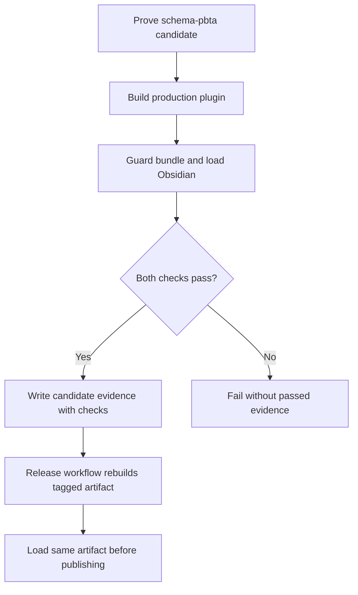
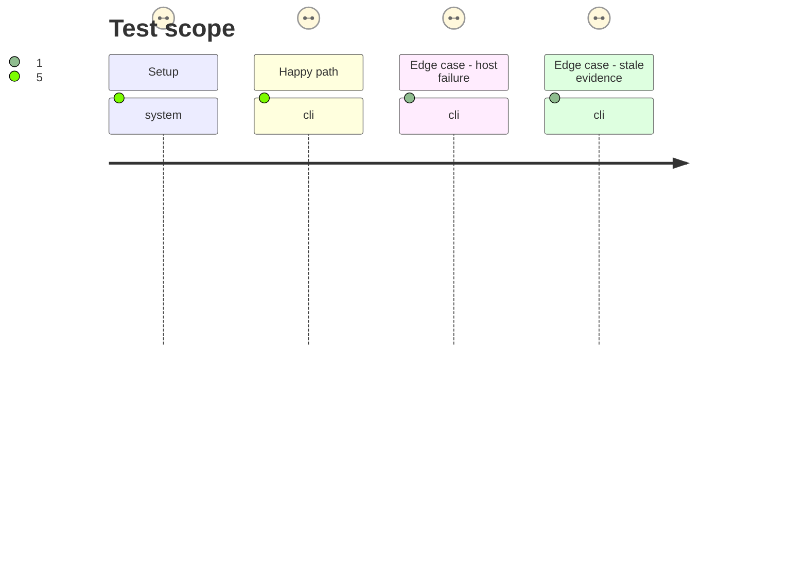

# Instruction: Require host load in candidate and publication gates

## Architecture projection

> Tree of the final files. ✅ create · ✏️ modify · ❌ delete

```txt
.
├── .github/workflows/
│   ├── ci.yml ✏️ run the focused Obsidian load smoke as an enabled job with uploaded failure diagnostics
│   └── release.yml ✏️ run the same smoke on the release-tag build before asset upload or release creation
└── tools/
    ├── release-train-schema-pbta-assert.mjs ✏️ require production build, bundle guard, and Obsidian load before writing passed candidate evidence
    └── assert-release-train-schema-pbta.mjs ✏️ verify proof names, failure propagation, and stale-evidence removal
```

## User Journey



## Test Scope



## Tasks to do

### `1)` Make host proof part of candidate evidence

> A passing provider contract alone must not certify an unloadable Handbook artifact.

1. Define and document the release-train runner prerequisite: provision the pinned Obsidian 1.13.7 host and Linux display/runtime dependencies before invoking Handbook's candidate assertion; fail closed with a clear prerequisite error if unavailable.
2. Run a production build, bundle guard, and Obsidian load in the Handbook candidate proof, in the same candidate checkout used for package and lock assertions.
3. Record explicit `production-build` and `obsidian-load` checks, including Obsidian version and artifact digest, in Handbook-owned evidence; keep the schema-owned manifest unchanged.
4. Write passed evidence only after every check succeeds; clear stale evidence before a retry and preserve host diagnostics on failure.
5. Keep local assertion fixtures able to test invocation and evidence shape without silently substituting a fake host result for actual candidate proof.

### `2)` Gate CI and release publication

> A maintainer dispatch cannot publish an unloadable plugin.

1. Enable a focused Linux host-load job in CI with a pinned Obsidian 1.13.7 download and retained failure diagnostics; leave broader layout and roller journeys independent.
2. Run the same host smoke in `release.yml` after `pnpm check` and tag/version validation, before `gh release create` or `gh release upload`.
3. Ensure the smoke uses the exact `dist` files that the release step uploads and that any failure halts the job.

## Test acceptance criteria

| Task | Acceptance criteria |
| --- | --- |
| 1 | Candidate evidence records `production-build` and `obsidian-load` only after the real production bundle loads in Obsidian 1.13.7. |
| 1 | A failed load leaves no passed candidate evidence and retains the original exception in diagnostics. |
| 2 | CI executes the focused smoke without `if: false`, and its failure artifacts show the load exception. |
| 2 | A release dispatch with a broken plugin cannot create or overwrite a GitHub release asset. |
