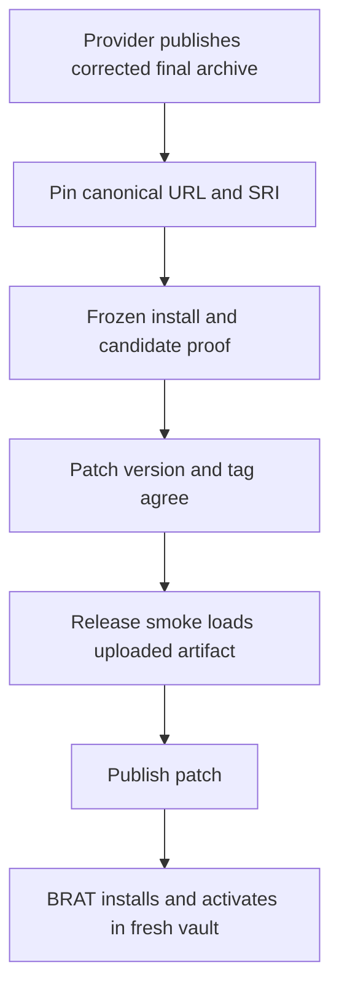
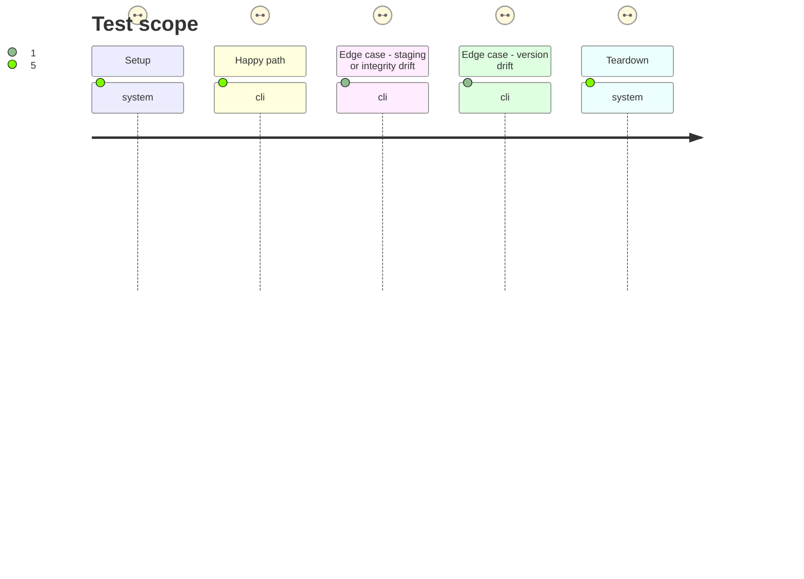

# Instruction: Adopt final provider archives and publish the patch

## Architecture projection

> Tree of the final files. ✅ create · ✏️ modify · ❌ delete

```txt
.
├── esbuild.config.mjs ✏️ remove the obsolete provider-specific import.meta.url rewrite after adopting the corrected archive
├── package.json ✏️ replace staging schema URLs with verified final release URLs and set patch version
├── pnpm-lock.yaml ✏️ pin canonical archive URLs and published SHA-512 SRI
├── manifest.json ✏️ set the matching patch version
├── versions.json ✏️ map the patch version to the supported Obsidian minimum
├── CHANGELOG.md ✏️ document the host-load release fix under the patch version
└── tools/
    ├── assert-consumer-schema-pins.mjs ✏️ require canonical final tags, archive names, lock URLs, and exact SRI after promotion
    ├── assert-release-train-schema-pbta.mjs ✏️ update fixed archive and integrity fixtures to the adopted final release
    └── assert-release-train-schema-adrenaline.mjs ✏️ update fixed archive and integrity fixtures if Adrenaline is promoted in this release
```

## User Journey



## Test Scope



## Tasks to do

### `1)` Promote and verify provider pins

> The consumer must depend on released provider bytes under their canonical final URLs.

1. Prove a corrected provider candidate with the new host-artifact gate before its final promotion; an archive promoted before this gate cannot serve as that proof. Require provider ownership for the root-export fix.
2. After final release, pin its canonical `.../releases/download/vX.Y.Z/schema-...-X.Y.Z.tgz` URL; inspect all Handbook schema pins for remaining staging tags.
3. Download the final asset from its canonical URL, verify its SHA-256 equals the host-proved staged candidate, compute its SHA-512 SRI from the returned archive bytes, compare it with provider-published integrity metadata when available, and pin that exact value in the lockfile. Reject byte or digest drift; verify with `pnpm install --frozen-lockfile`.
4. Tighten the consumer pin assertion to compare package URL, lock tarball URL, version, and exact SRI with the verified final archive.
5. Remove the temporary PbtA browser-asset rewrite only after the corrected provider bundle passes the guard and real Obsidian load.
6. Update hard-coded release-train fixtures to the final archive where applicable, without changing schema-owned protocol manifests.

### `2)` Version, publish, and verify the patch

> Ship only the artifact whose tag, metadata, host proof, and BRAT installation agree.

1. Choose the next patch version from the release state, update package, manifest, versions map, and changelog, then assert the tag/version match.
2. Run the complete checks, candidate evidence, and release workflow host gate before creating or replacing release assets.
3. Verify the published `main.js`, `manifest.json`, and `styles.css` digests match the gated `dist` files.
4. Install the patch via BRAT in a new isolated vault and verify Handbook appears in `app.plugins.plugins` without file edits.

## Test acceptance criteria

| Task | Acceptance criteria |
| --- | --- |
| 1 | Every promoted Handbook schema dependency uses its final canonical release URL and the lockfile carries that archive's exact published SRI. |
| 1 | Staging URLs, redirects as pins, or SRI drift fail the pin validation or frozen install. |
| 2 | Package, manifest, versions map, tag, and newest changelog entry identify the same patch release. |
| 2 | The release asset matches the host-tested build by digest, and BRAT installs and activates it in a fresh vault without manual changes. |
