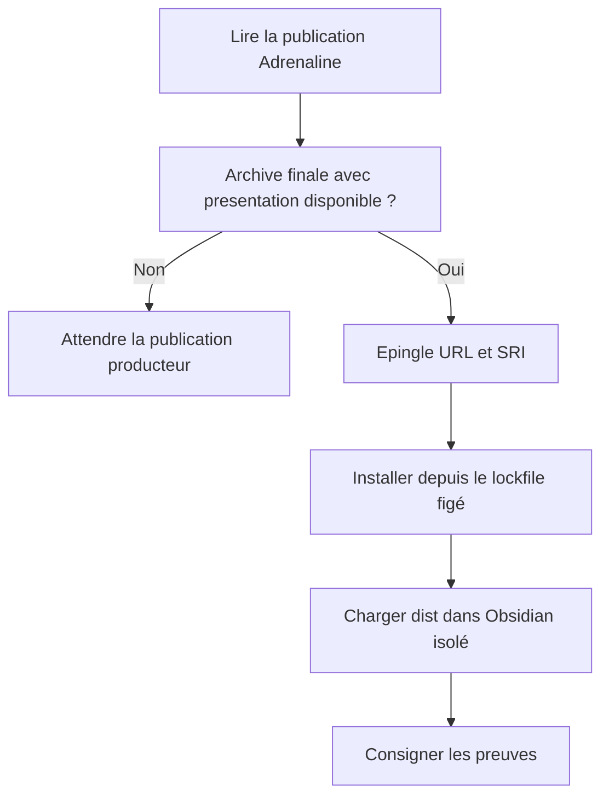
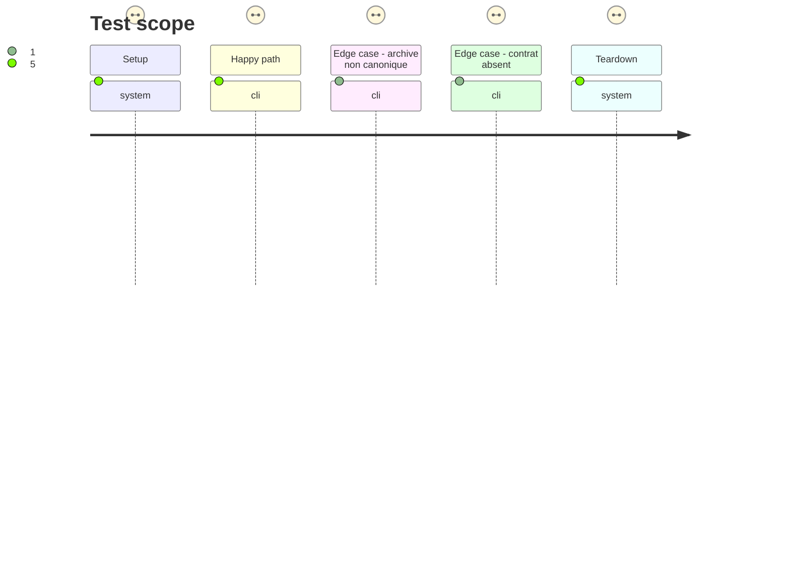

# Instruction: Vérifier le contrat publié et la preuve hôte

## Architecture projection

> Tree of the final files. ✅ create · ✏️ modify · ❌ delete

```txt
.
├── package.json ✏️ épingler l'archive finale canonique contenant ./presentation
├── pnpm-lock.yaml ✏️ conserver l'URL de publication et le SRI exact de cette archive
├── tools/
│   ├── assert-consumer-schema-pins.mjs ✏️ refuser candidate.tgz et vérifier l'archive finale nommée
│   ├── assert-release-train-schema-adrenaline.mjs ✏️ dériver les attentes de la version publiée au lieu de figer le producteur
│   └── assertAdrenalineContract.harness.mts ✏️ contrôler la cohérence catalogue/manifeste et la présence du sous-chemin publié
└── aidd_docs/tasks/2026_09/2026_09_25_zombiology-issue-64/
    └── preflight-evidence.md ✅ consigner l'archive, son SRI, l'installation figée et la preuve hôte
```

## User Journey



## Test Scope



## Tasks to do

### `1)` Confirmer les prérequis publiés

> Ne commencer l'adoption que sur les octets réellement publiés.

1. Vérifier la preuve #63 puis refaire `pnpm e2e:plugin-load` sur la construction courante dans un coffre isolé ; capturer l'exception et les journaux en cas d'échec. La construction Zombiology sera prouvée en phase 2.
2. Vérifier chez `schema-adrenaline` le sous-chemin `./presentation`, le catalogue `handbook.json`, son `pack.json`, l'URL finale nommée et le SRI publié ; attendre la publication producteur si l'un manque.
3. Épingler cette archive dans `package.json` et `pnpm-lock.yaml`, vérifier le SRI et lancer une installation figée depuis un store propre.

### `2)` Aligner les assertions de version

> Utiliser l'identité du pack publiée avec le contrat.

1. Faire lire aux assertions Adrenaline la version du catalogue et celle du manifeste qu'il référence ; comparer ces valeurs.
2. Vérifier l'export `./presentation` dans le paquet installé et supprimer les attentes figées sur une version producteur ou un nom `candidate.tgz`.
3. Consigner l'identité exacte du paquet et les sorties de la preuve hôte et de l'installation.

## Test acceptance criteria

| Task | Acceptance criteria |
| --- | --- |
| 1 | La construction courante charge dans Obsidian isolé ou livre l'exception réelle et son diagnostic ; le coffre utilisateur reste intact. |
| 1 | `package.json` et le verrou pointent vers la même archive finale nommée, avec SRI correspondant aux octets publiés ; `pnpm install --frozen-lockfile` réussit depuis un store propre. |
| 2 | Le paquet installé expose `./presentation`, et les versions de `handbook.json` et du `pack.json` référencé concordent sans constante de version du pack dans les assertions. |
| 2 | Une archive candidate, un SRI faux, un sous-chemin absent ou des versions discordantes échouent explicitement. |
