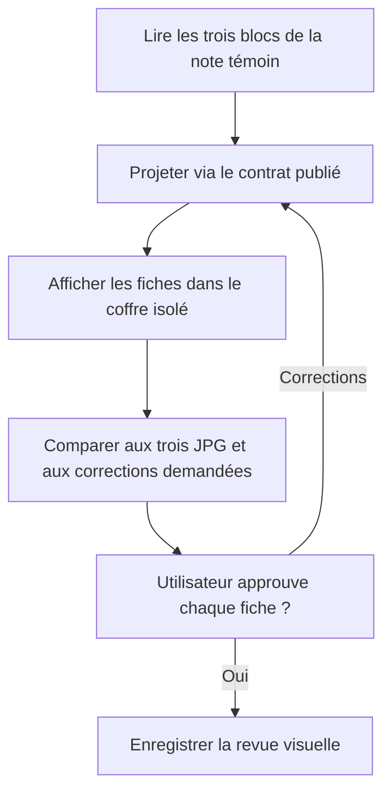
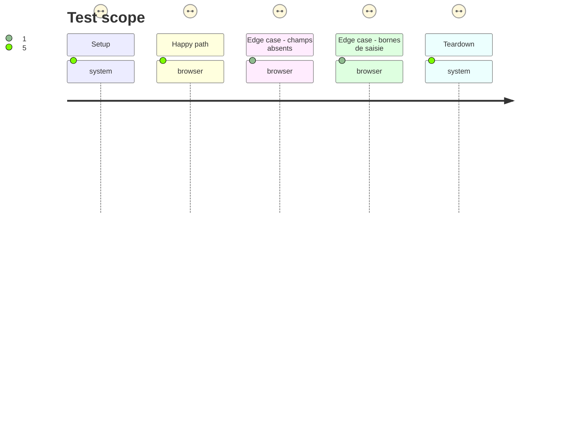

# Instruction: Reprendre les trois présentations et recueillir la revue visuelle

## Architecture projection

> Tree of the final files. ✅ create · ✏️ modify · ❌ delete

```txt
.
├── src/features/
│   ├── adrenaline/view.ts ✏️ rendre les valeurs communes depuis le contrat publié
│   ├── adrenalinePj/shape.ts ✏️ déclarer les zones PJ publiées
│   ├── adrenalinePj/renderer.ts ✏️ projeter les valeurs PJ dans ces zones
│   ├── adrenalinePnj/shape.ts ✏️ déclarer les zones PNJ publiées
│   ├── adrenalinePnj/renderer.ts ✏️ projeter les valeurs PNJ dans ces zones
│   ├── adrenalineMonstre/shape.ts ✏️ déclarer les zones Monstre publiées
│   └── adrenalineMonstre/renderer.ts ✏️ projeter les valeurs Monstre dans ces zones
├── src/styles/adrenaline/
│   ├── _content.scss ✏️ habiller les valeurs communes avec les jetons du pack
│   ├── _pj.scss ✏️ réaliser la fiche PJ et ses trois colonnes de formations
│   ├── _pnj.scss ✏️ réaliser la fiche PNJ et ses groupes
│   └── _monstre.scss ✏️ réaliser la fiche Monstre et ses états
├── tools/
│   ├── assertAdrenalineDocuments.harness.mts ✏️ vérifier les trois projections et les champs absents
│   └── assertAdrenalineZombiologyStyle.harness.mts ✏️ vérifier les zones, jetons, largeur réduite et l'absence de min/max visibles
└── aidd_docs/tasks/2026_09/2026_09_25_zombiology-issue-64/
    └── visual-review.md ✅ conserver les captures, écarts, corrections et approbation des trois fiches
```

## User Journey



## Test Scope



## Wireframe

Structure provisoire à confronter au `./presentation` publié et aux trois JPG avant toute validation.

```txt
PJ
┌───────────────────────────────────────────────────────────┐
│ (1) Nom · identité                                        │
├───────────────────┬───────────────────┬───────────────────┤
│ (2) Formation A   │ (2) Formation B   │ (2) Formation C   │
├───────────────────┴───────────────────┴───────────────────┤
│ (3) Caractéristiques · compétences                       │
├───────────────────────────┬───────────────────────────────┤
│ (4) Santé · états         │ (5) Équipement               │
└───────────────────────────┴───────────────────────────────┘

PNJ
┌───────────────────────────────────────┐
│ (1) Nom · rôle                         │
├───────────────────────────────────────┤
│ (2) Présentation · jeu                 │
├───────────────────┬───────────────────┤
│ (3) Capacités     │ (4) Santé · états │
├───────────────────┴───────────────────┤
│ (5) Équipement                         │
└───────────────────────────────────────┘

Monstre
┌───────────────────────────────────────┐
│ (1) Nom · type                         │
├───────────────────┬───────────────────┤
│ (2) Déplacement   │ (3) Actions       │
├───────────────────┴───────────────────┤
│ (4) Caractéristiques · santé           │
├───────────────────────────────────────┤
│ (5) Capacités · états · équipement     │
└───────────────────────────────────────┘
```

PJ : (1) identité ; (2) trois groupes de formations ; (3) caractéristiques et compétences ; (4) santé et états ; (5) équipement.

PNJ : (1) identité et rôle ; (2) présentation ; (3) capacités ; (4) santé et états ; (5) équipement.

Monstre : (1) identité et type ; (2) mobilité ; (3) actions ; (4) caractéristiques et santé ; (5) capacités, états et équipement.

## Tasks to do

### `1)` Reprendre la projection publiée

> Adapter le brouillon sur `main` sans ajouter de sémantique de présentation au consommateur.

1. Lire le brouillon `feat/zombiology-presentation-preview` en référence, puis porter uniquement les adaptations compatibles avec le `./presentation` publié.
2. Appliquer blocs, sections, ordre, noms et valeurs depuis le contrat ; laisser les TOML et leurs données inchangés.
3. Composer les styles avec les jetons et ressources du pack, y compris la carte du nom, l'écriture bleue, les trois colonnes PJ, la santé, l'équipement et les états ; rendre la largeur réduite lisible.

### `2)` Obtenir la revue des trois fiches

> Figer les choix de rendu sur des comparaisons observables.

1. Construire le plugin et vérifier son chargement dans Obsidian 1.13.7 isolé avant la comparaison visuelle.
2. Copier la note réelle et les JPG `pj`, `pnj`, `monstre` en lecture seule vers le coffre isolé ; capturer chaque bloc et sa version étroite, puis noter les écarts précis.
3. Présenter les trois comparaisons à l'utilisateur ; corriger et refaire les captures jusqu'à approbation explicite de chaque fiche. Si le contrat publié manque une valeur, demander une nouvelle publication producteur avant de finaliser le consommateur.

## Test acceptance criteria

| Task | Acceptance criteria |
| --- | --- |
| 1 | Les trois blocs réels suivent les zones et l'ordre du `./presentation` publié ; aucune valeur de présentation n'est ajoutée aux TOML. |
| 1 | Les styles emploient les jetons du pack ; la carte du nom, les valeurs manuscrites bleues, les formations PJ en trois colonnes, la santé, l'équipement et les états correspondent aux références. |
| 2 | La construction charge dans Obsidian isolé et les trois fiches restent lisibles à largeur réduite, sans min/max affichés ni zone vide pour un champ absent. |
| 2 | Le dossier de revue contient les trois comparaisons, les corrections appliquées et l'approbation explicite de l'utilisateur pour PJ, PNJ et Monstre. |
