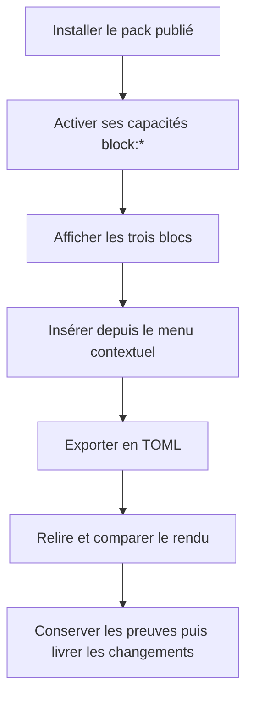
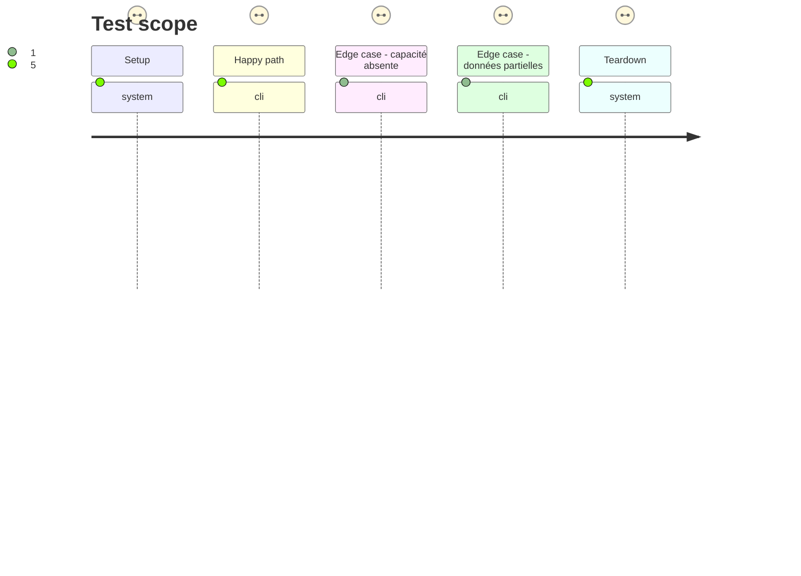

# Instruction: Prouver les trois parcours et stabiliser la livraison

## Architecture projection

> Tree of the final files. ✅ create · ✏️ modify · ❌ delete

```txt
.
├── tools/
│   ├── assertAdrenalineContract.harness.mts ✏️ prouver corpus et aller-retour des trois cibles sur le paquet publié
│   ├── contextualPackBlocks.harness.mts ✏️ prouver rendu et insertion selon les capacités déclarées
│   ├── contextualTomlExport.harness.mts ✏️ prouver l'export TOML contextuel selon les capacités déclarées
│   └── assertAdrenalineZombiologyStyle.harness.mts ✏️ finaliser les assertions de rendu approuvé
└── aidd_docs/tasks/2026_09/2026_09_25_zombiology-issue-64/
    └── acceptance-evidence.md ✅ relier les assertions, captures et résultats hôte aux critères #64
```

## User Journey



## Test Scope



## Tasks to do

### `1)` Unifier l'activation par capacité

> Le manifeste publié est la seule source de disponibilité des trois blocs.

1. Tracer `registry.ts`, `copyAsToml.ts` et `tomlExports.ts` ; vérifier que les trois parcours utilisent déjà `isAvailableBlock` et ne modifier leur code que si un test démontre un écart.
2. Vérifier chaque capacité `block:adrenaline-pj`, `block:adrenaline-pnj`, `block:adrenaline-monstre` indépendamment, y compris son absence.

### `2)` Fermer les preuves de livraison

> Livrer uniquement après les assertions et la revue approuvée.

1. Si la revue visuelle a imposé une nouvelle publication producteur, remplacer le pin par sa nouvelle archive finale et revérifier URL, SRI, version du catalogue, manifeste et installation figée.
2. Exécuter les assertions Adrenaline, corpus, styles, insertion et export sur le paquet final installé, puis `pnpm check`, `pnpm build`, l'installation figée et la preuve Obsidian isolée.
3. Vérifier les trois blocs de la note réelle, leur largeur réduite, les champs absents, l'absence de min/max, la fidélité des exports et l'absence de lien `pnpm` local ou de données de présentation dans les TOML.
4. Réconcilier les résultats avec la revue visuelle et consigner les preuves ; ne committer ni pousser les changements de #64 tant que tous les critères ne sont pas verts.

## Test acceptance criteria

| Task | Acceptance criteria |
| --- | --- |
| 1 | Chaque bloc Adrenaline n'est visible, insérable et exportable que lorsque sa capacité `block:*` figure dans le manifeste actif. |
| 1 | Aucun choix de mode seul n'active les trois blocs en l'absence des capacités publiées. |
| 2 | Les trois documents de la note réelle passent le corpus et l'aller-retour TOML du codec publié ; leur rendu approuvé reste stable sur largeur normale et réduite. |
| 2 | Les assertions, le build, l'installation figée et le chargement Obsidian isolé passent, avec résultats liés à l'archive canonique et à son SRI. |
| 2 | Toute nouvelle archive demandée par la revue visuelle remplace le pin précédent avant la preuve finale ; son URL canonique, son SRI et son manifeste sont revérifiés. |
| 2 | Aucun commit ou push de #64 ne précède la preuve finale ; la livraison ne contient ni lien local, ni changement du coffre utilisateur, ni donnée de présentation dans les TOML. |
