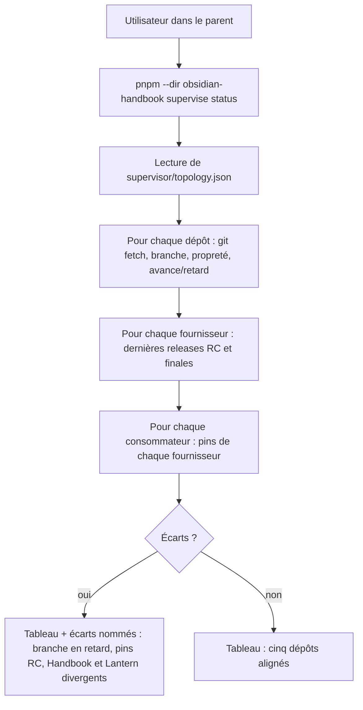
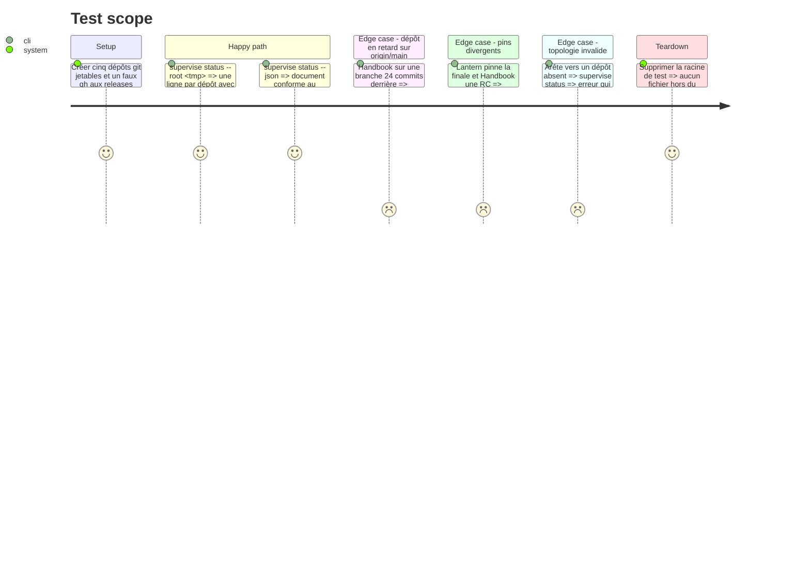

<!-- Fill or omit these sections; never add, rename, or reorder one. -->

# Instruction: Topologie et état des cinq dépôts

## Architecture projection

> Tree of the final files. ✅ create · ✏️ modify · ❌ delete

```txt
obsidian-handbook/
├── package.json                         ✏️ scripts supervise, assert:supervisor ; ajout à check
├── tools/check.mjs                      ✏️ exécute assert:supervisor
├── supervisor/
│   ├── topology.json                    ✅ cinq dépôts, rôles, arêtes fournisseur → consommateurs
│   ├── topology.schema.json             ✅ schéma draft-07 de la topologie
│   └── status.schema.json               ✅ schéma draft-07 de `status --json`
└── tools/
    ├── supervise.mjs                    ✅ point d'entrée CLI, routage des sous-commandes
    ├── supervisor/
    │   ├── topology.mjs                 ✅ lecture et validation de topology.json
    │   ├── git.mjs                      ✅ branche, propreté, avance/retard sur origin/main
    │   ├── gh.mjs                       ✅ seul appelant de gh, remplaçable par SUPERVISOR_GH
    │   ├── pins.mjs                     ✅ pins de schémas d'un consommateur (package.json + lockfiles)
    │   └── status.mjs                   ✅ assemblage et rendu de l'état (texte + --json)
    ├── supervisor.harness.mts           ✅ dépôts git jetables et faux gh
    ├── assert-supervisor.mjs            ✅ lanceur du harnais
    └── fixtures/supervisor/             ✅ topologies et réponses gh figées
```

## User Journey



## Test Scope



## Tasks to do

### `1)` Décrire la topologie

> Un fichier versionné déclare les cinq dépôts et qui consomme quoi.

1. `supervisor/topology.json` : `id`, `path` relatif au parent, `repository` GitHub, `role` (`coordinator`, `provider`, `consumer`), et pour chaque fournisseur son `adapter` (`pbta`, `adrenaline`, `mist`) et ses `consumers` (`lantern`, `handbook`).
2. Validation stricte par `ajv` puis contrôles croisés : identifiants uniques, arêtes vers des dépôts déclarés, `obsidian-notebook` absent.
3. Par dépôt, `trainFiles` : les chemins qu'un commit prévu par le train peut modifier (pins et lockfiles des consommateurs, fichiers de version et `CHANGELOG.md` des consommateurs pour leur release, manifestes et enregistrements finals du fournisseur, `release-train.matrix.json` de Lantern). Utilisé en phases 3 et 5.

### `2)` Observer git sans rien modifier

> Chaque dépôt dit où il en est par rapport à `origin/main`.

1. `git fetch --quiet origin` puis branche courante, arbre propre ou non, avance/retard sur `origin/main`.
2. Aucune commande d'écriture : pas de checkout, pas de pull.

### `3)` Observer releases et pins

> Savoir quelles versions existent et lesquelles chaque consommateur utilise.

1. `gh.mjs` : toutes les requêtes GitHub passent par une seule fonction, surchargée par `SUPERVISOR_GH` pour le harnais.
2. Fournisseur : dernière RC et dernière finale (`gh release list`).
3. Consommateur : URL et SRI de chaque schéma dans `package.json` et les lockfiles suivis.

### `4)` Rendre l'état

> Un tableau lisible et un JSON stable.

1. Rendu texte : un bloc par dépôt, puis la liste des écarts.
2. `--json` : même contenu, schéma stable pour les phases suivantes.
3. `--strict` : sortie non nulle si un écart existe.

### `5)` Harnais

> Le comportement est prouvé sans réseau.

1. `supervisor.harness.mts` : dépôts jetables, faux `gh`, scénarios du Test Scope.
2. `assert:supervisor` dans `package.json` et dans `tools/check.mjs`.

## Test acceptance criteria

| Task | Acceptance criteria |
| ---- | ------------------- |
| 1 | Une topologie avec une arête vers un dépôt inconnu est refusée avec le nom de l'arête ; la topologie livrée liste exactement les cinq dépôts. |
| 2 | Après `supervise status`, `git status` et `git rev-parse HEAD` de chaque dépôt sont inchangés. |
| 3 | Un consommateur qui pinne une RC d'un fournisseur apparaît avec l'URL RC et l'SRI lus dans son lockfile. |
| 4 | Sur la racine de test, un dépôt en retard est nommé avec son retard et `--strict` sort en non nul ; `--json` est accepté par `supervisor/status.schema.json` (ajv). |
| 5 | `pnpm assert:supervisor` passe sans accès réseau ; `pnpm check` l'exécute. |
