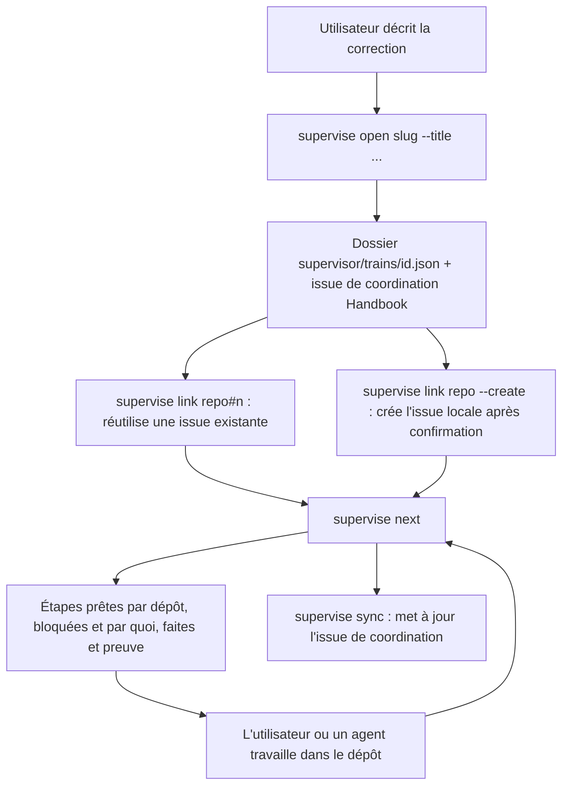

<!-- Fill or omit these sections; never add, rename, or reorder one. -->

# Instruction: Dossier de train, issues et prochaine étape

## Architecture projection

> Tree of the final files. ✅ create · ✏️ modify · ❌ delete

```txt
obsidian-handbook/
├── supervisor/
│   ├── train.schema.json                ✅ schéma du dossier de train
│   └── trains/
│       └── .gitkeep                     ✅ un fichier <id>.json par train
└── tools/
    ├── supervise.mjs                    ✏️ sous-commandes open, link, next, sync
    └── supervisor/
        ├── train.mjs                    ✅ lecture, validation, écriture atomique du dossier
        ├── next.mjs                     ✅ calcul des étapes prêtes, bloquées, faites
        ├── coordination.mjs             ✅ rendu de l'issue de coordination entre marqueurs
        └── status.mjs                   ✏️ affiche le train actif s'il y en a un
```

## User Journey



## Test Scope

```mermaid
---
title: Test scope
---
journey
  section Setup
    Racine de test de la phase 1 et faux gh qui enregistre les appels => prêt: 5: system
  section Happy path
    supervise open couleur-otherscape => dossier créé, issue de coordination créée, lien écrit dans le dossier: 5: cli
    supervise link schema-in-the-mist#31 => issue rattachée sans création: 5: cli
    supervise next => Mist prêt, Handbook et Lantern bloqués par Mist: 5: cli
    Commit fusionné sur origin/main de Mist et issue fermée, checkout local de Mist en retard => supervise next => Handbook et Lantern prêts: 5: cli
    supervise sync => corps de l'issue régénéré entre marqueurs, texte hors marqueurs conservé: 5: cli
  section Edge case - deux trains touchent le même dépôt
    Un second train lie un dépôt déjà engagé => supervise link => refus qui nomme le train concurrent: 1: cli
  section Edge case - dossier invalide
    Dossier modifié à la main avec une dépendance circulaire => supervise next => erreur qui nomme le cycle: 1: cli
  section Edge case - création sans confirmation
    supervise link lantern --create sans terminal interactif et sans --yes => aucun appel gh issue create: 1: cli
  section Teardown
    Supprimer la racine de test => baseline: 5: system
```

## Tasks to do

### `1)` Dossier de train

> Un fichier versionné décrit une correction, ses dépôts, ses dépendances et ses preuves attendues.

1. `train.schema.json` : `id`, `title`, `coordinationIssue`, `items[]` (`repo`, `issue`, `baseSha`, `dependsOn[]`, `expectedEvidence[]`), `approval` (vide jusqu'en phase 3), `publication` (vide jusqu'en phase 4).
2. `train.mjs` : validation, détection de cycles, écriture atomique (fichier temporaire puis renommage).
3. `open` : crée le dossier et l'issue de coordination dans Handbook.

### `2)` Rattacher les issues

> Réutiliser l'existant, créer seulement sur demande.

1. `link <repo>#<n>` : vérifie que l'issue existe et l'ajoute au dossier avec `baseSha`, le SHA d'`origin/main` du dépôt à cet instant (base du diffstat de `present`).
2. `link <repo> --create --title` : création après confirmation interactive, ou `--yes` explicite.
3. Refuser un dépôt déjà engagé par un autre train ouvert (travaux concurrents), en lisant les trains du checkout et ceux de `origin/main` de Handbook (`git show`, lecture seule).
4. Par défaut, `dependsOn` suit les arêtes de la topologie ; on peut le surcharger.

### `3)` Calculer la prochaine étape

> Dire qui peut avancer, ce qui bloque et ce qui est prouvé, à partir de l'état observé.

1. Un élément est fait quand son issue est fermée et que son commit de fermeture est atteignable depuis `origin/main`, lu par `gh` ; le checkout local n'intervient pas.
2. Un élément est prêt quand toutes ses dépendances sont faites, bloqué sinon, avec la dépendance nommée.
3. Aucun état « étape n » stocké : `next` recalcule tout à chaque appel.

### `4)` Projeter dans l'issue de coordination

> L'issue reste lisible sans devenir la source de vérité.

1. `sync` régénère uniquement le bloc entre `<!-- supervisor:begin -->` et `<!-- supervisor:end -->`.
2. Le contenu : liste des éléments avec lien, état, blocage et preuves attendues.

## Test acceptance criteria

| Task | Acceptance criteria |
| ---- | ------------------- |
| 1 | Un dossier sans `coordinationIssue` ou avec un cycle est refusé ; un dossier valide relu après écriture est identique octet pour octet. |
| 2 | `link` sur une issue existante ne produit aucun appel de création ; un second train sur un dépôt engagé est refusé. |
| 3 | Une fois le fournisseur fermé et fusionné, `next` fait passer ses consommateurs de bloqués à prêts, sans modifier le dossier. |
| 4 | Après `sync`, le texte ajouté à la main hors marqueurs est toujours présent. |
