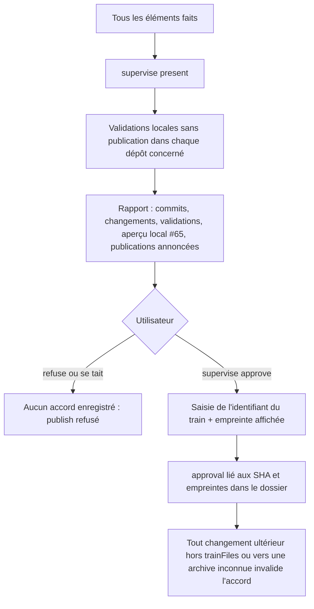
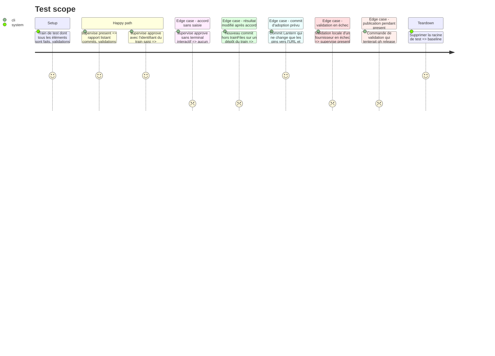

<!-- Fill or omit these sections; never add, rename, or reorder one. -->

# Instruction: Présentation et feu vert lié aux commits

## Architecture projection

> Tree of the final files. ✅ create · ✏️ modify · ❌ delete

```txt
obsidian-handbook/
├── supervisor/
│   ├── topology.json                    ✏️ commandes de validation locales par dépôt
│   └── train.schema.json                ✏️ bloc approval
└── tools/
    ├── supervise.mjs                    ✏️ sous-commandes present, approve
    └── supervisor/
        ├── present.mjs                  ✅ rapport de présentation (Markdown)
        ├── digest.mjs                   ✅ empreinte des SHA, des trainFiles admis et des publications annoncées
        ├── approval.mjs                 ✅ enregistrement et vérification de l'accord
        └── guard/
            ├── gh                       ✅ refuse release, workflow run, pr merge ; délègue le reste
            └── git                      ✅ refuse push et tag ; délègue le reste
```

## User Journey



## Test Scope



## Tasks to do

### `1)` Validations locales sans publication

> Réutiliser les validations de chaque dépôt, sans rien publier.

1. Dans `topology.json`, par dépôt, la liste des commandes de validation locale (`pnpm check`, `npm run check`, `pnpm build`, etc.).
2. Garde-fou réel : `present` préfixe le `PATH` des validations par `tools/supervisor/guard/`, où `gh` refuse `release`, `workflow run` et `pr merge`, et `git` refuse `push` et `tag`, puis délèguent le reste aux vrais binaires. Le harnais prouve le même garde-fou, pas un faux `gh`.
3. Pré-condition en lecture seule : chaque dépôt concerné a un arbre propre et `HEAD == origin/main` ; sinon `present` s'arrête en nommant le dépôt et la commande à lancer à la main (`git switch main && git pull`). Les SHA enregistrés sont ces `HEAD`.

### `2)` Rapport de présentation

> Montrer la preuve adaptée au changement.

1. Commits et diffstat par dépôt depuis le `baseSha` de son élément.
2. Résultat de chaque validation.
3. Rappel de l'aperçu local de #65 (`pnpm dev:schema-pbta`) quand schema-pbta change ; pour les autres fournisseurs, le rapport indique qu'aucun aperçu local n'existe encore.
4. Liste des publications que l'accord couvrira : RC, promotion, releases des consommateurs.

### `3)` Accord explicite

> Seul un geste interactif de l'utilisateur vaut accord.

1. `digest.mjs` : empreinte stable des SHA de chaque dépôt, des `trainFiles` admis et de la liste des publications annoncées.
2. `approve` affiche l'empreinte et exige que l'utilisateur tape l'identifiant du train ; pas de `--yes`.
3. `approval.mjs --verify` : pour chaque dépôt, les commits postérieurs au SHA approuvé ne doivent toucher que ses `trainFiles`, et toute URL/SRI introduite doit correspondre à une archive observée du train (candidat ou finale) ; sinon l'accord est invalide et renvoie à `present`, en nommant le dépôt, le commit et le fichier.

## Test acceptance criteria

| Task | Acceptance criteria |
| ---- | ------------------- |
| 1 | Pendant `present`, aucune release, aucun push et aucun déclenchement de workflow n'a lieu par `gh` ou `git`, même si une commande configurée le tente. |
| 2 | Le rapport cite chaque dépôt concerné avec ses SHA et le résultat de ses validations. |
| 3 | Sans saisie interactive, aucun `approval` n'est écrit ; un commit hors `trainFiles`, ou qui introduit une URL/SRI inconnue, rend `approve --verify` non nul et nomme le dépôt ; un commit d'adoption du candidat observé le laisse valide. |
