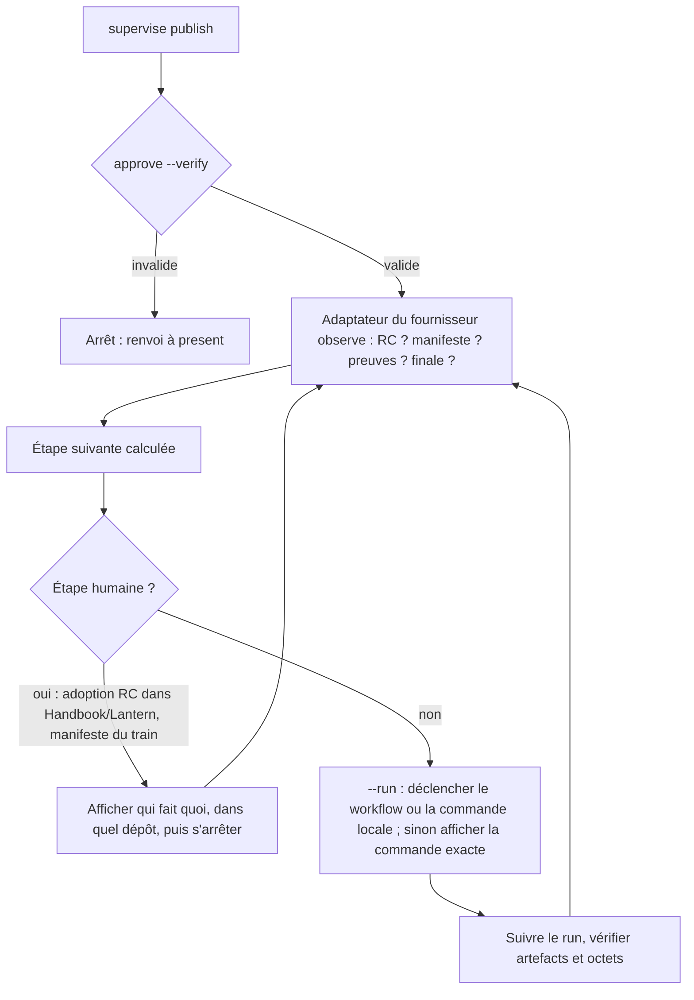
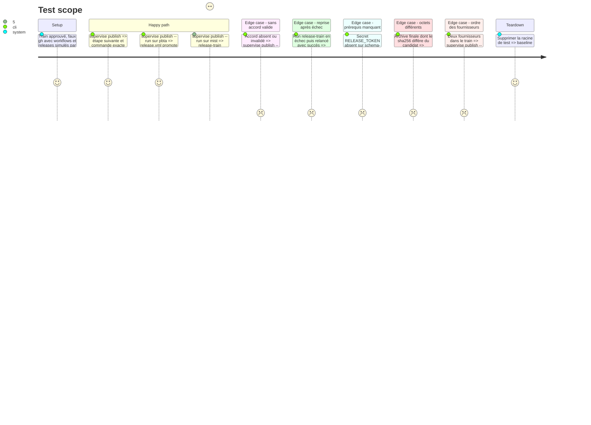

<!-- Fill or omit these sections; never add, rename, or reorder one. -->

# Instruction: Pilotage de la publication par fournisseur

## Architecture projection

> Tree of the final files. ✅ create · ✏️ modify · ❌ delete

```txt
obsidian-handbook/
├── supervisor/
│   └── train.schema.json                ✏️ bloc publication (étapes observées, runs, releases)
└── tools/
    ├── supervise.mjs                    ✏️ sous-commande publish
    └── supervisor/
        ├── publish.mjs                  ✅ boucle observer → étape suivante → exécuter ou afficher
        └── adapters/
            ├── pbta.mjs                 ✅ release.yml digest|stage|promote, release-train.yml
            ├── adrenaline.mjs           ✅ publish-candidate, release-train.yml, release.yml
            └── mist.mjs                 ✅ release-candidate.yml puis stage, assert, promote en local
```

## User Journey



## Test Scope



## Tasks to do

### `1)` Contrat commun des adaptateurs

> Chaque fournisseur expose les mêmes questions, avec ses propres outils.

1. `observe(train)` : RC publiée, manifeste de train commité, preuves des consommateurs, finale publiée ; tout lu depuis GitHub et le dépôt.
2. `nextStep(observation)` : une seule étape, de type `human` (avec dépôt et instruction) ou `automated` (avec commande exacte).
3. `run(step)` : exécute l'étape `automated` et renvoie le run ou le résultat à vérifier.

### `2)` Adaptateurs

> Appeler les outils existants tels qu'ils sont.

1. `pbta`, chemin manifeste uniquement : `release.yml mode=digest` (artefact de workflow, aucune release), commit humain du manifeste, `release.yml mode=stage` (publie la RC, `RELEASE_TOKEN`), adoption par les consommateurs, `release-train.yml` (`provider_commit`, `config`), `release.yml mode=promote` (`RELEASE_TOKEN`). `publish-candidate.yml` n'est pas utilisé : il publie une RC hors manifeste, que le train ne peut pas lier à l'accord.
2. `adrenaline` : `publish-candidate.yml` (`tag`, depuis `main`), `release-train.yml` (`manifest`), `release.yml` (`tag`).
3. `mist` : `release-candidate.yml` (`tag`), puis `npm run release-train:stage|assert|promote` dans le dépôt.
4. Étapes humaines nommées : adoption de l'URL et de l'SRI de la RC dans Handbook et Lantern, commit du manifeste du train côté fournisseur.

### `3)` Boucle de publication

> Avancer uniquement sous accord valide, un pas observable à la fois.

1. Pré-vérification avant tout `--run` : `gh auth status`, présence des secrets requis par le workflow visé (`gh secret list`, par ex. `RELEASE_TOKEN` pour pbta) ; un manque arrête avant tout déclenchement.
2. `approve --verify` avant chaque étape, pas seulement au départ.
3. Sans `--run`, afficher la commande ; avec `--run`, l'exécuter, suivre le run (`gh run watch`) et vérifier sha256 et SRI.
4. Consigner chaque run et chaque release dans le bloc `publication` du dossier, dont le sha256 et l'SRI du candidat dès sa publication ; l'étape suivante reste recalculée depuis l'observation.
5. Un fournisseur à la fois, dans l'ordre des dépendances du dossier.

## Test acceptance criteria

| Task | Acceptance criteria |
| ---- | ------------------- |
| 1 | Pour chaque fournisseur, un même état observé donne toujours la même étape suivante. |
| 2 | Les inputs envoyés aux workflows sont exactement ceux déclarés par les fichiers `.github/workflows/*.yml` du fournisseur. |
| 3 | Sans pré-vérification réussie ou sans accord valide, aucun `gh workflow run` ni commande de promotion n'est lancé ; après un échec, la reprise ne republie pas une RC existante. |
