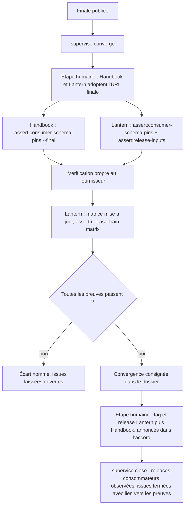
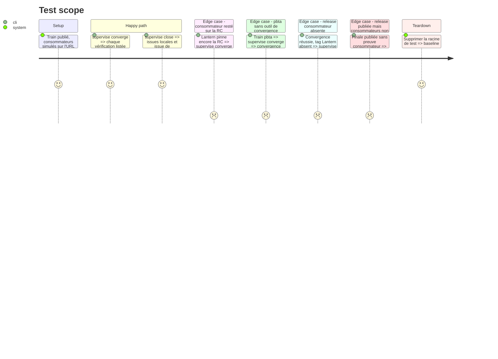

<!-- Fill or omit these sections; never add, rename, or reorder one. -->

# Instruction: Convergence finale, clôture et guide

## Architecture projection

> Tree of the final files. ✅ create · ✏️ modify · ❌ delete

```txt
obsidian-handbook/
├── README.md                            ✏️ section Superviseur (EN), renvoi au guide
├── supervisor/
│   └── train.schema.json                ✏️ bloc convergence (SHA vérifiés, vérifications, date), bloc consumerReleases
├── doc/
│   ├── supervisor.fr.md                 ✅ guide opérateur FR
│   └── supervisor.en.md                 ✅ guide opérateur EN
└── tools/
    ├── supervise.mjs                    ✏️ sous-commandes converge, close
    └── supervisor/
        ├── converge.mjs                 ✅ appelle les vérifications de convergence existantes
        ├── close.mjs                    ✅ ferme les issues sur preuves
        └── adapters/
            ├── pbta.mjs                 ✏️ convergence : pins finaux des consommateurs
            ├── adrenaline.mjs           ✏️ convergence : final-convergence.yml / release-train:verify-final
            └── mist.mjs                 ✏️ convergence : release-train:converge puis validate-completed
```

## User Journey



## Test Scope



## Tasks to do

### `1)` Convergence par fournisseur

> Réutiliser la vérification de convergence de chaque dépôt.

1. `adrenaline` : dossier protocole 2 `release-train/*-final.json`, `final-convergence.yml` ou `npm run release-train:verify-final`.
2. `mist` : `npm run release-train:converge` puis `release-train:validate-completed`.
3. `pbta` : aucun outil propre ; la convergence repose sur les pins finaux vérifiés des deux consommateurs, et le rapport le dit.
4. Communs : Handbook `assert:consumer-schema-pins --final`, Lantern `assert:consumer-schema-pins` et `assert:release-inputs`, puis `assert:release-train-matrix` après mise à jour de `release-train.matrix.json`.

### `2)` Clôture sur preuves

> Ne fermer que ce qui est prouvé.

1. `converge` consigne son résultat dans le bloc `convergence` du dossier (SHA vérifiés par dépôt, vérifications et résultats) ; `close` exige que ce bloc soit réussi et que ses SHA égalent les `origin/main` actuels.
2. `close` exige aussi les releases consommateurs annoncées dans l'accord (Lantern puis Handbook), observées par `gh release view`, consignées dans `consumerReleases` et pointant sur un commit dont les pins sont les URL finales ; `approve --verify` passe encore, les commits de version restant dans les `trainFiles`. Sinon il affiche l'étape humaine à faire et s'arrête.
3. Commentaire de clôture : versions finales, SHA et releases des consommateurs, vérifications passées.
4. L'issue de coordination est fermée en dernier.

### `3)` Guide FR/EN

> Un opérateur sait s'en servir sans lire le code.

1. Cycle complet : `status` → `open` / `link` → `next` → `present` → `approve` → `publish` → `converge` → releases consommateurs → `close`.
2. Ce qui est automatique, ce qui reste humain, et ce qui ne se publie jamais avant accord.
3. Lien avec l'aperçu local de #65 et différences entre les trois fournisseurs.

## Test acceptance criteria

| Task | Acceptance criteria |
| ---- | ------------------- |
| 1 | Un consommateur resté sur une RC fait échouer `converge` en nommant le dépôt et l'URL. |
| 2 | `close` ne ferme aucune issue tant que `converge` n'a pas réussi sur les SHA actuels et que les releases Lantern et Handbook annoncées n'existent pas ; l'issue de coordination est la dernière fermée. |
| 3 | Les guides FR et EN décrivent les mêmes commandes, dans le même ordre. |
