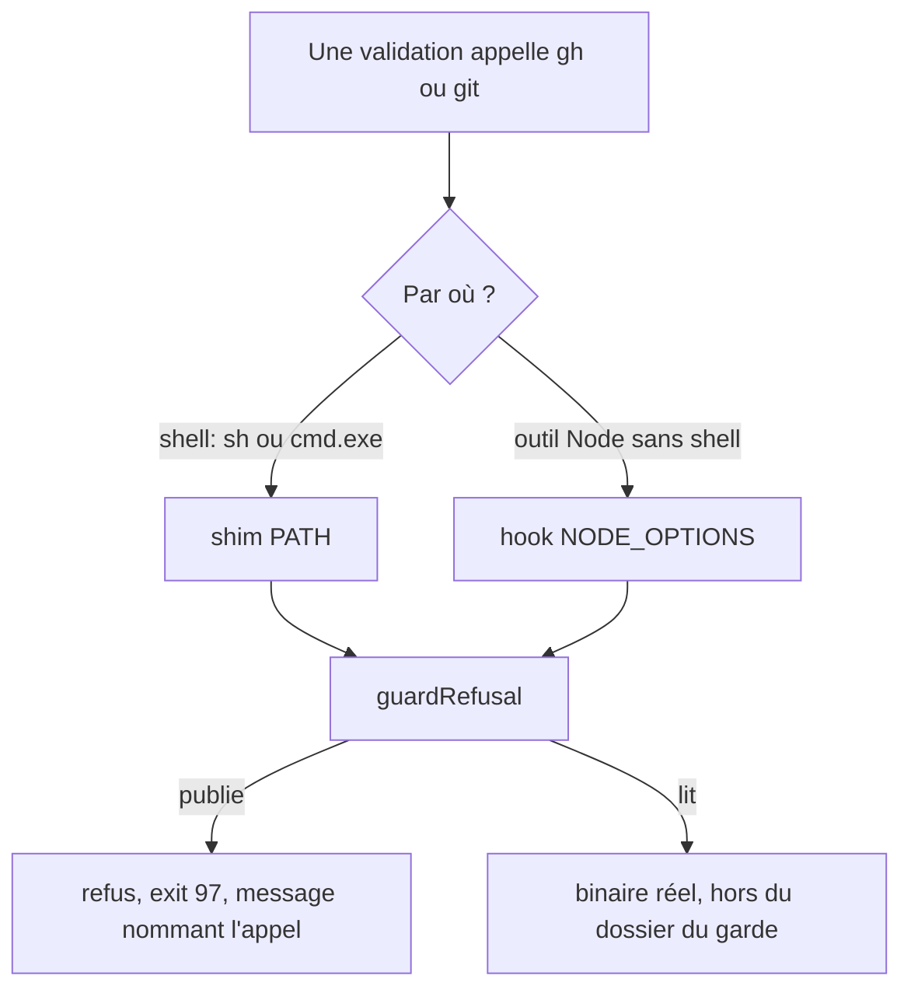
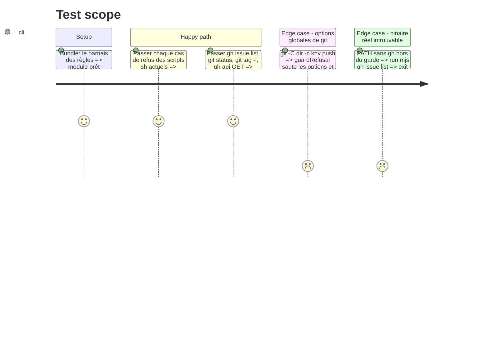

# Instruction: les règles du garde en Node, et deux voies d'interception

## Architecture projection

> Racine : `obsidian-handbook/`. ✅ créer · ✏️ modifier · ❌ supprimer

```txt
tools/supervisor/guard/
├── rules.mjs        ✅ guardRefusal(tool, args) : fonction pure, règles gh et git reprises à l'identique des scripts sh
├── run.mjs          ✅ point d'entrée des shims : applique les règles, résout le binaire réel hors du dossier du garde (PATH + PATHEXT), le lance, échoue fermé
├── hook.cjs         ✅ préchargé par NODE_OPTIONS : enveloppe spawn/spawnSync/execFile/execFileSync/exec/execSync, refuse un appel gh/git publiant avant tout lancement
├── gh               ✏️ shim sh réduit à l'appel de run.mjs par node, échec fermé si node est absent
├── git              ✏️ idem pour git
├── gh.cmd           ✅ shim Windows : node "%~dp0run.mjs" gh %*
└── git.cmd          ✅ idem pour git
tools/supervisorGuard.harness.mts  ✅ table d'arguments → refus ou passage, pour gh et git, sans monde git
tools/assert-supervisor.mjs        ✏️ bundle et lance aussi le harnais des règles, avant les scénarios
.gitattributes                     ✏️ les .cmd du garde en CRLF, les shims sh toujours en LF
```

## User Journey



## Test Scope



## Tasks to do

### `1)` Écrire les règles une seule fois

> Porter les deux scripts sh dans `rules.mjs`, sans rien changer à ce qu'ils refusent.

1. `guardRefusal("gh", args)` refuse `release create|upload|edit|delete`, `workflow run`, `run rerun` et `pr merge`. Il refuse aussi `gh api` dès qu'il porte une méthode autre que GET ou un champ (`-f`, `-F`, `--field`, `--raw-field`, `--input`, formes collées comprises).
2. `guardRefusal("git", args)` cherche la sous-commande après les options globales (`-C`, `-c`, `--git-dir`, `--work-tree`, `--namespace`, `--exec-path`). Il refuse `push`, et `tag` sauf en liste (aucun argument, `-l`/`--list`, options de filtre).
3. Renvoyer `null`, ou le message de refus que les scripts sh émettent déjà.

### `2)` Shims et point d'entrée

> Un appel en shell passe par les règles, sur les deux plateformes.

1. `run.mjs` applique les règles. Sur refus, il écrit le message sur stderr et sort en 97.
2. Résoudre le binaire réel sur un `PATH` d'où le dossier du garde est retiré. Sous Windows, la comparaison est insensible à la casse et suit les extensions de `PATHEXT`. Un `.cmd` réel se lance par `cmd.exe /d /s /c`, un exécutable directement. Le stdio est hérité et le code de sortie propagé.
3. Réduire `gh` et `git` en sh à l'appel de `run.mjs`. Ajouter `gh.cmd` et `git.cmd`.
4. Dans `.gitattributes`, ajouter `tools/supervisor/guard/*.cmd text eol=crlf` et conserver la règle LF des autres fichiers.

### `3)` Hook `child_process`

> Un outil Node qui lance `gh` ou `git` sans shell est gardé, même sous Windows.

1. `hook.cjs` enveloppe les six fonctions de `child_process`. Le nom de commande est ramené à son nom de base, sans extension (`gh`, `gh.exe`, `C:\…\git.exe`). Pour `exec`, `execSync` et `shell: true`, la ligne est découpée sur les blancs, guillemets respectés.
2. Sur refus, aucun processus réel n'est lancé :
   - `spawnSync`, `execFileSync` et `execSync` lèvent une erreur au statut 97 ;
   - `spawn`, `execFile` et `exec` rendent un enfant qui sort en 97, avec le message sur stderr.
3. `hook.cjs` doit charger `rules.mjs` depuis du CJS. Deux voies, à trancher à l'exécution en visant le Node 20 de la CI :
   - un `require` du module ESM, admis par Node ≥ 20.19 et ≥ 22.12 ;
   - sinon, un `rules.cjs` qui porte les règles, et que `rules.mjs` réexporte.

### `4)` Harnais des règles

> Les règles se prouvent par une table, pas par un monde de test.

1. `tools/supervisorGuard.harness.mts` couvre chaque cas actuel de refus et de passage, plus les formes collées (`-XPOST`, `--method=GET`, `-fkey=v`).
2. Mutation : vider une règle (par exemple `push`) doit faire échouer le harnais en nommant le cas. À vérifier une fois à la main, sans commiter la mutation.

## Test acceptance criteria

| Task | Acceptance criteria |
| ---- | ------------------- |
| 1 | Chaque appel que refusaient les scripts sh est refusé par `guardRefusal`, avec le même message. Chaque appel qu'ils laissaient passer passe encore. |
| 2 | Sous Windows comme sous POSIX, `gh release create`, lancé par un shell avec le garde en tête du `PATH`, sort en 97 sans atteindre le vrai `gh`. `gh issue list`, lui, l'atteint. Sans `node` ou sans `gh` réel, l'appel échoue au lieu de passer. |
| 3 | Un processus Node lancé avec le hook, qui appelle `spawnSync("gh", ["workflow", "run", "x"])`, reçoit un statut 97, et le vrai `gh` ne reçoit aucun appel. `spawnSync("git", ["status"])` passe. |
| 4 | Le harnais des règles passe. Retirer une règle le fait échouer, en nommant l'appel concerné. |

## Écarts constatés à l'exécution

- **`rules.cjs`, pas de `rules.mjs`.** Le point ouvert ESM/CJS est tranché pour CJS, sans réexport ESM, car aucun consommateur ne l'exige. `run.mjs` le charge par `createRequire`, le harnais par import. `require(esm)` n'est donc jamais requis, quel que soit le Node 20 de la CI.
- **`tools/supervisor/spawn.mjs` arrive dès cette phase**, alors que le plan le prévoyait en phase 2 : `run.mjs` en a besoin pour résoudre et lancer le binaire réel. On y trouve `pathKey`, `findExecutable` (PATHEXT et exclusion du garde), `withRequire` et `spawnCommand`. L'échappement de `cmd.exe` suit cross-spawn (`^` devant les méta-caractères, doublé pour les shims `node_modules\.bin`) plutôt que le simple « `"` doublé » prévu.
- **`NODE_OPTIONS` se lit avec des échappements.** Un chemin Windows entre guillemets y perd ses `\`. `withRequire` échappe donc `\` et `"`, et le harnais le vérifie à côté d'une option préexistante (`--max-old-space-size`).
- **Le hook couvre aussi les shells explicites** (`cmd /c|/k`, `sh|bash|dash|zsh -c`) et les lignes composées (`&`, `|`, `;`, parenthèses). Sur un refus, l'appel est réécrit en `node -e` qui sort en 97 : `spawnSync` rend un statut 97, `execSync` et `execFileSync` lèvent une erreur de statut 97, `spawn`, `exec` et `execFile` rendent un enfant qui sort en 97.
- **Les sondes du harnais passent par des fichiers.** Sur ce poste, la protection antivirale refuse en `EPERM` un `node -e` dont la ligne contient à la fois `exec(` et `spawn(`.
- **La preuve de passage est intégrée au harnais, pour chaque voie.** Chaque voie est rejouée sans garde, pour montrer que le faux `gh` était bien atteignable. La mutation manuelle (règle `push` vidée) fait échouer « guard rules » avec `guardRefusal must refuse: git push`, et « PATH shims ». Elle n'a pas été commitée.
- Vérifié sous Windows natif (Node 23.4) et sous WSL Ubuntu (Node 24.15). `pnpm build` et les deux portées de lint sont vertes.
