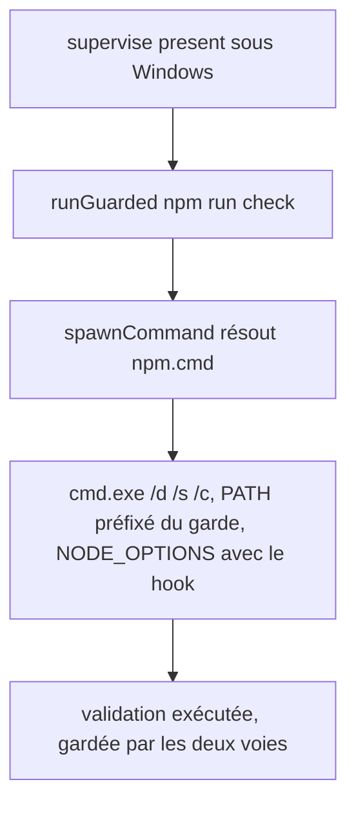
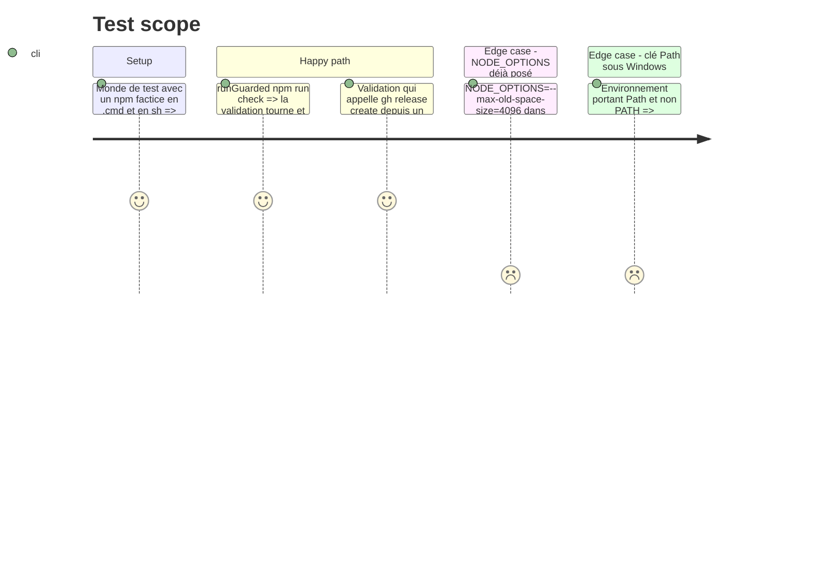

# Instruction: lancer les commandes locales de façon portable

## Architecture projection

> Racine : `obsidian-handbook/`. ✅ créer · ✏️ modifier · ❌ supprimer

```txt
tools/supervisor/
├── spawn.mjs     ✅ spawnCommand(command, args, options). Sous Windows, résout PATH + PATHEXT, lance un .exe tel quel et un .cmd/.bat par cmd.exe /d /s /c avec des arguments cités. Ailleurs, spawnSync inchangé.
├── present.mjs   ✏️ runGuarded passe par spawnCommand, pose le garde sur la clé PATH existante (Path sous Windows) et ajoute --require hook.cjs à NODE_OPTIONS
├── publish.mjs   ✏️ runLocal passe par spawnCommand (npm run … échoue aujourd'hui en ENOENT sous Windows)
└── git.mjs       ✏️ SUPERVISOR_GIT remplace le binaire, comme SUPERVISOR_GH (une valeur en .mjs est lancée par node)
```

## User Journey



## Test Scope



## Tasks to do

### `1)` `spawnCommand`

> Une commande de la topologie (`npm`, `pnpm`, `node`) se lance sous Windows comme sous POSIX.

1. Sous Windows, résoudre le nom sur le `PATH` avec `PATHEXT`. Un chemin absolu ou relatif est pris tel quel.
2. Un `.cmd` ou un `.bat` se lance par `spawnSync("cmd.exe", ["/d", "/s", "/c", ligne citée], { windowsVerbatimArguments: true })`. Chaque argument est cité à la manière de cmd : `"` doublé, `%` et `^` neutralisés.
3. Une commande introuvable rend un statut 127 et un message qui la nomme, sans exception ni `ENOENT` brut.

### `2)` `runGuarded` et `runLocal`

> Les validations et les étapes locales de publication tournent sous Windows.

1. `runGuarded` retrouve la clé existante du `PATH` (insensible à la casse) et la préfixe par `GUARD_DIR`, sans créer de doublon.
2. Il ajoute `--require "<hook.cjs>"` à `NODE_OPTIONS`, en conservant ce qui s'y trouve déjà.
3. `runLocal` (publish) passe par `spawnCommand`, avec le stdio hérité. Il reste sans garde, comme aujourd'hui : `publish` est justement l'étape qui publie, sous accord.

### `3)` `SUPERVISOR_GIT`

> Le harnais peut observer git sous Windows.

1. `git.mjs` lit `SUPERVISOR_GIT` comme `gh.mjs` lit `SUPERVISOR_GH`. Sans la variable, le comportement ne change pas.

## Test acceptance criteria

| Task | Acceptance criteria |
| ---- | ------------------- |
| 1 | Sous Windows, `npm run check` et `pnpm check`, lancés par le superviseur, s'exécutent et rendent leur vrai statut. Une commande absente est rapportée par son nom, avec le statut 127. |
| 2 | Lantern `npm run check` passe dans `supervise present` sous Windows natif. Un `NODE_OPTIONS` préexistant survit. L'enfant ne voit qu'une seule clé `PATH`, avec le garde en tête. |
| 3 | Avec `SUPERVISOR_GIT` pointé sur un faux `git` en `.mjs`, chaque commande git du superviseur y passe. Sans la variable, le vrai `git` est appelé comme avant. |
