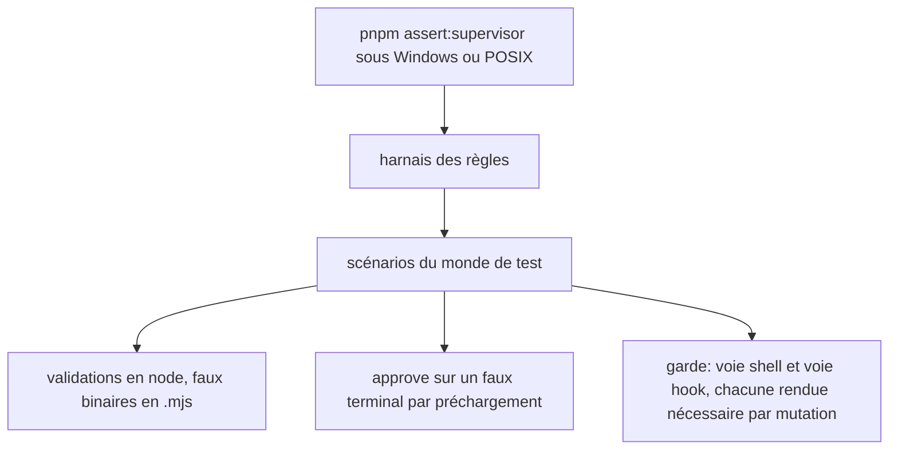
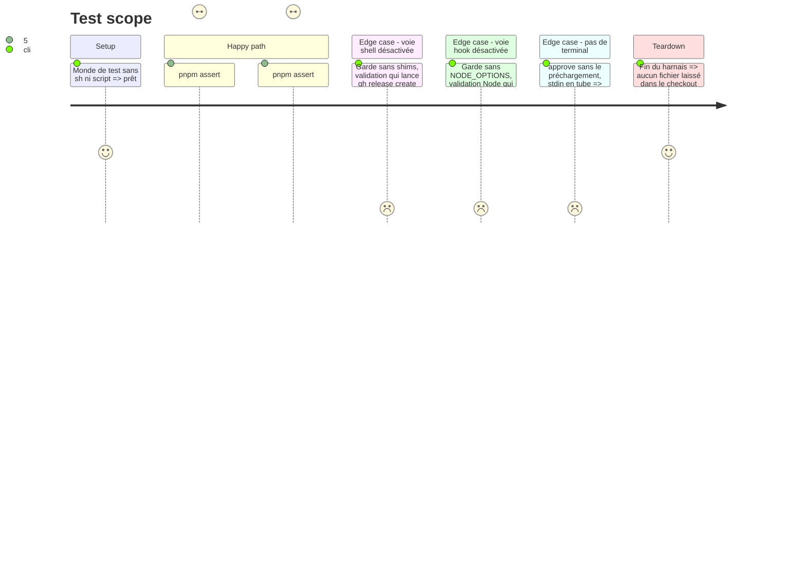

# Instruction: un harnais qui tourne sans `sh` ni `script`

## Architecture projection

> Racine : `obsidian-handbook/`. ✅ créer · ✏️ modifier · ❌ supprimer

```txt
tools/fixtures/supervisor/
├── world.mts        ✏️ faux git et npm écrits en .mjs, lancés par SUPERVISOR_GIT et par un shim sh + .cmd dans bin/ ; git réel trouvé sans « sh -c command -v » ; PATH posé sur la clé existante
├── fake-git.mjs     ✅ journalise l'appel puis délègue au git réel (remplace le script sh écrit à la volée)
├── fake-tty.cjs     ✅ préchargement de test : process.stdin.isTTY = true, rien d'autre
└── fake-gh.mjs      (inchangé, déjà en Node)
tools/supervisor.harness.mts  ✏️ validations factices en node -e au lieu de sh -c ; superviseTty lance node --require fake-tty.cjs au lieu de script -qec ; scénario du garde étendu aux deux voies, avec preuve par mutation
```

## User Journey



## Test Scope



## Tasks to do

### `1)` Faux binaires portables

> Le monde de test ne fabrique plus aucun script sh.

1. `fake-git.mjs` journalise dans `gitLog`, puis délègue au git réel trouvé par une recherche Node sur le `PATH`.
2. `world.env()` pose `SUPERVISOR_GIT`, et place `bin/` en tête de la clé `PATH` existante. `bin/` porte, pour `git` et `npm`, un shim sh et un shim `.cmd` qui lancent le `.mjs`. Les validations qui appellent `git` ou `npm` en shell y passent aussi.
3. Le faux « vrai gh » du scénario du garde est écrit en `.mjs`, avec ses deux shims.

### `2)` Validations et terminal

> Aucun scénario ne dépend de `sh` ou de util-linux.

1. `PASS` et `FAIL` deviennent `[process.execPath, "-e", …]`.
2. `superviseTty` lance `node --require fake-tty.cjs supervise.mjs …`, la réponse passée sur stdin.
3. Nouveau scénario : sans le préchargement, `approve` refuse (stdin en tube) et n'écrit aucun accord. L'invariant de production est ainsi prouvé, et plus seulement contourné.

### `3)` Le garde, prouvé sur ses deux voies

> Chaque voie est nécessaire, et le scénario le montre.

1. La validation piégée est un script Node. Il tente chaque appel publiant deux fois : une fois par un shell (`cmd.exe` ou `sh` selon la plateforme), une fois par `spawnSync` direct. Il tente ensuite les appels de lecture.
2. Affirmer que le vrai `gh` n'a vu que les lectures, que le remote n'a pas bougé et que `gitLog` ne contient ni `push` ni `tag v9`.
3. Mutation intégrée : rejouer la validation sans les shims, puis sans `NODE_OPTIONS`, et affirmer que chaque fois au moins un appel publiant atteint le vrai `gh`. Une voie devenue inutile ferait échouer le harnais.

## Test acceptance criteria

| Task | Acceptance criteria |
| ---- | ------------------- |
| 1 | `pnpm assert:supervisor` passe sous PowerShell et sous Git Bash sur ce poste, et sous WSL ou Linux. `gitLog` enregistre les commandes du superviseur sur les deux plateformes. |
| 2 | Aucun scénario n'appelle `sh` ni `script`. `approve` aboutit sur le faux terminal, et il est refusé sans lui. |
| 3 | Les appels publiants n'atteignent jamais le vrai `gh` ou `git` quand les deux voies sont en place. Sans l'une ou l'autre, le harnais montre la fuite, sur les deux plateformes. |
