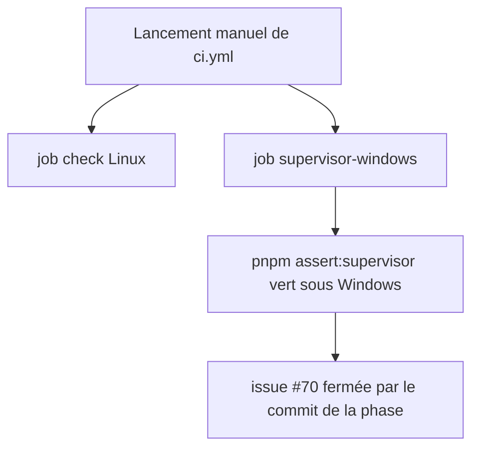
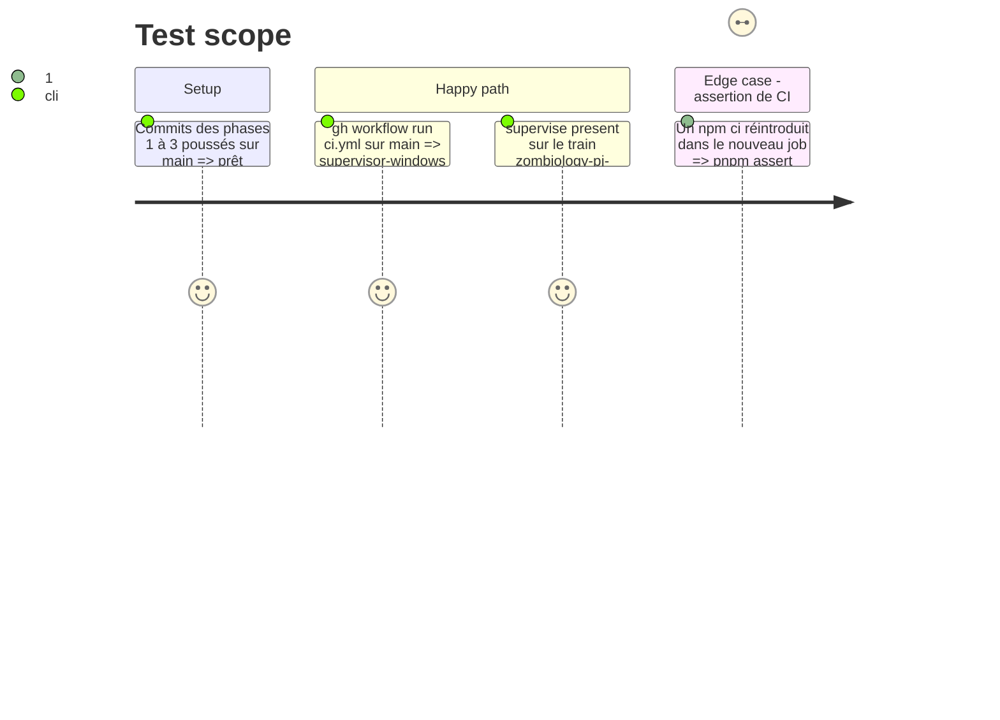

# Instruction: CI Windows, doc et mémoire

## Architecture projection

> Racine : `obsidian-handbook/`. ✅ créer · ✏️ modifier · ❌ supprimer

```txt
.github/workflows/ci.yml   ✏️ job supervisor-windows (windows-latest, Node 20) : pnpm install --frozen-lockfile puis pnpm assert:supervisor
doc/supervisor.fr.md       ✏️ prérequis : plus de shell POSIX exigé ; le garde et ses deux voies décrits ; paragraphe « Checkout Windows » mis à jour (LF pour sh, CRLF pour .cmd)
doc/supervisor.en.md       ✏️ idem en anglais
CLAUDE.md                  ✏️ section « Superviseur » : la recette WSL et les pièges du garde sous Windows remplacés par l'état mesuré
aidd_docs/tasks/2026_09/2026_09_29_zombiology-pj-design/phase-5.md  ✏️ « supervise present sous WSL » et « converge sous WSL » deviennent natifs
```

## User Journey



## Test Scope



## Tasks to do

### `1)` Job CI Windows

> La preuve Windows tourne ailleurs que sur ce poste.

1. Ajouter le job `supervisor-windows`, sur le modèle d'installation des autres jobs (`pnpm/action-setup@v4` avec `package_json_file`, `setup-node` Node 20, `--frozen-lockfile`).
2. Vérifier que `pnpm assert:ci-install` accepte le job.
3. La CI reste en `workflow_dispatch`. La lancer une fois (action autonome, sans publication).

### `2)` Doc et mémoire

> Plus rien n'affirme que Windows natif est sans garde.

1. `doc/supervisor.{fr,en}.md` : prérequis, deux voies d'interception, échec fermé, fins de ligne.
2. `CLAUDE.md` : retirer la recette WSL et le piège « le garde ne s'interpose pas sous Windows natif ». Garder le piège LF des shims sh, et ajouter celui du CRLF des `.cmd`.
3. `phase-5.md` du train Zombiology : `present` et `converge` se lancent en natif.

### `3)` Répétition réelle

> Le cas qui a motivé #70 est rejoué.

1. `pnpm supervise present` sous PowerShell, sur le train `zombiology-pj-design`, sans `approve` : Lantern `npm run check` tourne, et le rapport ne signale aucune validation non gardée.
2. Le commit de la phase ferme #70.

## Test acceptance criteria

| Task | Acceptance criteria |
| ---- | ------------------- |
| 1 | Un run de `ci.yml` sur `main` montre `supervisor-windows` vert. `pnpm assert:ci-install` passe. |
| 2 | Ni la doc ni `CLAUDE.md` ne disent plus que le superviseur exige un shell POSIX ou WSL, et le piège des fins de ligne couvre les deux sortes de shims. |
| 3 | `supervise present` produit un rapport complet sous Windows natif, avec les validations des cinq dépôts exécutées. Aucun accord n'est enregistré sans `approve` tapé par l'utilisateur. |
