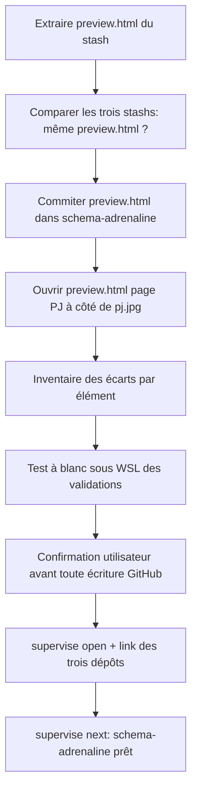
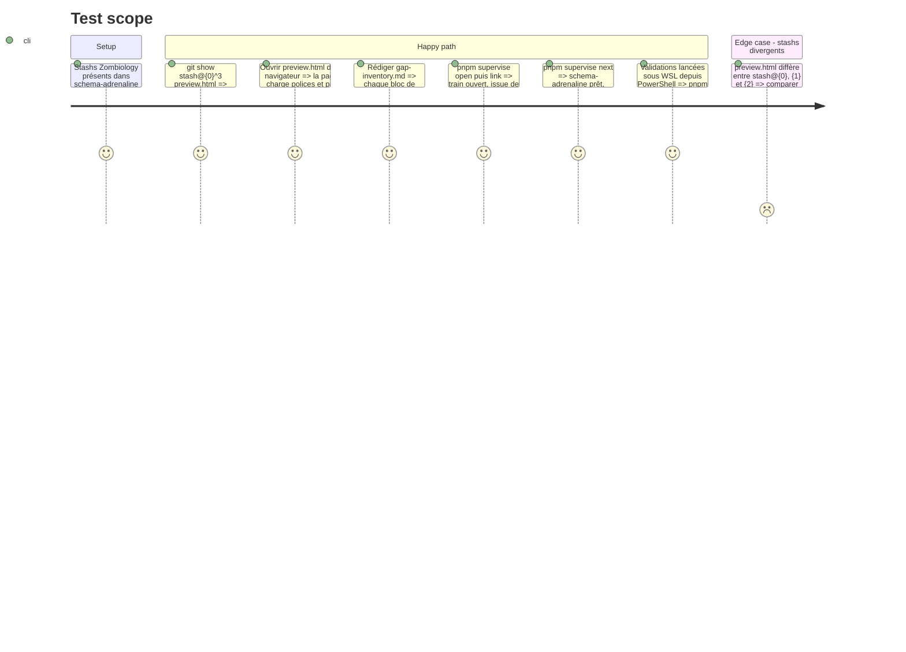

# Instruction: Récupérer la maquette HTML, inventorier les écarts, ouvrir le train

## Architecture projection

> Racine : le parent `obsidian/`. ✅ créer · ✏️ modifier. Aucune suppression dans cette phase.

```txt
schema-adrenaline/
└── aidd_docs/tasks/2026_09/2026_09_24_contrat-presentation-fiches/
    └── preview.html                                  ✅ restauré depuis stash@{0}^3, commité tel quel
obsidian-handbook/
├── aidd_docs/tasks/2026_09/2026_09_29_zombiology-pj-design/
│   └── gap-inventory.md                              ✅ table élément de pj.jpg → HTML → schéma → Handbook → Lantern
└── supervisor/trains/zombiology-pj-design.json       ✅ écrit par `pnpm supervise open`
```

## User Journey



## Test Scope



## Tasks to do

### `1)` Restaurer la maquette HTML

> Sortir `preview.html` des stashs et le rendre durable.

1. `git show stash@{0}^3:aidd_docs/tasks/2026_09/2026_09_24_contrat-presentation-fiches/preview.html`, puis la même commande sur `stash@{1}^3` et `stash@{2}^3` ; diff des trois.
2. Écrire la version retenue à son chemin d'origine dans `schema-adrenaline` et vérifier que ses chemins relatifs vers `handbook/adrenaline/assets/` résolvent.
3. Commit dans `schema-adrenaline` à la demande de l'utilisateur (message en anglais, référence de conception, contenu inchangé).

### `2)` Inventorier les écarts

> Savoir exactement ce qui manque, et où, avant d'écrire du code.

1. Pour chaque élément visuel de `pj.jpg` (cartouche à trois cases : nom, marque ☣, paramètres + PX ; bandeaux de section ; grille de compétences en trois colonnes avec % ; identité en deux colonnes à lignes pointillées ; lignes de caractéristiques Création/Actuel ; équipement ; dés de stress Adrénaline/Panique ; seuils avec +Armure/+Caractère ; malus : libellé vertical, cercles de fatigue, Froid/Faim, Vie 1-10 ; cartes d'état Blessé/Malade/Traumatisé/Répulsion avec Heure/Jour/Semaine/Mois ; fond de page), noter :
   - sa règle dans `preview.html` ;
   - ce que v2.6.0 publie (forme dans `src/presentation.ts`, jeton dans `handbook/adrenaline/pack.json`) ;
   - ce que Handbook rend (`src/features/adrenalinePj/renderer.ts`, `src/styles/adrenaline/_pj.scss`) ;
   - ce que Lantern rend (`src/templates/adrenaline/pj/preview/PjPreview.tsx`, `shared/preview/*`).
2. Classer chaque manque : **schéma** (jeton absent, ou jeton existant réutilisable), **Handbook**, **Lantern**. Un manque qui exigerait un **type** nouveau (forme, champ) est signalé à l'utilisateur au lieu d'être classé : v2.6.0 publie déjà les seize formes du PJ.
3. Consigner les désaccords HTML ↔ `pj.jpg` et leur arbitrage (règle : `pj.jpg` gagne ; cas connu : l'encre manuscrite).
4. Écrire `gap-inventory.md`.

### `3)` Tester à blanc l'exécution sous WSL

> Savoir dès maintenant si `present` pourra lancer les validations des trois dépôts.

1. Depuis PowerShell, lancer sous WSL `pnpm supervise status` puis, un par un, les validations que la topologie attribue à chaque dépôt (`pnpm check`, `npm run check`), sur les checkouts actuels.
2. Si un binaire win32 (esbuild ou autre) casse l'exécution, noter la parade (installation propre à WSL, par exemple un checkout séparé), la tester, et l'ajouter à `gap-inventory.md` ainsi qu'au pas 1 de la phase 5.
3. Vérifier que `tools/supervisor/guard/{gh,git}` sont en LF (`git ls-files --eol`).

### `4)` Ouvrir le train

> Donner au superviseur l'état du travail. Toute création d'issue GitHub attend l'accord explicite de l'utilisateur.

1. `pnpm supervise status`.
2. Montrer à l'utilisateur les titres et le contenu des issues prévues, puis attendre son accord.
3. `pnpm supervise open zombiology-pj-design --title "Zombiology PJ sheet matches its design mockup"`.
4. `pnpm supervise link schema-adrenaline --create --title "..."`, puis `link obsidian-handbook … --depends-on schema-adrenaline` et `link lantern … --depends-on schema-adrenaline`. Chaque corps d'issue reprend la partie de `gap-inventory.md` propre au dépôt.
5. `pnpm supervise sync`, puis `pnpm supervise next`.

## Test acceptance criteria

| Task | Acceptance criteria |
| ---- | ------------------- |
| 1 | `preview.html` est suivi par git sur `main` dans `schema-adrenaline`. Ouvert dans un navigateur, sa page PJ s'affiche avec ses polices et son fond. |
| 2 | Chaque élément de `pj.jpg` a une ligne dans `gap-inventory.md`, avec un statut pour chacun des trois dépôts. Chaque manque est attribué à un dépôt. |
| 3 | Chaque validation de la topologie tourne sous WSL, telle quelle ou avec une parade écrite et vérifiée. Le garde est en LF. |
| 4 | `pnpm supervise next` rapporte `schema-adrenaline` prêt, Handbook et Lantern bloqués par lui, et l'issue de coordination liste les trois issues. |
