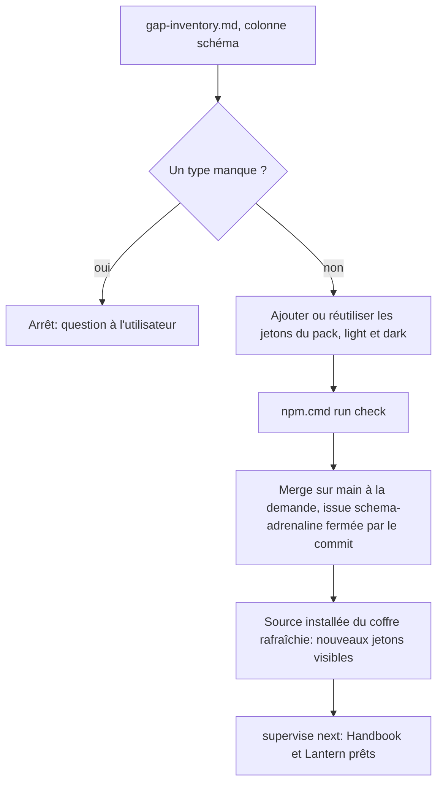
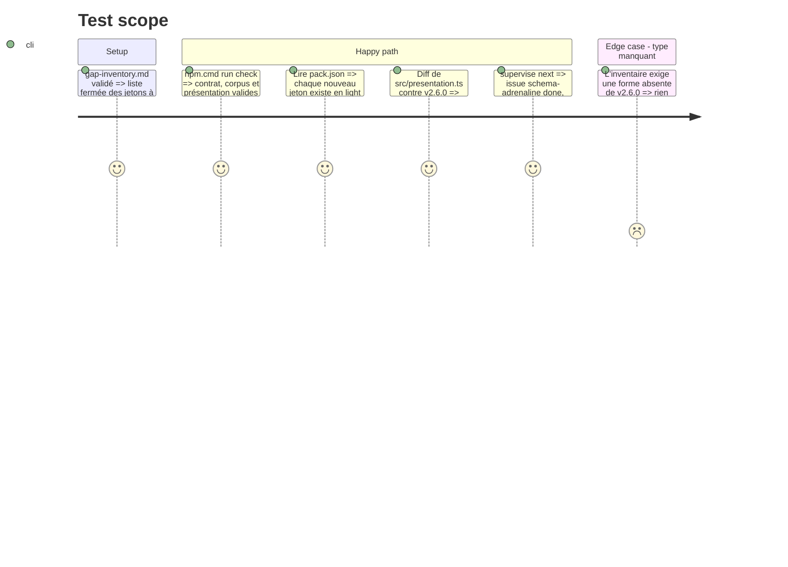

# Instruction: Compléter les jetons de schema-adrenaline, fusionnés sans publication

## Architecture projection

> Racine : `schema-adrenaline/`. ✏️ modifier. **Aucune publication dans cette phase** : ni candidat, ni tag, ni dispatch, tant que l'accord n'est pas donné (phase 5). **Aucun nouveau type** dans `src/presentation.ts`.

```txt
schema-adrenaline/
├── handbook/adrenaline/pack.json     ✏️ jetons manquants de gap-inventory.md, couches light et dark ; version du pack montée
├── handbook.json                     ✏️ version du pack, égale à celle de pack.json
├── src/presentation.ts               ✏️ seulement si besoin : nouvelles entrées dans appearance.tokens, valeurs d'un type existant — jamais un membre d'union ni un champ nouveau
├── CHANGELOG.md                      ✏️ entrée « Unreleased » décrivant les jetons ajoutés
└── package.json                      ✏️ version montée (2.7.0 attendu), pour que le candidat de la phase 5 porte déjà la bonne version
```

## User Journey



## Test Scope



## Tasks to do

### `1)` Compléter les jetons du pack

> Chaque couleur du design devient un jeton nommé, existant ou nouveau.

1. Pour chaque couleur de `gap-inventory.md`, réutiliser un jeton existant si l'écart ne se voit pas ; sinon ajouter un jeton dans `handbook/adrenaline/pack.json`, couches `light` et `dark`.
2. Garder `--adrenaline-handwritten-ink` en bleu, d'après `pj.jpg`.
3. Si `appearance.tokens` doit référencer un nouveau jeton, l'ajouter comme valeur, sans changer le type.
4. Monter la version du pack de `0.5.0` à `0.6.0`, dans `pack.json` et dans `handbook.json` ensemble (l'égalité est vérifiée par `validate-versioning.ts`).

### `2)` Prouver et fusionner, sans publier

> Les jetons sont sur `main`, donc visibles des harnais consommateurs et du coffre ; rien n'est publié.

1. `npm.cmd run check`. Sous le Bash tool, `npm` échoue : passer par `npm.cmd` ou PowerShell.
2. Monter `package.json` → `version` en `2.7.0` et écrire l'entrée `CHANGELOG.md`. **Ne pas** toucher `ADRENALINE_SCHEMA_VERSION` ni ses quatre emplacements (`schema-adrenaline/CLAUDE.md`) : c'est la version du contrat, et des jetons ne la changent pas ; `exports` et `files` gardent leur chemin `schemas/adrenaline/<contrat>/`.
3. Commit et merge sur `main` à la demande de l'utilisateur ; le commit ferme l'issue du dépôt.
4. `pnpm supervise next` (depuis Handbook).

## Test acceptance criteria

| Task | Acceptance criteria |
| ---- | ------------------- |
| 1 | Chaque couleur du design PJ correspond à un jeton du pack en `light` et en `dark`. `handbook.json` et `pack.json` portent la même version. `src/presentation.ts` n'a aucun type nouveau, et `ADRENALINE_SCHEMA_VERSION` est inchangé. |
| 2 | Les jetons sont sur `origin/main`. Aucune release, aucun tag ni aucun dispatch n'a eu lieu. `next` rapporte `schema-adrenaline` done. |
