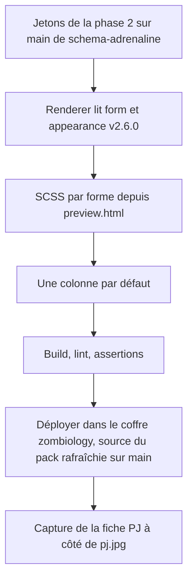
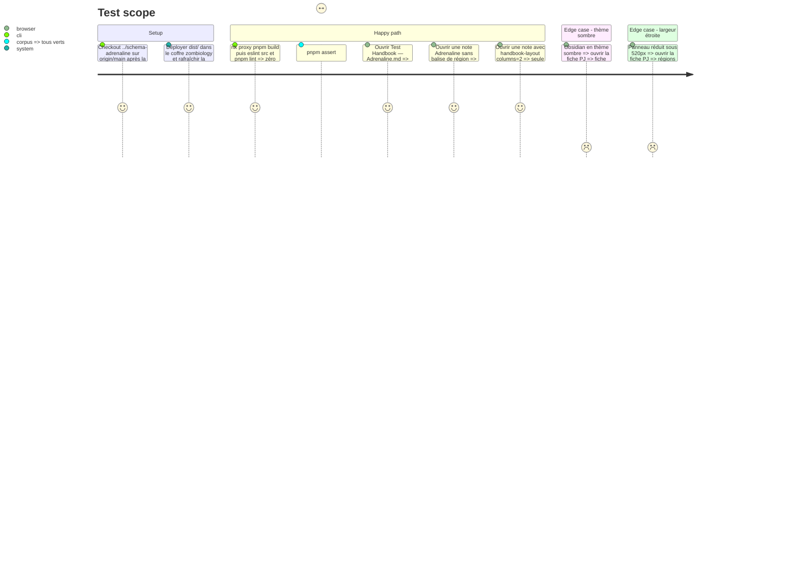

# Instruction: Handbook — rendre la fiche PJ depuis la présentation v2.6.0, une colonne par défaut

## Architecture projection

> Racine : `obsidian-handbook/`. ✅ créer · ✏️ modifier. Travail sur `main` (règle `.codex/rules/00-architecture/0-main-only-execution.md`). L'épingle reste **v2.6.0** : le candidat n'existe qu'après l'accord (phase 5). Commits à la demande de l'utilisateur.

```txt
obsidian-handbook/
├── src/features/adrenalinePj/renderer.ts               ✏️ rendu piloté par form/layout/appearance au lieu du switch(block.id) ; nouvelles formes
├── src/features/adrenalinePj/shape.ts                  ✏️ si de nouvelles zones apparaissent
├── src/styles/adrenaline/_pj.scss                      ✏️ design de preview.html transposé par forme, jetons uniquement
├── src/styles/adrenaline/_page.scss                    ✏️ suppression des deux colonnes par défaut (l.148-180) et de l'échappatoire adrenaline-one-column
├── tools/assertAdrenalineZombiologyStyle.harness.mts   ✏️ attentes du nouveau _pj.scss
├── tools/assertAdrenalineTheme.harness.mts             ✏️ l.126-133 : une colonne par défaut, plus de :not(.adrenaline-one-column)
├── tools/assertAdrenalineContract.harness.mts          ✏️ classes attendues pour les nouvelles formes
└── tools/fixtures/adrenaline-visual.md                 ✏️ note PJ + une région multi-colonnes balisée
```

## User Journey



## Test Scope



## Tasks to do

### `1)` Partir du bon état

> Le code se fusionne contre v2.6.0 ; les jetons viennent de la source.

1. Vérifier que `node_modules/schema-adrenaline` est en v2.6.0 et que `../schema-adrenaline` est sur `origin/main`, jetons de la phase 2 inclus.
2. N'importer depuis `schema-adrenaline` que des types et valeurs présents en v2.6.0.

### `2)` Rendre par forme

> Le renderer suit la présentation publiée, pas l'identifiant du bloc.

1. Remplacer le `switch(block.id)` de `renderer.ts` par une distribution sur `block.form` et `section.layout`, en gardant un rendu dégradé pour une forme inconnue (constat journalisé une fois).
2. Implémenter les formes nouvelles et existantes nécessaires au PJ.
3. Appliquer `appearance` (alignement et police des titres de section et des valeurs) par classes ou variables, sans valeur en dur.

### `3)` Transposer le design

> `_pj.scss` reproduit `preview.html`, arbitré par `pj.jpg`.

1. Porter les règles de `preview.html`, forme par forme, dans `_pj.scss` ; couleurs par jetons uniquement ; fond `paper-grain` par `var(--brumes-image-…)`.
2. Reprendre les règles tablette et mobile en container queries.

### `4)` Une colonne par défaut

> Le multi-colonnes ne vient que des régions balisées.

1. Supprimer de `_page.scss` le bloc `@media (min-width: 900px)` qui pose `column-count: 2` et ses `column-span`, ainsi que la règle d'impression qui n'existe que pour lui.
2. Vérifier que `_layout-regions.scss` suffit pour `<!-- handbook-layout: columns=N -->`.
3. Mettre à jour `assertAdrenalineTheme` et la fixture visuelle.
4. Mode édition (constaté le 2026-09-29) : retirer le contour rouge autour de la zone éditable (`_page.scss:35-39`, `:focus-visible` qui touche `.cm-content`) et rendre lisibles les en-têtes de tableau blancs sur fond clair (`_content.scss:51`).

### `5)` Vérifier dans le coffre

> Preuve visuelle pour la présentation de la phase 5.

1. Déployer `dist/` dans `C:/Users/fxgui/Documents/Perso/RPG/zombiology/.obsidian/plugins/obsidian-handbook/` sans écraser `data.json`.
2. Rafraîchir la source installée `rebellioussmile--schema-adrenaline` (elle suit `main`) pour que le coffre voie les jetons de la phase 2 ; vérifier dans l'onglet de réglages la version du pack chargée.
3. Capturer la fiche PJ en clair et en sombre, puis une note avec une région, pour le dossier de présentation.
4. Commit et merge sur `main` à la demande de l'utilisateur ; le commit ferme l'issue Handbook du train.

## Test acceptance criteria

| Task | Acceptance criteria |
| ---- | ------------------- |
| 1 | `rtk proxy pnpm build` passe avec l'épingle v2.6.0, et aucun import ne vise un type absent de v2.6.0. |
| 2 | Chaque forme du PJ produit son balisage, et une forme inconnue se rend dégradée sans exception. |
| 3 | La fiche PJ dans Obsidian est fidèle à l'œil à `pj.jpg` : cartouche, bandeaux, grilles, dés de stress, malus, cartes d'état, fond. |
| 4 | Une note Adrenaline sans balise s'affiche sur une colonne, et une région balisée garde son nombre de colonnes. |
| 5 | Le coffre charge le pack `0.6.0`, celui de la phase 2. Des captures claires et sombres de la fiche PJ existent, prêtes à être comparées côte à côte avec `pj.jpg`. |
