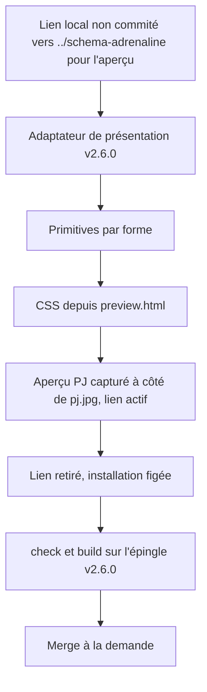
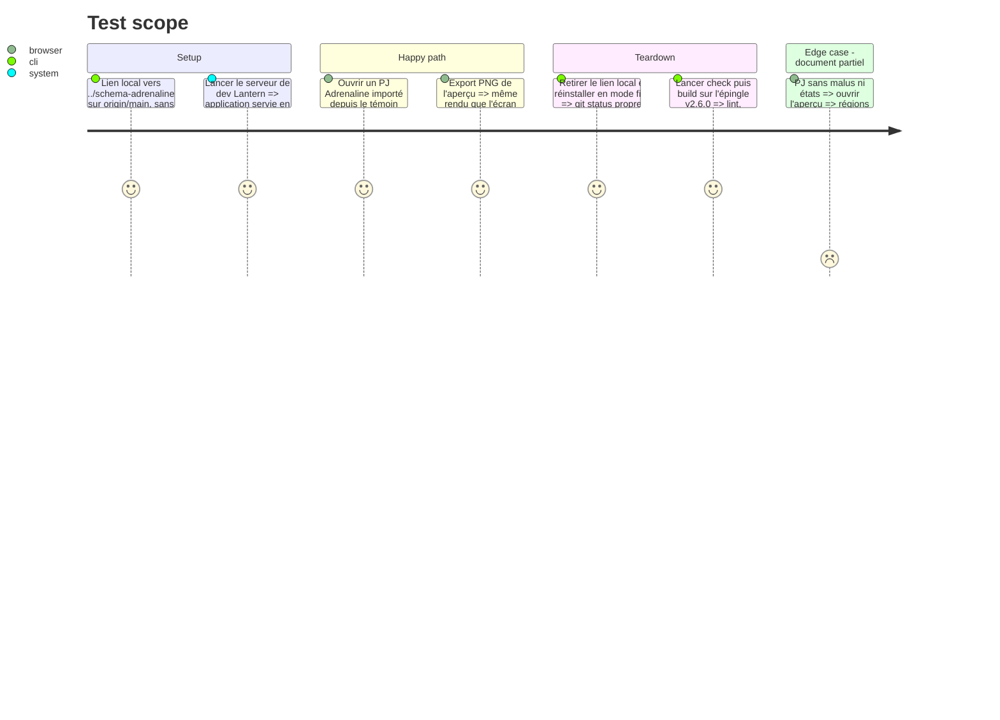

# Instruction: Lantern — rendre la fiche PJ depuis la présentation v2.6.0

## Architecture projection

> Racine : `lantern/`. ✅ créer · ✏️ modifier. Suivre `lantern/CLAUDE.md`. Sa mémoire `aidd_docs/memory/project-brief.md:24-27` et `database.md:46` est périmée : ne pas s'y fier. L'épingle reste **v2.6.0** jusqu'à l'accord (phase 5) ; aucun lockfile n'est modifié ici. Commits à la demande de l'utilisateur.

```txt
lantern/
├── src/templates/adrenaline/pj/preview/PjPreview.tsx        ✏️ sections, libellés et ordre lus depuis PJ_PRESENTATION
├── src/templates/adrenaline/shared/preview/SheetPrimitives.tsx ✏️ primitives par forme (cartouche, grilles, dés de stress, malus, cartes d'état)
├── src/templates/adrenaline/shared/preview/adrenalineTheme.css ✏️ jetons alignés sur ceux du pack, design de preview.html
└── src/templates/adrenaline/shared/presentation.ts          ✅ adaptateur PJ_PRESENTATION → primitives (nom indicatif)
```

## User Journey



## Test Scope



## Tasks to do

### `1)` Préparer l'aperçu sans toucher à l'épingle

> Voir les jetons de la phase 2 avant la release, sans rien commiter de local.

1. Relier temporairement `schema-adrenaline` au checkout `../schema-adrenaline` (lien local), sans modifier `package.json` ni les lockfiles.
2. Où lire les jetons : depuis `schema-adrenaline/handbook/adrenaline/pack.json` du paquet, jamais recopiés en valeurs locales. Aucune valeur locale de repli : entre ce merge et l'adoption du candidat (phase 5), un jeton absent de v2.6.0 reste non défini sur `main`, et aucune release Lantern n'a lieu dans cet état.

### `2)` Lire la présentation

> Plus de titres ni de libellés codés en dur dans `PjPreview.tsx`.

1. Écrire l'adaptateur `PJ_PRESENTATION` → primitives.
2. Remplacer les titres et le tableau `labels` locaux par les valeurs publiées.

### `3)` Transposer le design

> Le même design que Handbook, à partir de la même référence.

1. Porter `preview.html`, forme par forme, dans les primitives et `adrenalineTheme.css`, avec des jetons aux mêmes valeurs que le pack (police, couleurs, fond).
2. Arbitrer par `pj.jpg`, avec les mêmes décisions que la phase 3 (encre bleue).

### `4)` Vérifier

> Preuve visuelle pour la présentation.

1. Capture de l'aperçu PJ et de son export PNG, lien local actif, pour le dossier de présentation.
2. Retirer le lien, réinstaller en mode figé, puis `npm run check` et `npm run build` sur l'épingle v2.6.0.
3. Commit et merge sur `main` à la demande de l'utilisateur ; le commit ferme l'issue Lantern du train.

## Test acceptance criteria

| Task | Acceptance criteria |
| ---- | ------------------- |
| 1 | L'aperçu montre les jetons de la phase 2, et `git status` ne liste ni `package.json` ni lockfile. |
| 2 | Renommer un libellé de section dans la présentation change l'aperçu sans toucher à `PjPreview.tsx`. |
| 3 | L'aperçu PJ est fidèle à l'œil à `pj.jpg`, et cohérent avec le rendu Handbook de la phase 3. |
| 4 | Une capture de l'aperçu et de l'export PNG existe. `check` et `build` passent sur l'épingle v2.6.0, checkout propre. |
