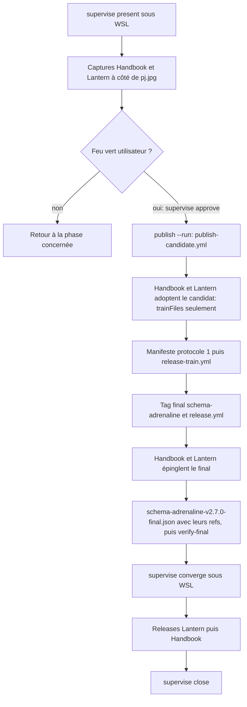
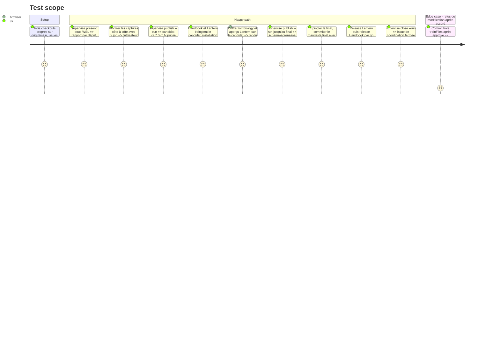

# Instruction: Présenter, obtenir le feu vert, publier le candidat puis le final, converger

## Architecture projection

> Racines : les trois dépôts. ✅ créer · ✏️ modifier. Toute publication attend l'accord explicite de l'utilisateur, tapé par lui à `pnpm supervise approve`.

```txt
schema-adrenaline/
├── release-train/schema-adrenaline-v2.7.0.json         ✅ manifeste du candidat (protocole 1), SHA des consommateurs après adoption
└── release-train/schema-adrenaline-v2.7.0-final.json   ✅ manifeste final (protocole 2), écrit après l'épingle du final, avec les refs des consommateurs qui l'épinglent
obsidian-handbook/
├── package.json, pnpm-lock.yaml                        ✏️ épingle du candidat, puis du final
├── manifest.json, versions.json, CHANGELOG.md          ✏️ version Handbook, par pnpm version
└── supervisor/trains/zombiology-pj-design.json         ✏️ état tenu par le superviseur
lantern/
└── package.json et lockfiles                           ✏️ épingle du candidat, puis du final ; release Lantern
```

## User Journey



## Test Scope



## Tasks to do

### `1)` Présenter

> Montrer le résultat concret avant toute publication.

1. Vérifier que le garde `tools/supervisor/guard/{gh,git}` est en LF.
2. `pnpm supervise present`, lancé sous WSL depuis PowerShell, avec la parade éventuelle notée en phase 1.
3. Présenter à l'utilisateur les captures des phases 3 et 4 à côté de `pj.jpg`, les changements par dépôt, les validations et les publications prévues.
4. Attendre l'accord. Le silence et des tests verts ne valent pas accord.

### `2)` Approuver et publier

> Publier dans l'ordre, sans contourner une validation.

1. L'utilisateur lance `pnpm supervise approve` lui-même, à un TTY.
2. `pnpm supervise publish`, puis `publish --run` : `publish-candidate.yml`, lancé sur `main` (il refuse toute autre ref) avec `tag: v2.7.0-rc.N`, publie le candidat ; noter URL, SHA-256 et SRI.
3. Adoption du candidat (étape humaine) : Handbook et Lantern épinglent son URL et son SRI dans `package.json` et chaque lockfile, installation figée, `pnpm check` / `npm run check`, commit limité aux `trainFiles`, puis `pnpm supervise approve --verify`.
4. Déployer Handbook dans le coffre et relancer l'aperçu Lantern sur le candidat : le rendu doit être celui qui a été présenté.
5. Suivre `publish` : manifeste protocole 1 avec les SHA des consommateurs, `release-train.yml`, tag final `v2.7.0` poussé à la main (il déclenche `release.yml`, qui promeut les octets du candidat).
6. Chaque commit ou push de cette phase est fait à la demande de l'utilisateur, dans le cadre de l'accord.

### `3)` Converger et clore

> Les consommateurs adoptent le final publié, et c'est prouvé.

1. Handbook et Lantern épinglent l'URL et le SRI du final (`package.json` et chaque lockfile ; Lantern : `resolved` du `package-lock.json` inclus), installation figée, validations vertes, commit limité aux `trainFiles`.
2. Écrire `release-train/schema-adrenaline-v2.7.0-final.json` avec les refs de ces commits, le commiter, puis `npm.cmd run release-train:verify-final` : il relit l'épingle chez chaque consommateur.
3. `pnpm supervise converge` sous WSL.
4. Release Lantern selon son dépôt, puis release Handbook : `pnpm version <x.y.z>`, `pnpm assert:release-version`, push, puis `gh workflow run release.yml --ref v<x.y.z>`.
5. `pnpm supervise close --run`.

## Test acceptance criteria

| Task | Acceptance criteria |
| ---- | ------------------- |
| 1 | L'utilisateur a vu la fiche PJ des deux outils à côté de `pj.jpg` avant toute publication. |
| 2 | Les deux consommateurs ont adopté le candidat sans annuler l'accord. La release `schema-adrenaline` v2.7.0 existe, et ses octets sont ceux du candidat. |
| 3 | Handbook et Lantern publiés épinglent v2.7.0, la convergence est verte, et l'issue de coordination est fermée. |
