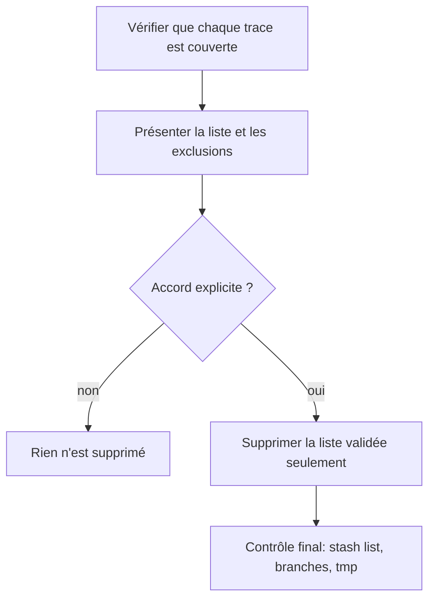
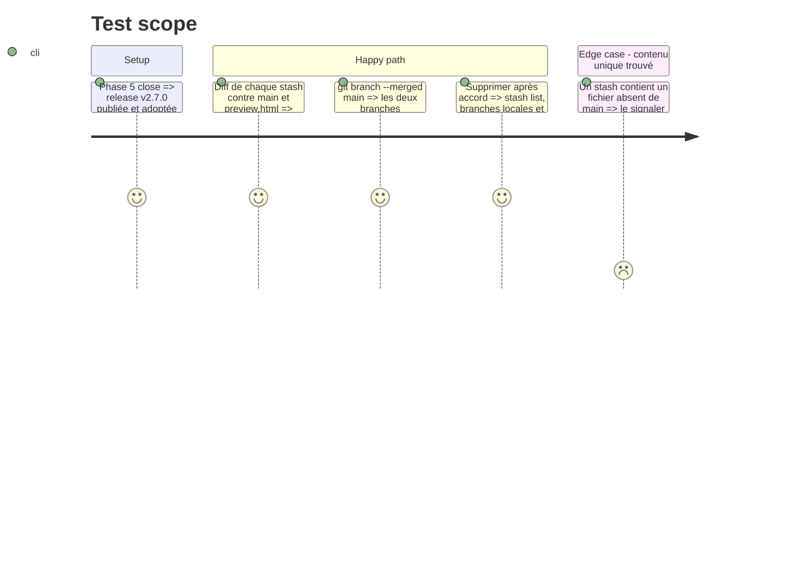

# Instruction: Supprimer les traces intermédiaires après validation

## Architecture projection

> Racine : `schema-adrenaline/`. ❌ supprimer. Rien ne se supprime sans que l'utilisateur ait validé la liste exacte.

```txt
schema-adrenaline/
├── stash@{0} superseded-html-preview-2026-09-25              ❌ preview.html commité en phase 1
├── stash@{1} zombiology-phase1-checkpoint-2026-09-25         ❌ contenu arrivé sur main ou dans preview.html
├── stash@{2} zombiology-presentation-before-main-sync-2026-09-24 ❌ idem
├── tmp/zombiology-preview-backup-2026-09-25/                 ❌ build Handbook 2.27.0 et pack 0.3.0 périmés
├── branche feat/zombiology-presentation-contract             ❌ fusionnée dans main
└── branche feat/issue-style-zombiology-adrenaline            ❌ fusionnée dans main
```

## User Journey



## Test Scope



## Tasks to do

### `1)` Prouver que rien ne se perd

> Chaque trace est couverte par `main` avant d'être proposée à la suppression.

1. Pour chaque stash, comparer `stash@{N}^3` et `stash@{N}` avec `main` ; lister tout fichier ou toute ligne unique.
2. Vérifier `git branch --merged main` pour les deux branches.

### `2)` Présenter et supprimer

> Suppression sur liste validée, jamais en bloc.

1. Montrer la liste, avec les exclusions qu'on ne touche pas sans avis : `stash@{3}` (audit issue-21), `tmp/obsidian-handbook/`, `tmp/schema-adrenaline-2.6.0.tgz`, branches distantes.
2. Après accord : `git stash drop` sur chaque stash, du plus haut indice au plus bas pour que les indices restent valides ; `git branch -d` ; suppression du dossier `tmp/zombiology-preview-backup-2026-09-25/`.
3. Supprimer les branches distantes seulement si l'utilisateur l'a demandé nommément.

## Test acceptance criteria

| Task | Acceptance criteria |
| ---- | ------------------- |
| 1 | Chaque trace proposée a une preuve de couverture (fusion ou diff vide). |
| 2 | Seules les traces validées ont disparu, et `stash@{3}` ainsi que les autres exclusions sont intacts. |
