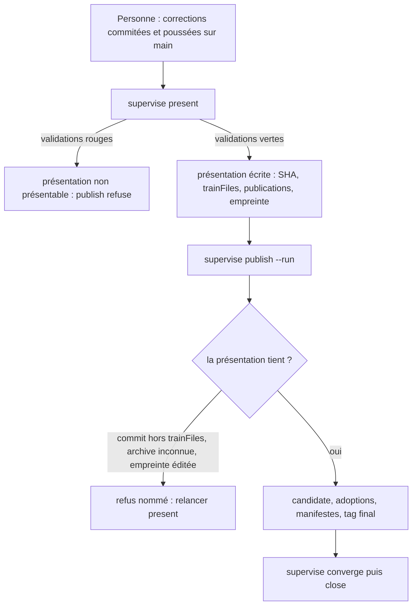
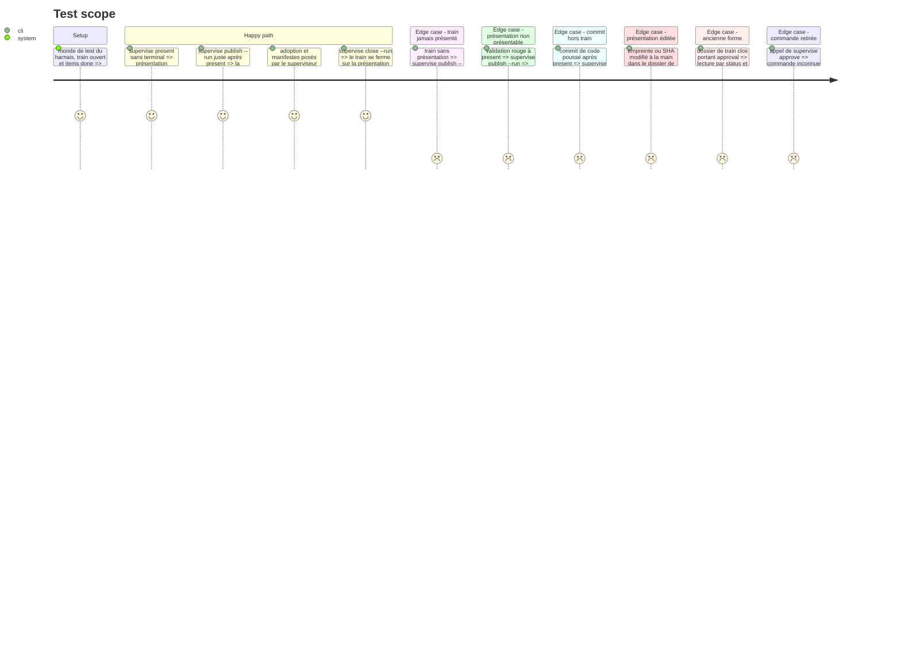

<!-- Fill or omit these sections; never add, rename, or reorder one. -->

# Instruction: le lien passe de l'accord à la présentation

## Architecture projection

> Tree of the final files. ✅ create · ✏️ modify · ❌ delete

```txt
.
├── supervisor/
│   └── train.schema.json                 ✏️ `approval` sort de `required`, devient facultatif et obsolète ; `presentation` décrit le lien
├── tools/
│   ├── supervise.mjs                     ✏️ importe PRESENT_COMMANDS ; `approve` n'est plus une commande
│   ├── supervisor.harness.mts            ✏️ scénarios d'accord réécrits sur la présentation ; plus de faux terminal pour `approve`
│   ├── fixtures/supervisor/
│   │   ├── world.mts                     ✏️ le recours au faux TTY ne sert plus qu'à `link --create`
│   │   └── fake-tty.cjs                  ✏️ commentaire : ne cite plus `approve`
│   └── supervisor/
│       ├── binding.mjs                   ✅ `bindingProblems`, `assertBinding`, `boundSha`, `knownArchives` (repris de approval.mjs, lus sur la présentation)
│       ├── presentCommands.mjs           ✅ `present` et `preview` (repris de approvalCommands.mjs, sans `approve`)
│       ├── approval.mjs                  ❌ remplacé par binding.mjs ; `askTrainId` disparaît (suppression par l'utilisateur)
│       ├── approvalCommands.mjs          ❌ remplacé par presentCommands.mjs (suppression par l'utilisateur)
│       ├── publish.mjs                   ✏️ `assertBinding` avant chaque étape ; `approvedSha` → `boundSha`
│       ├── converge.mjs                  ✏️ quatre appels `assertApproval` → `assertBinding`
│       ├── close.mjs                     ✏️ `assertBinding` ; la version de départ d'un consommateur se lit au SHA présenté
│       ├── present.mjs                   ✏️ rendu : plus de « Approve with… » ; section « Publications que `publish` va faire »
│       ├── preview.mjs                   ✏️ avertissements : « present again » sans « before approving »
│       ├── coordination.mjs              ✏️ ligne de statut : « presented at … » au lieu de « approved at … »
│       ├── trainCommands.mjs             ✏️ `open` n'écrit plus `approval: null`
│       ├── digest.mjs                    ✏️ commentaires : l'empreinte lie la présentation
│       ├── publishCommands.mjs           ✏️ textes d'usage (« a presented train »)
│       ├── commit.mjs, land.mjs, git.mjs, matrix.mjs   ✏️ commentaires d'en-tête seulement
│       ├── adapters/pbta.mjs             ✏️ messages et commentaires (« the train presented … »)
│       ├── adapters/common.mjs           ✏️ commentaire
│       └── guard/rules.cjs               ✏️ message du garde : « publishes and is refused inside a validation »
```

## User Journey



## Test Scope



## Tasks to do

### `1)` Le contrôle du lien, lu sur la présentation

> Même contrôle qu'aujourd'hui, autre source : `train.presentation`.

1. Créer `binding.mjs` : `knownArchives` et `addedLines` repris tels quels.
2. `bindingProblems(root, topology, train, {fetch})` : pas de présentation → « never presented » ; `presentable` faux → raisons ; empreinte recalculée ≠ `digest` → « edited after present » ; puis, par dépôt, descendance d'`origin/main` depuis le SHA présenté, commits postérieurs limités aux `trainFiles` et aux archives connues.
3. `assertBinding` : lève avec la liste, message final « Present the train again: supervise present ».
4. `boundSha(train, repo)` : SHA présenté du dépôt, erreur nommée s'il manque.
5. Aucune fonction interactive : `askTrainId` n'est pas repris.

### `2)` Les commandes

> `approve` n'existe plus ; `present` et `preview` gardent leur comportement.

1. Créer `presentCommands.mjs` avec `present` et `preview` ; retirer `checkPresentation` (ses contrôles vivent dans `bindingProblems`).
2. `supervise.mjs` : importer `PRESENT_COMMANDS`, retirer `approve` de l'aide.
3. `trainCommands.mjs` : `open` n'écrit plus `approval`.

### `3)` Les appelants

> Chaque étape qui publie vérifie le lien, pas un accord.

1. `publish.mjs` : `assertBinding` aux deux points (avant l'observation, avant l'exécution) ; `boundSha` dans `stepOf`.
2. `converge.mjs` : quatre appels remplacés.
3. `close.mjs` : `assertBinding` ; `consumerReleases` lit `train.presentation.repos`.
4. `coordination.mjs`, `present.mjs`, `preview.mjs`, `adapters/pbta.mjs`, `guard/rules.cjs` : textes visibles.
5. Autres fichiers : commentaires d'en-tête.

### `4)` Le schéma de train

> L'ancienne forme reste lisible, la nouvelle ne l'exige plus.

1. Retirer `approval` de `required`.
2. Garder la propriété et sa définition, description « obsolète : écrit par l'ancien `approve`, plus lu ».
3. Description de `presentation` : ce à quoi `publish`, `converge` et `close` sont liés.

### `5)` Le harnais

> Les scénarios prouvent le lien sans terminal.

1. `presentAndApprove` → `presentTrain` (un seul `present`) ; `approvedTrain` → `presentedTrain`, option `present: false`.
2. Scénario « approve records nothing without a terminal… » → « present binds the SHAs without a terminal ».
3. Scénario « approve refuses a presentation the repositories moved away from » → `publish` refuse un commit hors train poussé après `present`.
4. Scénario « an adoption commit… keeps the approval; any other change voids it » → mêmes assertions, vérifiées par `publish` (sans `approve --verify`).
5. Scénario « a failing validation… approve refuses it » → `publish --run` refuse et ne lance rien.
6. Scénario « without a valid approval… » → train jamais présenté : `/never presented/`.
7. Les quatre `approve --verify` de fin de scénario → un `publish` sans `--run` qui passe le contrôle.
8. `open` : `record.approval` absent ; ajouter les cas « ancienne forme » et « commande retirée ».
9. Lecture des SHA : `record.presentation.repos`.

### `6)` Vérifier et montrer

> Rien n'est commité par cette session ; le diff se relit en deux lots.

0. Lot A montré seul avant d'entamer le lot B : tâches 1 à 4 (code et schéma). Lot B : tâche 5 (harnais et fixtures).
1. `./node_modules/.bin/eslint tools` à zéro erreur ; `tsc -noEmit -skipLibCheck` vert.
2. `pnpm assert:supervisor` complet vert, sans toucher au dépôt pendant la passe (le harnais échoue si `git status` de Handbook change entre son début et sa fin ; `aidd_docs/memory/README.md` a bougé ainsi le 2026-10-04).
3. Montrer le diff complet à l'utilisateur ; lui laisser `git rm` des deux fichiers remplacés, le commit et le push.

## Test acceptance criteria

<!-- Each criterion is an observable behavior, not a command. -->

| Task | Acceptance criteria |
| ---- | ------------------- |
| 1 | Un commit qui touche un fichier hors `trainFiles` après `present` fait refuser `publish` avec le commit et le fichier nommés ; un commit d'adoption d'une archive observée ne le fait pas. |
| 1 | Une présentation dont l'empreinte ou un SHA a été modifié à la main fait refuser `publish`. |
| 2 | `supervise approve` est refusé comme commande inconnue ; l'aide ne la cite plus. |
| 2 | `supervise present` aboutit sans terminal et n'écrit aucun champ `approval`. |
| 3 | `publish --run` lancé juste après un `present` vert va jusqu'à la finale sans aucune saisie. |
| 3 | Sans présentation, ou avec une présentation non présentable, `publish --run` ne déclenche aucun workflow et n'exécute aucune commande. |
| 3 | `close` nomme un consommateur dont la version est restée celle du SHA présenté. |
| 4 | Le dossier clos `zombiology-pj-design` (avec `approval`) et le dossier ouvert `zombiology-booklet-styles` passent tous deux la validation du schéma. |
| 5 | Le harnais complet passe ; aucun scénario n'utilise le faux terminal pour autre chose que `link --create`. |
| 6 | Le diff complet a été montré ; aucun fichier du superviseur n'a été commité par la session. |
