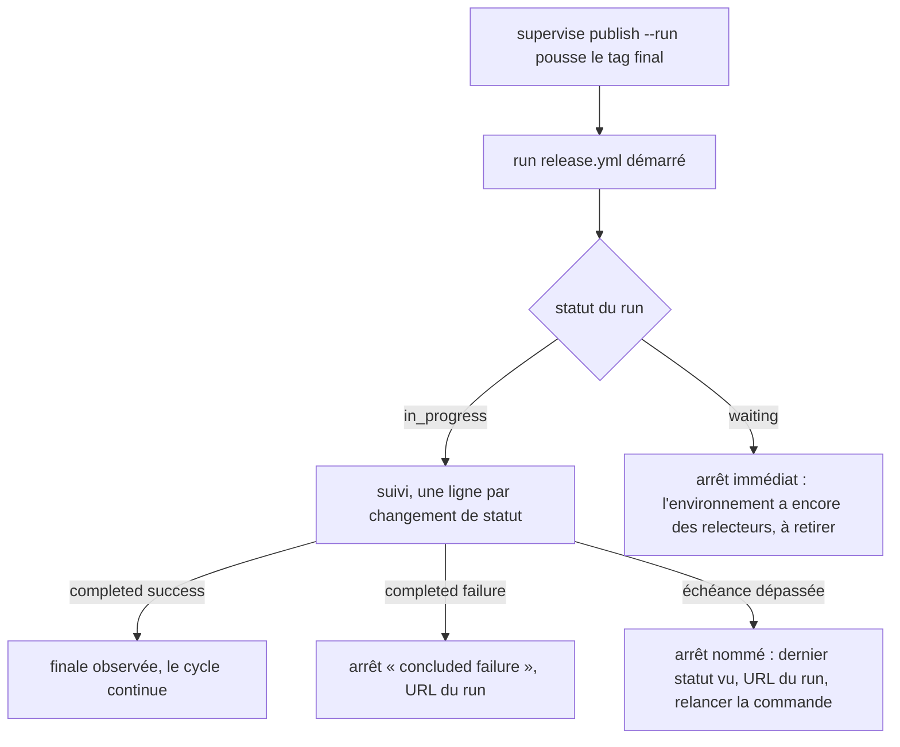
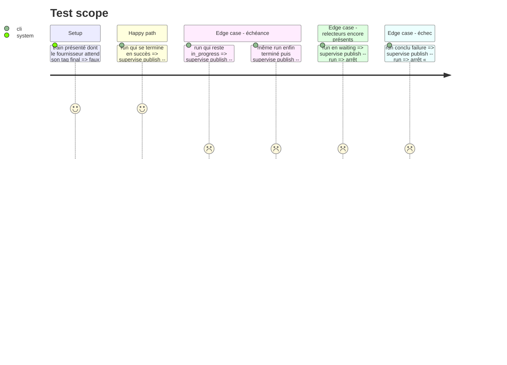

<!-- Fill or omit these sections; never add, rename, or reorder one. -->

# Instruction: le suivi d'un run est borné

## Architecture projection

> Tree of the final files. ✅ create · ✏️ modify · ❌ delete

```txt
.
└── tools/
    ├── supervisor.harness.mts            ✏️ scénarios : run qui ne se termine pas, run retenu par des relecteurs
    ├── fixtures/supervisor/
    │   └── fake-gh.mjs                   ✏️ un run peut rester `in_progress` ou `waiting` au lieu de `completed`
    └── supervisor/
        └── publish.mjs                   ✏️ `followRun` a une échéance et nomme le dernier statut vu ; `dispatch` et `watch` rapportent l'arrêt
```

## User Journey



## Test Scope



## Tasks to do

### `1)` `followRun` a une échéance

> L'échéance est la garantie ; elle ne dépend d'aucun statut particulier.

1. `followRun` rend la conclusion à l'achèvement et lève après une échéance bornée (constante à côté de `WATCH_MS`, sans option de ligne de commande).
2. Le message d'échéance cite le dernier statut vu, l'URL du run et la commande à relancer.
3. La conclusion reste `null` dans le dossier de train ; `refreshRuns` la complète au passage suivant, sans redéclencher.

### `2)` Le raccourci sur `waiting`

> Zéro arrêt : une attente de relecteur est une anomalie, signalée tout de suite.

1. Sur le statut `waiting`, `followRun` lève sans attendre l'échéance : « the release environment still has required reviewers; remove them, then run the command again ».
2. Ce raccourci est un confort : si `gh run view --json status` rend un autre mot pour cet état, l'échéance de la tâche 1 arrête quand même le superviseur. Le mot exact se constate sur la doc de l'API GitHub Actions, sans bloquer la phase.

### `3)` Le harnais

> Les deux arrêts sont prouvés localement.

1. `fake-gh.mjs` : un effet garde un run `in_progress` ou `waiting`, un second le termine.
2. Scénarios du Test Scope ; échéance réduite pour la passe par le moyen que le harnais emploie déjà pour ses délais, sans variable lue en production.

### `4)` Vérifier et montrer

> Rien n'est commité par cette session.

1. `./node_modules/.bin/eslint tools` à zéro erreur, `tsc` vert, `pnpm assert:supervisor` complet vert, sans toucher au dépôt pendant la passe.
2. Diff complet montré à l'utilisateur.

## Test acceptance criteria

<!-- Each criterion is an observable behavior, not a command. -->

| Task | Acceptance criteria |
| ---- | ------------------- |
| 1 | Un run qui ne se termine pas arrête le superviseur à l'échéance, avec son dernier statut et son URL, et un code de sortie non nul. |
| 1 | Relancée une fois le run terminé, la commande reprend ce run sans en déclencher un second. |
| 2 | Un run retenu par des relecteurs arrête le superviseur dès le premier sondage, avec un message qui demande de les retirer. |
| 3 | Le harnais complet passe, scénarios d'échéance et d'attente compris. |
| 4 | Le diff complet a été montré ; aucun fichier du superviseur n'a été commité par la session. |
