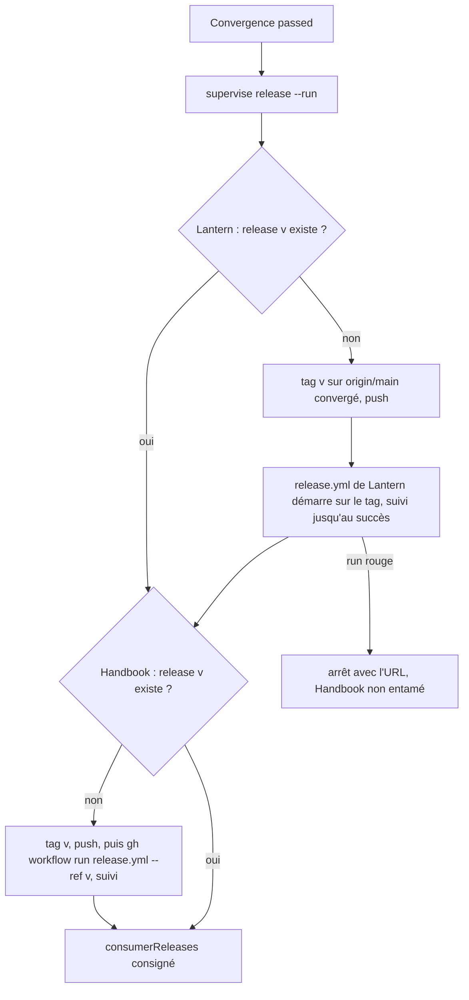
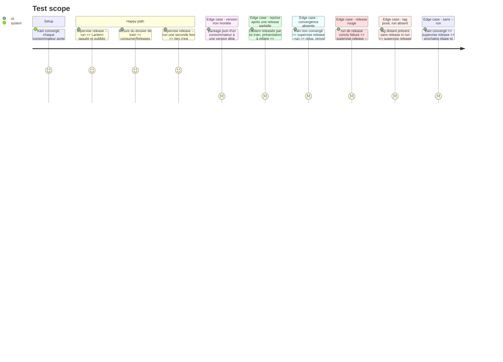

<!-- Fill or omit these sections; never add, rename, or reorder one. -->

# Instruction: le superviseur publie les releases des consommateurs

## Architecture projection

> Tree of the final files. ✅ create · ✏️ modify · ❌ delete

```txt
.
├── supervisor/
│   ├── topology.json                     ✏️ par consommateur : comment sa release se déclenche (`release.trigger`: `tag` ou `dispatch`, `release.workflow`)
│   ├── topology.schema.json              ✏️ déclare ce bloc `release`
│   └── train.schema.json                 ✏️ `consumerReleases` : écrit par `release`, constaté par `close`
└── tools/
    ├── supervisor.harness.mts            ✏️ scénarios de release des consommateurs
    ├── fixtures/supervisor/fake-gh.mjs   ✏️ run de release d'un consommateur, par tag ou par dispatch
    └── supervisor/
        ├── consumerRelease.mjs           ✅ observation puis prochaine étape de release d'un consommateur (pure), et son exécution
        ├── present.mjs                   ✏️ un consommateur dont la version a déjà une release rend le train non présentable
        ├── close.mjs                     ✏️ ne fait plus que constater les releases ; le cas « version inchangée » disparaît
        └── publishCommands.mjs           ✏️ commande `release [--run]`
```

## User Journey



## Test Scope



## Tasks to do

### `1)` Déclarer comment chaque consommateur publie

> Faits relevés dans les workflows le 2026-10-04 ; ils vont dans la topologie, pas dans le code.

1. Lantern (`.github/workflows/release.yml`) : part d'un push de tag `v*` ; exige que le commit du tag descende d'`origin/main` ; lance `npm run check`, dont `assert:release-inputs` exige `package.json`, `package-lock.json` et la première section du CHANGELOG à la même version ; ne lit que `github.token`.
2. Handbook (`.github/workflows/release.yml`) : part d'un `workflow_dispatch` sans entrée, lancé sur le tag ; exige les archives finales (`assert-consumer-schema-pins.mjs --final`) et que le tag égale la version du manifeste (`assert-release-version.mjs`) ; ne lit que `GITHUB_TOKEN`.
3. Topologie : `release.trigger` vaut `tag` pour Lantern, `dispatch` pour Handbook ; `release.workflow` vaut `release.yml` pour les deux.

### `2)` La version fait partie du changement

> Le superviseur ne rédige ni numéro de version ni CHANGELOG.

1. Règle : la montée de version et la section de CHANGELOG sont préparées dans l'arbre avec le changement, sans commit ni tag propres (`pnpm version` pour Handbook, `npm version` pour Lantern, avec l'option qui n'écrit ni commit ni tag ; l'option exacte se constate sur l'aide de chaque outil avant d'être écrite dans la doc), puis posées par `supervise commit`.
2. Les validations de `present` portent déjà la cohérence des fichiers de version (`pnpm check` et `npm run check`) ; rien à ajouter là.
3. `present.mjs` : un consommateur dont la version à `origin/main` a déjà une release rend le train non présentable, raison nommée (dépôt, version), sauf si cette release est celle que le train a lui-même consignée dans `consumerReleases` (reprise après une release partielle).
4. `close.mjs` : remplacer la comparaison au SHA présenté par « la release `v<version>` existe, son tag est sur `main`, le dépôt épingle chaque finale » ; retirer la tolérance « version inchangée ».

### `3)` L'étape de release

> Même forme que les fournisseurs : observer, puis une étape à la fois.

1. `consumerRelease.mjs` : observation (version à `origin/main`, tag distant, release, run en cours), `nextStep` pur (`tag`, `dispatch`, `watch`, `done`).
2. Ordre : consommateurs avant coordinateur, tel que la topologie les déclare.
3. Tag posé sur le `origin/main` convergé, par `pushTag` ; lien vérifié (`assertBinding`) avant chaque étape.
4. Le run né d'un push de tag se retrouve comme `publish.mjs` retrouve celui du fournisseur ; le suivi est le `followRun` borné de la phase 2.
5. Un tag distant sans release ni run en cours : `dispatch` le relance pour un déclenchement `dispatch` ; pour un déclenchement `tag`, arrêt nommé (un tag ne se repousse pas, et le supprimer est un geste humain).
6. `consumerReleases` écrit dans le dossier de train à chaque release constatée.

### `4)` Le harnais, vérifier, montrer

> Rien n'est commité par cette session.

1. Scénarios du Test Scope.
2. `./node_modules/.bin/eslint tools` à zéro erreur, `tsc` vert, `pnpm assert:supervisor` complet vert ; diff complet montré.

## Test acceptance criteria

<!-- Each criterion is an observable behavior, not a command. -->

| Task | Acceptance criteria |
| ---- | ------------------- |
| 1 | Le mode de déclenchement de chaque consommateur se lit dans la topologie ; aucun nom de dépôt n'est codé en dur dans l'étape de release. |
| 2 | Un consommateur dont la version est déjà publiée rend le train non présentable, avec le dépôt et la version nommés. |
| 2 | `close` refuse un train dont un consommateur n'a pas de release à sa version. |
| 3 | Après une convergence verte, `release --run` publie Lantern puis Handbook sans aucune saisie, et le dossier de train les consigne. |
| 3 | Relancée, la commande ne pousse aucun tag et ne déclenche aucun run. |
| 3 | Une release rouge arrête la commande avant le consommateur suivant. |
| 4 | Le harnais complet passe ; le diff complet a été montré ; rien n'a été commité par la session. |
