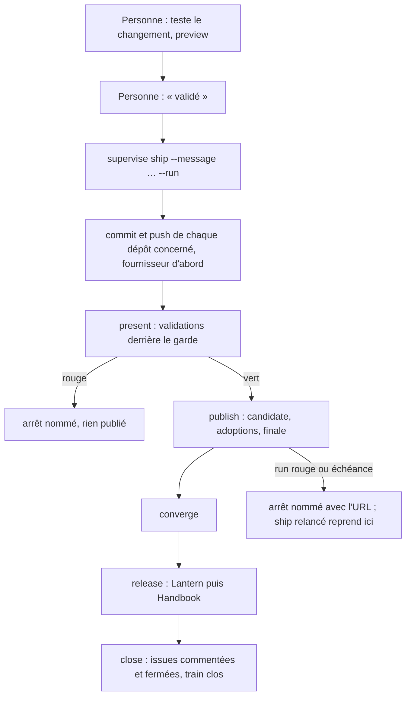
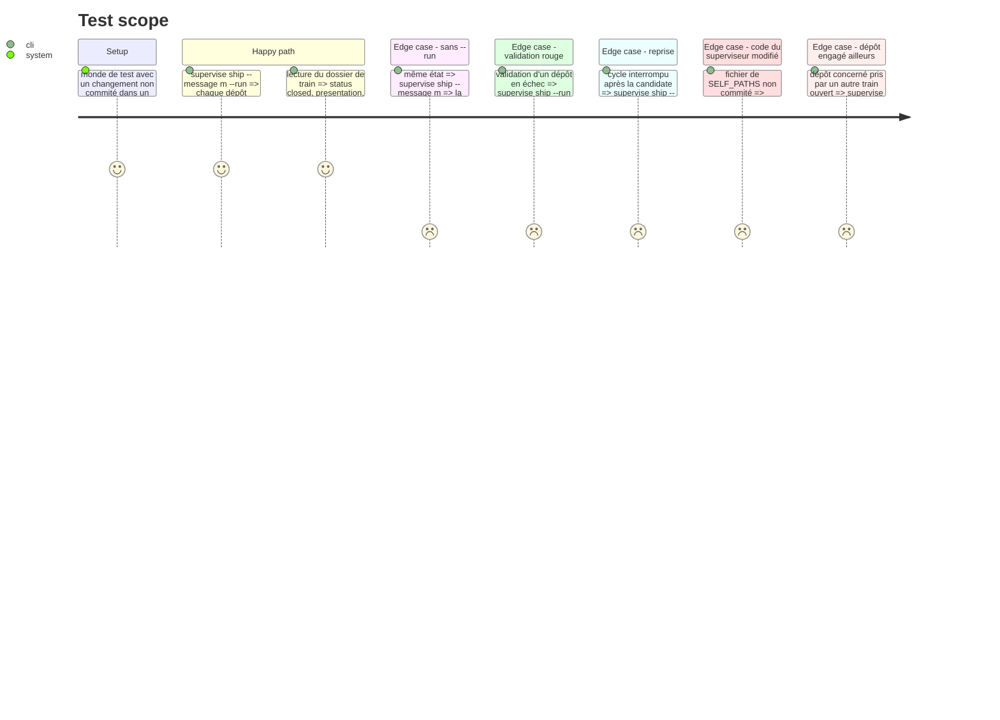

<!-- Fill or omit these sections; never add, rename, or reorder one. -->

# Instruction: une commande, de la validation à la clôture

## Architecture projection

> Tree of the final files. ✅ create · ✏️ modify · ❌ delete

```txt
.
└── tools/
    ├── supervise.mjs                     ✏️ enregistre la commande `ship`
    ├── supervisor.harness.mts            ✏️ scénarios du cycle complet et de sa reprise
    └── supervisor/
        ├── ship.mjs                      ✅ enchaîne commit → present → publish → converge → release → close ; reprend là où le dossier de train en est
        └── publishCommands.mjs           ✏️ `ship --message <m> [--run]`
```

## User Journey



## Test Scope



## Tasks to do

### `1)` L'enchaînement

> Une invocation vaut validation ; plus rien ne s'arrête pour un commit ou une release.

1. `ship.mjs` appelle, dans l'ordre, les fonctions existantes : `commitRepos` puis `planCommit` et `executeCommit`, `presentTrain`, `publishTrain`, `convergeTrain`, la release de la phase 3, `closeTrain`. Aucune logique dupliquée.
2. Chaque maillon garde ses refus ; `ship` s'arrête au premier, rend son message tel quel et sort avec un code non nul.
3. Sans `--run` : afficher la suite des étapes, ne rien écrire.

### `2)` La reprise

> Relancer `ship` est toujours sûr.

1. Rien à commiter → sauter `commit`.
2. Présentation qui tient (`bindingProblems` vide) → ne pas représenter ; sinon représenter.
3. `publish`, `converge`, `release`, `close` sont déjà idempotents : les rappeler.

### `3)` Ce que `ship` ne fait pas

> Les bornes existantes restent.

1. `assertSelfPublished` s'applique : le code du superviseur n'est jamais commité par `ship`.
2. Les dossiers de train restent exclus des commits de changement.
3. Aucune suppression (branche, trace, fichier).
4. Aucune attente d'un geste humain : un arrêt est toujours un échec nommé, jamais une invite.

### `4)` Le harnais, vérifier, montrer

> Rien n'est commité par cette session.

1. Scénarios du Test Scope.
2. `./node_modules/.bin/eslint tools` à zéro erreur, `tsc` vert, `pnpm assert:supervisor` complet vert ; diff complet montré.

## Test acceptance criteria

<!-- Each criterion is an observable behavior, not a command. -->

| Task | Acceptance criteria |
| ---- | ------------------- |
| 1 | Une seule commande mène un changement non commité jusqu'au train clos, sans saisie ni seconde commande, quand rien n'échoue. |
| 1 | Une validation rouge arrête le cycle avant toute publication, avec le dépôt et la commande nommés. |
| 2 | Relancée après une interruption, la commande reprend à l'étape manquante sans refaire les précédentes. |
| 3 | Une modification du code du superviseur présente dans l'arbre fait refuser `ship` avant tout commit. |
| 3 | Aucun chemin de `ship` ne lit l'entrée standard. |
| 4 | Le harnais complet passe ; le diff complet a été montré ; rien n'a été commité par la session. |
