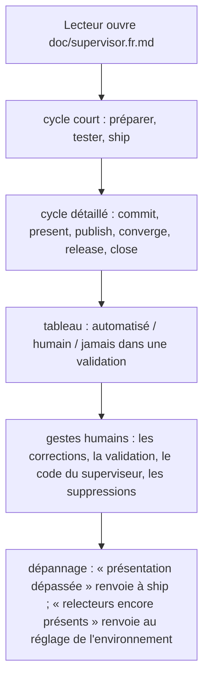
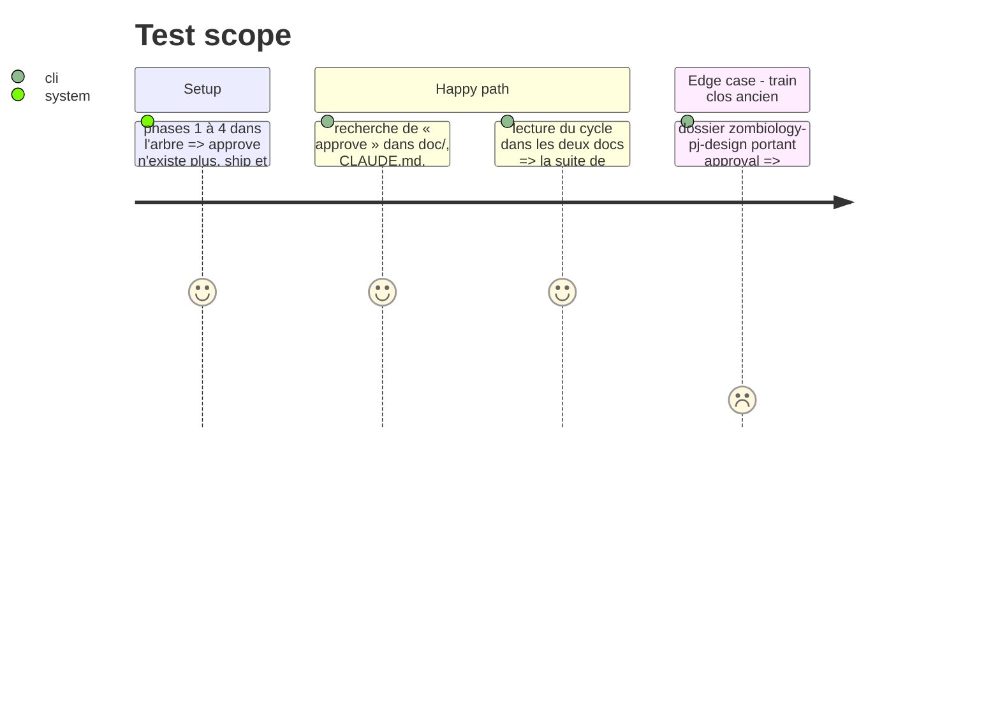

<!-- Fill or omit these sections; never add, rename, or reorder one. -->

# Instruction: documentation, ADR et en-têtes alignés

## Architecture projection

> Tree of the final files. ✅ create · ✏️ modify · ❌ delete

```txt
.
├── aidd_docs/
│   └── memory/internal/decisions/
│       └── supervisor-orchestrates-github-builds.md   ✏️ `approve` supprimé ; releases des consommateurs au superviseur ; aucune porte humaine après la validation
├── doc/
│   ├── supervisor.fr.md                  ✏️ cycle, `ship`, `release`, section `approve` retirée, tableau des gestes, dépannage
│   └── supervisor.en.md                  ✏️ même contenu, en anglais
├── ../schema-adrenaline/.github/workflows/release.yml   ✏️ commentaire « one human gate » corrigé, par l'utilisateur
├── CLAUDE.md                             ✏️ section Release : la release de Handbook passe par le superviseur
└── tools/
    └── supervise.mjs                     ✏️ en-tête : ce que le superviseur publie, et sous quelle condition
```

## User Journey



## Test Scope



## Tasks to do

### `1)` Les deux docs

> Le cycle écrit est le cycle réel.

1. Ligne de cycle : `status` → `open` / `link` → `next` → `ship` (soit `commit` → `present` → `publish` → `converge` → `release` → `close`).
2. Retirer la section `approve` ; ajouter `ship` et `release` ; reporter dans `present` la règle des commits admis après la présentation.
3. Prérequis : le vrai terminal n'est plus exigé que par `link --create` sans `--yes` ; la version et le CHANGELOG d'un consommateur se préparent avec le changement.
4. Tableau des gestes : la ligne humaine se réduit aux corrections, à la validation (lancer `ship`), au code du superviseur et aux suppressions ; « jamais avant l'accord » devient « jamais dans une validation ».
5. Section « Ce que juge l'accord » → « Ce que juge la validation » : rendu et comportement, testés avant `ship` (`preview`).
6. Dépannage : « Accord annulé » → « Présentation dépassée » ; ajouter « Run retenu par des relecteurs » (les retirer de l'environnement `release`, puis relancer `ship`).
7. Prérequis GitHub : l'environnement `release` de `schema-adrenaline` n'a aucun relecteur requis.

### `2)` L'ADR

> Les décisions ouvertes sont fermées.

1. `approve` supprimé ; le lien aux commits est porté par `present`.
2. Table des propriétaires : « Release des consommateurs » → superviseur ; « Tag de version d'un consommateur » → superviseur.
3. Remplacer « Une seule porte humaine sur une publication finale : l'*Environment* `release` » par la décision du 2026-10-04 : zéro arrêt après la validation, relecteurs retirés par l'utilisateur.
5. `schema-adrenaline/.github/workflows/release.yml` l. 26 dit encore « The one human gate of a train » : correction du commentaire proposée en diff à l'utilisateur, qui l'applique (la session ne modifie pas les workflows des autres dépôts).
4. Retirer le passage « `approve` reste à redéfinir … reste en place ».

### `3)` `CLAUDE.md` et l'en-tête de `supervise.mjs`

> Une phrase vraie sur ce qui est publié.

1. `CLAUDE.md`, section Release : le tag et `gh workflow run release.yml --ref v<x.y.z>` sont faits par `supervise release` ; `pnpm version` reste le geste de préparation.
2. En-tête de `supervise.mjs` : il publie ce qu'un `present` vert a lié, et rien d'autre.

### `4)` Vérifier

> Aucun reste.

1. Recherche de `approv` et `accord` hors dossiers de train et plan remplacé.
2. `pnpm lint` à zéro erreur ; harnais du superviseur vert.

## Test acceptance criteria

<!-- Each criterion is an observable behavior, not a command. -->

| Task | Acceptance criteria |
| ---- | ------------------- |
| 1 | Les deux docs décrivent le même cycle, sans `approve`, avec `ship` comme geste unique après la validation. |
| 1 | Les deux docs disent que la version et le CHANGELOG d'un consommateur font partie du changement préparé. |
| 2 | L'ADR ne contient plus de point ouvert sur `approve`, attribue les releases des consommateurs au superviseur et ne décrit plus aucune porte humaine après la validation. |
| 3 | `CLAUDE.md` et l'en-tête de `supervise.mjs` ne décrivent plus de release manuelle ni d'accord. |
| 4 | Les seules occurrences restantes de « approve » désignent l'ancien champ du schéma, des dossiers de train existants ou le message sur les relecteurs à retirer. |
