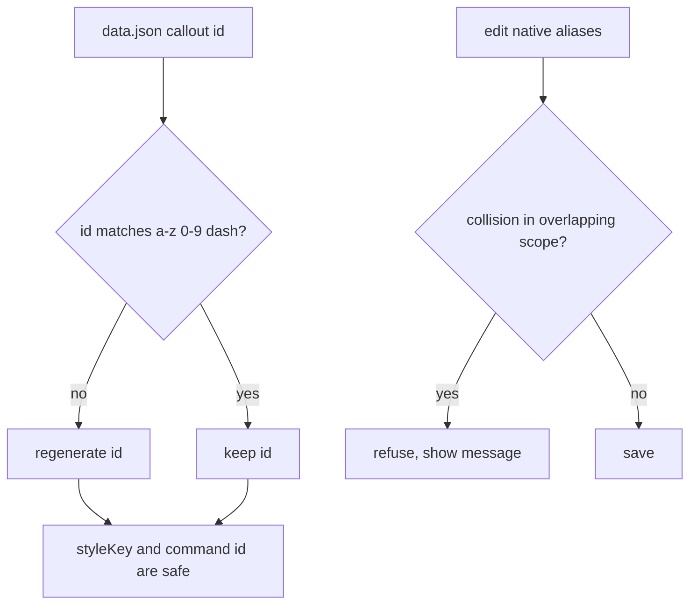
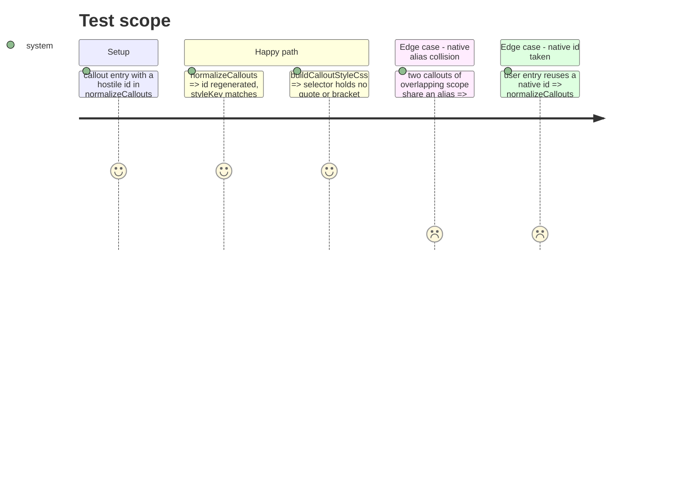

# Instruction: Close the unchecked inputs

## Architecture projection

> Tree of the final files. ✅ create · ✏️ modify · ❌ delete

```txt
src/features/callouts/
├── migrateAliases.ts      ✏️ validate the user id, register native ids in takenIds
├── collisions.ts          ✅ aliasCollisions(entries, candidate), shared by modal and native edit
└── types.ts               ✏️ scopesOverlap (moved out of calloutsModal)
src/settings/
├── calloutsModal.ts       ✏️ use the shared collision check
└── index.ts               ✏️ native alias edit (≈841) runs the same check
tools/assertCallouts.harness.mts ✏️ cases: hostile id, native alias collision
```

## User Journey



## Test Scope



## Tasks to do

### `1)` Validate the user callout id

> No raw string from `data.json` reaches a CSS selector or a command id.

1. In `migrateAliases.ts:170`, accept an id only if it matches the rule `generateCalloutId` produces (`/^[a-z0-9-]+$/`); otherwise regenerate it.
2. Add native entries to `takenIds` (`:122-136`) so a user id cannot collide with a native one.
3. Add the harness cases above.

### `2)` Share the alias collision check

> Native and user callouts obey the same collision rule.

1. Move `scopesOverlap` (`calloutsModal.ts:25`) to `callouts/types.ts`; replace the inline copy at `migrateAliases.ts:91`.
2. Create `collisions.ts` from the modal check (`calloutsModal.ts:204-214`).
3. Call it from the modal and from the native edit at `index.ts:841`.

## Test acceptance criteria

| Task | Acceptance criteria                                                                                            |
| ---- | -------------------------------------------------------------------------------------------------------------- |
| 1    | A hostile id never appears in `buildCalloutStyleCss` output nor in a command id; a valid id is kept unchanged. |
| 1    | A user id equal to a native id is replaced; native ids are untouched.                                          |
| 2    | Editing a native alias into a collision is refused with the same message as the modal.                         |
| 2    | `pnpm assert:callouts` and `pnpm assert:settings-ui` pass.                                                     |
