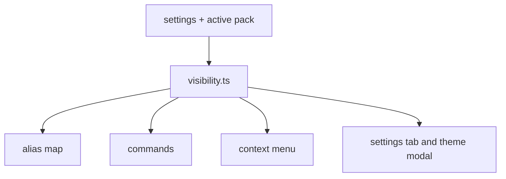
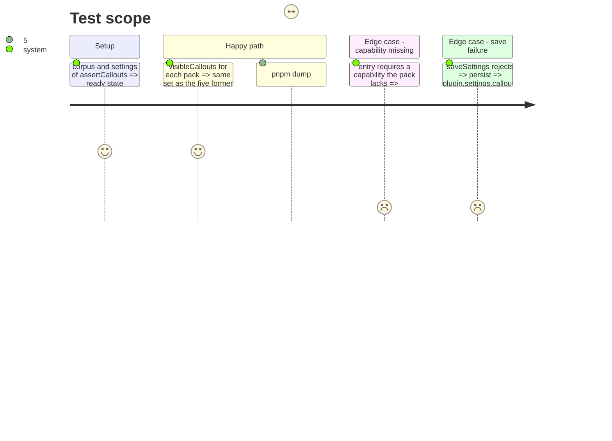

# Instruction: One visibility filter and callout-domain DRY

## Architecture projection

> Tree of the final files. ✅ create · ✏️ modify · ❌ delete

```txt
src/features/callouts/
├── visibility.ts          ✅ visibleCallouts(settings, activePackId) and requiredCapabilities
├── scopeLabel.ts          ✅ scopeLabel(scope), shared with the settings tab
├── aliasSupport.ts        ✏️ use visibility.ts
├── commands.ts            ✏️ use visibility.ts and scopeLabel; merge imports (5-7)
├── contextMenu.ts         ✏️ use visibility.ts; one insertCallout branch
├── styleWriter.ts         ✏️ import BRUMES_CALLOUT_STYLE_ATTR
├── migrateAliases.ts      ✏️ derive schema ids from NATIVE_CALLOUTS
└── nativeCallouts.ts      ✏️ stale comment (81-87)
src/features/blocks/registry.ts ✏️ reuse requiredCapabilities
src/settings/
├── index.ts               ✏️ use visibility.ts and scopeLabel; shared constants (33-34)
├── themeContentsModal.ts  ✏️ use visibility.ts
└── calloutsModal.ts       ✏️ constants (16-17), named default colour, persist after save
```

## User Journey



## Test Scope



## Tasks to do

### `1)` Extract the visibility filter

> One definition of "which callouts the active game shows".

1. Create `visibility.ts`; fold in the private `requiredCapabilities` of `blocks/registry.ts:54`.
2. Replace the five copies (`aliasSupport.ts:107`, `commands.ts:98-99`, `contextMenu.ts:24-26`, `index.ts:767-769`, `themeContentsModal.ts:26-32`).

### `2)` Share constants and helpers

> One home for each repeated value.

1. `scopeLabel` from `commands.ts:19-26` and `index.ts:859`.
2. Export the constants at `index.ts:33-34` and import them in `calloutsModal.ts:16-17`.
3. Use `BRUMES_CALLOUT_STYLE_ATTR` in `styleWriter.ts:38`; name the default colour `#e2c6c5` (`calloutsModal.ts:69`).
4. Merge the duplicate imports in `commands.ts:5-7`; update the stale comment in `nativeCallouts.ts:81`.
5. Derive the schema ids at `migrateAliases.ts:81-83` from `NATIVE_CALLOUTS`.

### `3)` Small correctness items

> No behaviour change except safer persistence.

1. Merge the two `insertCallout` branches (`contextMenu.ts:64-93`).
2. `persist` (`calloutsModal.ts:243`) builds a copy, saves, then assigns.

## Test acceptance criteria

| Task | Acceptance criteria                                                                                                    |
| ---- | ---------------------------------------------------------------------------------------------------------------------- |
| 1    | `isCalloutAvailable` has a single caller module; menus, commands, alias map and settings list the same callouts per pack. |
| 2    | No duplicated constant, label lookup or attribute literal remains in the scope.                                        |
| 3    | A rejected save leaves `settings.callouts` unchanged; insertion output is unchanged.                                   |
| all  | `pnpm assert:callouts`, `assert:callout-retarget`, `assert:settings-ui` pass; `pnpm dump:dom` is identical.            |
