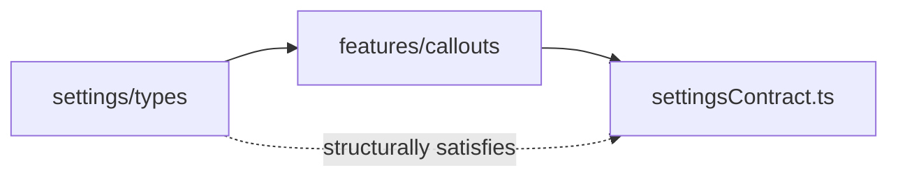
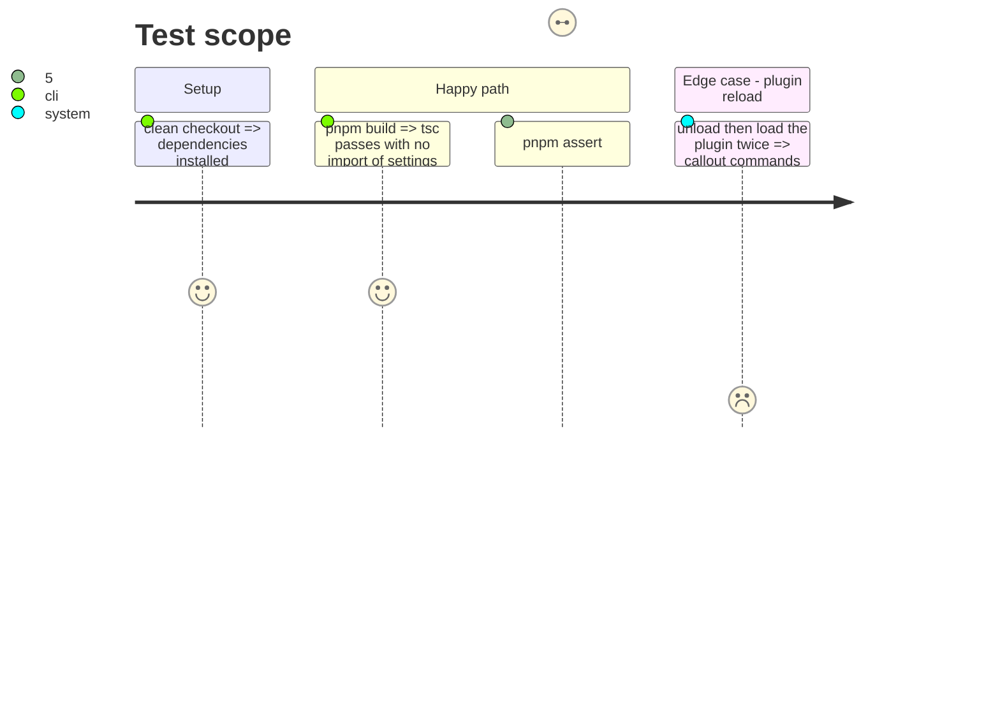

# Instruction: Make the callout types a leaf and break the cycle

## Architecture projection

> Tree of the final files. ✅ create · ✏️ modify · ❌ delete

```txt
src/features/callouts/
├── types.ts               ✏️ stays a leaf: no import from settings
├── settingsContract.ts    ✅ CalloutSettingsView (callouts, mode) and BrumesCalloutAliasesSettings
├── aliasSupport.ts        ✏️ depend on CalloutSettingsView, not BrumesSettings
├── contextMenu.ts         ✏️ same
├── migrateAliases.ts      ✏️ same
└── commands.ts            ✏️ registry held by the feature instance, not a module Map
src/settings/types.ts      ✏️ drop the sanitizeAlias re-export (17)
src/settings/*.ts          ✏️ import sanitizeAlias from features/callouts/sanitizeAlias
```

## User Journey



## Test Scope



## Tasks to do

### `1)` Invert the dependency

> `features/callouts` declares what it needs; `settings` satisfies it.

1. Create `settingsContract.ts` with the minimal view the callout modules read.
2. Retype `aliasSupport.ts:2`, `contextMenu.ts:5`, `migrateAliases.ts:1`.
3. Verify no `settings/` import remains under `features/callouts/`.

### `2)` Remove leaks

> Settings expose settings only; the registry dies with the plugin.

1. Drop the re-export at `settings/types.ts:17`; update the imports in `calloutsModal.ts`, `index.ts` and `migrateAliases.ts`.
2. Move `registered` (`commands.ts:33`) into the object returned by the command feature.

## Test acceptance criteria

| Task | Acceptance criteria                                                                               |
| ---- | ------------------------------------------------------------------------------------------------- |
| 1    | `grep "settings/" src/features/callouts` returns nothing.                                         |
| 2    | `sanitizeAlias` is imported from its own module only; after a reload no duplicate command exists. |
| all  | Build and both lint scopes green; `pnpm assert:callouts` passes.                                  |
