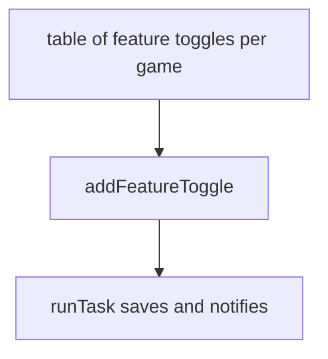
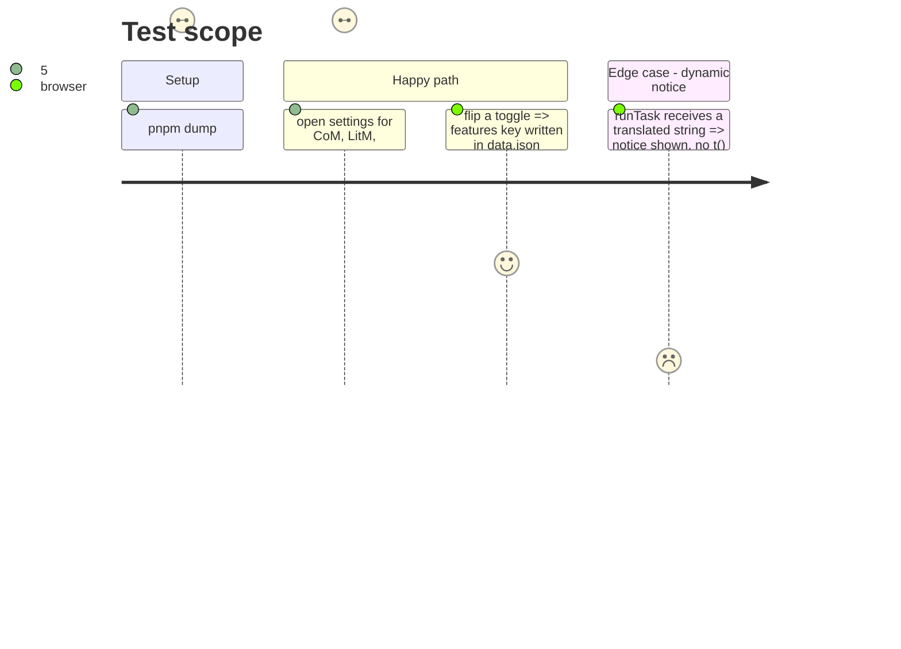

# Instruction: Table-driven settings tab, dead code out

## Architecture projection

> Tree of the final files. ✅ create · ✏️ modify · ❌ delete

```txt
src/settings/
└── index.ts               ✏️ addFeatureToggle + addCanvasSnippetButton; isActive, inactive, wrappers, orphan comment removed
```

## User Journey



## Test Scope



## Tasks to do

### `1)` Generalize the toggle helper

> One helper, one table per game.

1. Turn `addOtherscapeToggle` (`index.ts:690-714`) into `addFeatureToggle(section, label, block, featureKey)`.
2. Replace the nine copies (349-650) with table rows; keep every `features.*` key and label.
3. One `addCanvasSnippetButton` for 513-537 and 653-677.

### `2)` Remove dead code

> No branch that cannot run.

1. Remove `isActive` (455, 541, 681) and its `setDisabled` calls.
2. Remove the `inactive` parameter of `createSection` (965-974).
3. Inline the description wrappers (917-923); delete the orphan comment (45-46).
4. `runTask` takes an already translated message (982-991); update the callers.

## Test acceptance criteria

| Task | Acceptance criteria                                                                                    |
| ---- | ------------------------------------------------------------------------------------------------------ |
| 1    | Settings tab shows the same controls per game; each toggle still writes its original `features.*` key. |
| 2    | No `isActive`, `inactive` or `t(<variable>)` remains in `settings/`.                                   |
| all  | `pnpm assert:settings-ui` passes; `settings/index.ts` is at least 200 lines shorter.                   |
