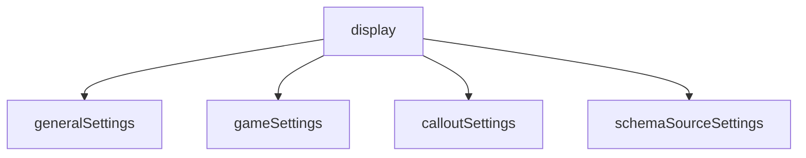
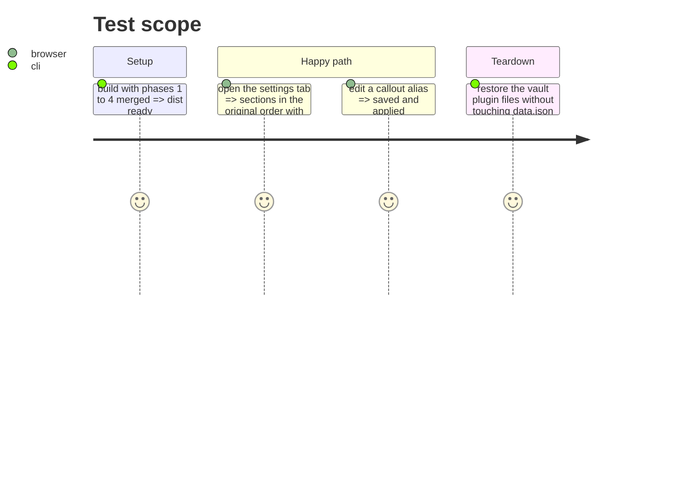

# Instruction: Split the settings tab by domain

## Architecture projection

> Tree of the final files. ✅ create · ✏️ modify · ❌ delete

```txt
src/settings/
├── index.ts                ✏️ assembles sections, owns display() and saving only
├── generalSettings.ts      ✏️ renders the general section
├── gameSettings.ts         ✏️ renders the per-game sections (hardcoded ids stay: deferred)
├── calloutSettings.ts      ✏️ renders the callouts section and native alias edit
├── schemaSourceSettings.ts ✏️ renders the sources and release section
└── sectionHelpers.ts       ✅ createSection, runTask, addFeatureToggle shared by the renderers
```

## User Journey



## Test Scope



## Tasks to do

### `1)` Move section rendering into the domain modules

> The domain modules stop being pass-through wrappers.

1. Create `sectionHelpers.ts` with `createSection`, `runTask`, `addFeatureToggle`.
2. Move each section body out of `index.ts` into its domain module; `index.ts` calls them in the original order.
3. Keep the `PluginSettingTab` class in `index.ts` only.

## Test acceptance criteria

| Task | Acceptance criteria                                                                          |
| ---- | -------------------------------------------------------------------------------------------- |
| 1    | `settings/index.ts` is under 250 lines; the domain modules contain real rendering code.      |
| 1    | Settings tab is identical to the pre-phase one in the test vaults; `data.json` is untouched. |
| all  | `pnpm check` is green; build and both lint scopes at zero errors.                            |
