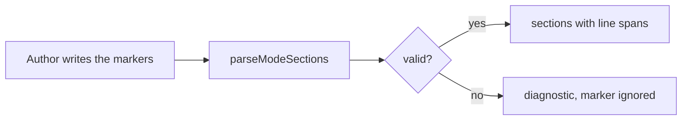

# Phase 1 — Marker grammar and parser

## Architecture projection

New `src/features/modeSections/parser.ts`, sibling of `layoutRegions/parser.ts`: `parseModeSections(text) -> { sections: { polarity, openLine, lineStart, lineEnd }[], diagnostics }`. Same rules as the layout parser: markers alone on their line, fenced code skipped, zero-based line bounds. Diagnostics: `empty | invalid-open | invalid-polarity | orphan-close | overlapping-open | unclosed-open`. A `handbook-mode` nested in another `handbook-mode` is `overlapping-open` (one forced mode at a time); nesting with `handbook-layout` is free, both ways.

## User Journey

## Test Scope

An author wraps a block in a pair and the parser returns its line span; broken markers yield a diagnostic and no section.

## Tasks to do

- Write `parser.ts`, mirroring the layout parser's fence handling.
- Harness `tools/modeSections.harness.mts` + `tools/assert-mode-sections.mjs` (esbuild-bundled, same pattern as `assert-layout-regions`); register `assert:mode-sections` in `package.json` and in `pnpm check`.
- Add `corpus/temoins/` and `corpus/refus/` notes (both halves are required).
- Low ES target: no `flat`, no `Object.values`.

## Test acceptance criteria

- Dark and light pairs parse to the right line spans; a pair inside a layout region and the reverse both parse.
- Markers inside a fenced block are ignored.
- Each diagnostic has a refusing corpus case.
- `rtk proxy pnpm build`, both lint scopes and `pnpm assert:mode-sections` are green.
