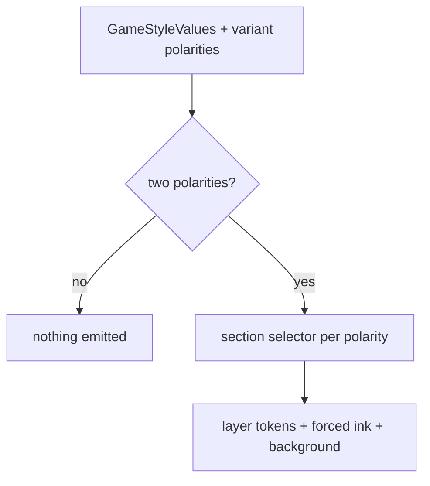

# Phase 2 — Scoped style emission, per pack and per variant

## Architecture projection

`styleElement.ts`: a new `modeSectionStyle(mode, values, polarities, printerFriendly)` appended by `buildGameStyle` when `polarities.length > 1`. For each declared polarity it emits, with the same `renderLayer` content as the body variant:

1. `body.brumes--<g> .handbook-mode-
` carrying `values[p]`;
2. `body.brumes--<g> .handbook-mode-
 .brumes-block-scope.brumes--<g>` (finding 3 of the plan: otherwise Handbook blocks re-apply the body polarity);
3. `forcedInkTokens(
)` on the section;
4. `background-color: var(--background-primary)` and the generic texture token (decision D3).

Dark blocks go through `offPaperDark` / `keepOnPaper` exactly like body layers. A pack with one or no polarity emits nothing. The polarities passed in are the **active variant's** (D2); the callers at `BrumesPlugin.ts:355` and `:458` already compute them.

Spike first: check that adding Obsidian's `theme-
` class on the section block restores the theme variables the pack does not redefine; otherwise extend `forcedInkTokens` with the missing derived set.

City of Mist: a `@mixin` shares the night palette of `_dangers.scss` between `.theme-dark` and `.handbook-mode-dark`.

## User Journey

## Test Scope

A dark section in a light note shows the pack's dark paper, ink and callouts; a light section in a dark note does the reverse.

## Tasks to do

- Spike on Adrenaline (vault zombiology, eval + computed styles): theme class on the section vs re-derived tokens.
- Implement `modeSectionStyle`; keep the `buildGameStyle` signature.
- Background image: the section paints a flat opaque colour; a texture only through `--brumes-section-texture` (+ `-size`), set per polarity by the pack. Open the schema-side issue first (extend, publish, then adopt); nothing local names `--adrenaline-*`. Until published, sections are flat.
- Mirror `_dangers.scss` through a `@mixin`. Confirm `_workspace.scss` needs nothing (workspace chrome, not a section).
- Specificity: `body.theme-
 .brumes-block-scope.brumes--<g>` (existing) and the new section variant both weigh four classes and one element, so the tie is settled by source order: the section blocks are appended last and an assertion in `assert:style-scope` checks that order.
- Extend `assert:style-scope` for the new selectors.

## Test acceptance criteria

- Computed `--background-primary`, `--text-normal` and `--metadata-input-text-color` inside a forced section equal the pack's layer of that polarity, on Adrenaline and City of Mist, in both Obsidian themes and with colourScheme light, dark and obsidian.
- A Handbook block inside a dark section of a light note is dark.
- The output CSS holds no section rule for Legend in the Mist.
- `dist/styles.css` stays under 150 000 bytes; no static dark SCSS rule on a bare selector.
