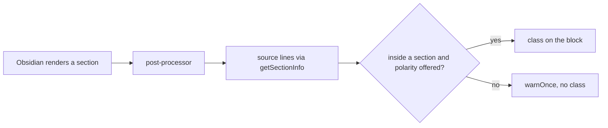

# Phase 3 — Application in reading view

## Architecture projection

`src/features/modeSections/postProcessor.ts`, registered next to `loadLayoutRegions`: same `getSectionInfo` + MutationObserver scheme as `layoutRegions/postProcessor.ts`. Rendered blocks lying entirely inside a section get `handbook-mode-
`; marker-only blocks reuse `MARKER_BLOCK` / `isMarkerBlock` from `sectionMapper.ts` rather than a second class. A block partly inside a section is left untouched. When the active variant lacks the polarity, nothing is applied and `warnOnce` reports it once per note; parser diagnostics go through `warnOnce` too. Live Preview is unchanged (D5).

## User Journey

## Test Scope

Open a note in reading view, scroll (Obsidian recycles sections), edit a marker: the classes follow without a reload.

## Tasks to do

- Post-processor and observer; reuse `warnOnce`.
- `src/styles/_mode-sections.scss`: adjacent sections of the same polarity read as one band (no gap between them) and the band reaches the full width of the view, beyond the sizer padding; geometry shared by `@mixin`.
- Read the effective polarities through the accessor of D8.
- Interplay with `handbook-layout-flow`: a forced section inside a column region and a region inside a forced section (e2e under `tools/e2e/`).

## Test acceptance criteria

- Vault zombiology: a dark section in a light note and the reverse render correctly; scrolling and editing keep them.
- Legend in the Mist vault: markers ignored, one console warning, note unchanged.
- Nesting with a 2-column region works both ways.
