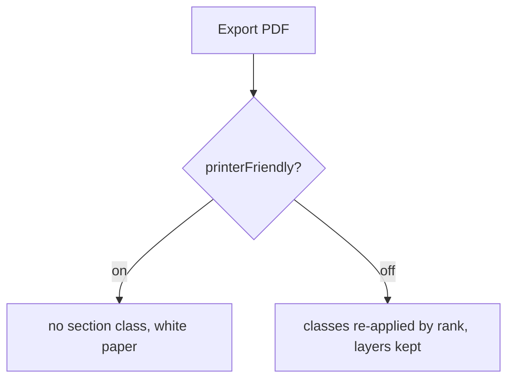

# Phase 4 — Print

## Architecture projection

Obsidian's export builds `.print .markdown-preview-view` outside the live DOM, so classes must be re-applied by rank (ADR `print-export-joins-blocks-by-rank`), as `printProcessor.ts` does for layout regions. With `printerFriendly` on (default) nothing needs to be re-applied: dark layers are `@media screen` only and `_print.scss` keeps the white paper, so a section class would be inert. Classes are re-applied only when it is off. With it off, sections are kept as authored (dark layers are `@media screen` only while printer-friendly is on, per `offPaperDark`).

## User Journey

## Test Scope

Export a note holding a dark section with the setting on, then off.

## Tasks to do

- A print mapper for mode sections, following `printMapper.ts`.
- Extend `assert:style-scope`: no dark section rule survives outside `@media screen` when printer-friendly.
- Page-break marker blocks keep working inside sections.

## Test acceptance criteria

- Setting on: the exported PDF is fully light.
- Setting off: the dark section stays dark, the rest of the note keeps its own mode.
