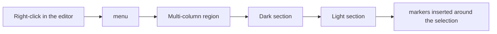

# Phase 5 — Context-menu item and i18n

## Architecture projection

`src/features/modeSections/insertion.ts`, same shape as `layoutRegions/insertion.ts`: `wrapInModeSection(selection, polarity)` and `contributeModeSectionInsertion(menu, editor)`. Two items, "Dark section" and "Light section" (a single item naming "the opposite of the current mode" would depend on the theme, rejected by D7), inserted immediately after "Multi-column region" by calling the contributor right after `contributeLayoutRegionInsertion` in the context-menu composition. The items stay offered for single-polarity packs (brainstorm decision). Markers sit alone on their line with blank lines around them, cursor on the body. French strings in `src/locales/fr.ts`.

## User Journey

## Test Scope

Select two paragraphs, right-click, choose "Dark section": the markers wrap them. With no selection, an empty body is created with the cursor inside.

## Tasks to do

- Implement the insertion and wire it right after the layout item (find where `contributeLayoutRegionInsertion` is called).
- i18n keys, with the existing i18n check if there is one.
- Harness: wrapped text has markers on their own lines, selection mid-line included.

## Test acceptance criteria

- Menu order: Multi-column region, Dark section, Light section.
- Insertion mid-line yields valid markers (parser round-trip in the harness).
