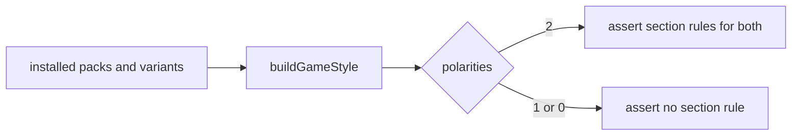

# Phase 6 — Cross-pack matrix, docs, corpus

## Architecture projection

An extension of the `assert:mode-sections` harness builds the style for **every declared pack and variant** from the installed tarballs (City of Mist, Legend in the Mist, Otherscape variants, Adrenaline, PbtA, a custom-pack fixture) and asserts: two polarities give section rules for both; one or none give none. Counts on Handbook's own declarations are equalities (asymmetric tolerance rule). Docs: `aidd_docs/memory/internal/game-packs.md` (section rules, texture token, D2), an ADR for D3, the marker syntax in the user documentation, CHANGELOG and `pnpm version` prepared with the change.

## User Journey

## Test Scope

A future pack is added and the matrix catches a missing or extra section rule.

## Tasks to do

- Matrix harness over all packs and variants.
- Docs, ADR, CHANGELOG, version bump through `pnpm version` (no commit or push without a request).
- Final run: `rtk proxy pnpm build`, `eslint src --ext .ts`, `pnpm lint`, `pnpm check`, `pnpm dump:dom` unchanged for notes without markers.

## Test acceptance criteria

- A note with no marker produces a byte-identical DOM dump.
- City of Mist and an Otherscape variant declaring both polarities pass the matrix as Adrenaline does; Legend in the Mist asserts none.
