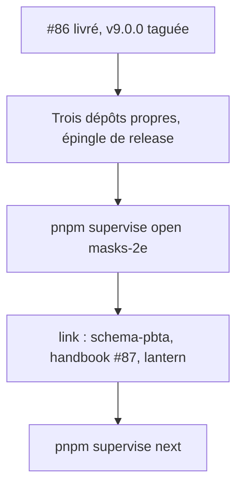
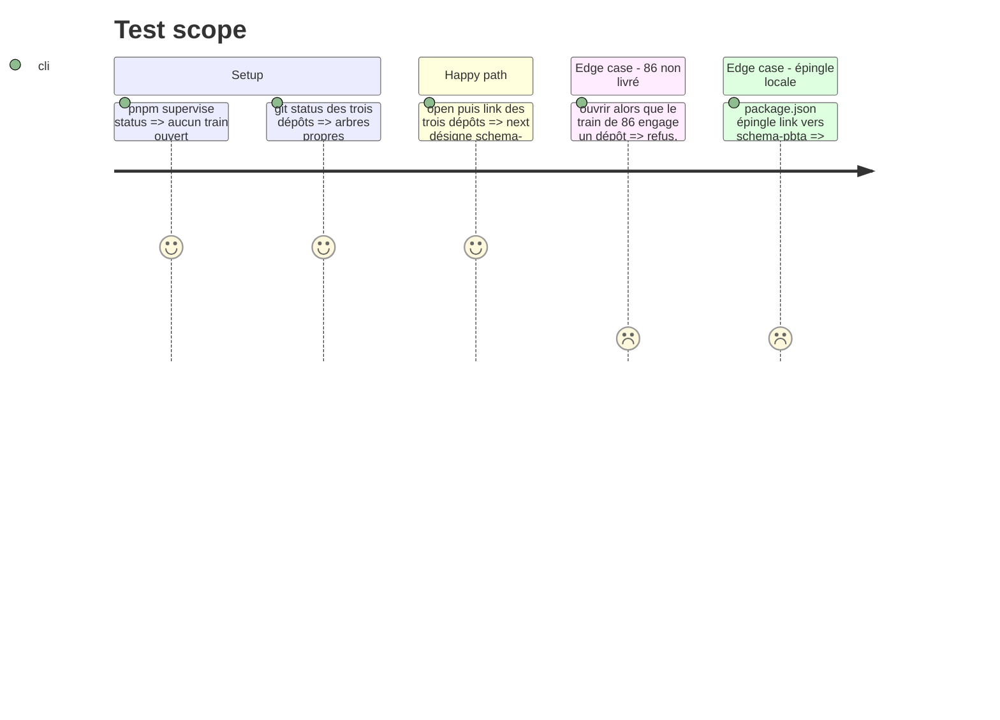

# Instruction: Ouvrir le train

Trois dépôts (`schema-pbta`, `obsidian-handbook`, `lantern`) et une publication : le changement passe par un train du superviseur. Rien ne démarre tant que #86 n'est pas livré.

## Architecture projection

> Tree of the final files. ✅ create · ✏️ modify · ❌ delete

```txt
obsidian-handbook/
└── supervisor/trains/masks-2e.json   ✅ écrit par `open` puis `link`, jamais à la main
```

## User Journey



## Test Scope



## Tasks to do

### `1)` Vérifier les préalables

> État constaté le 2026-10-07 : aucun train ouvert, mais #86 est en cours hors train dans les deux dépôts.

1. `schema-pbta` : le tag `v9.0.0` existe et l'arbre est propre (73 fichiers non commités aujourd'hui)
2. Handbook : arbre propre (12 fichiers de #86 modifiés aujourd'hui) et `package.json` épingle l'archive de release `schema-pbta`, plus `link:..\schema-pbta`
3. Lantern : arbre propre, même épingle
4. Le code du superviseur est identique à `origin/main`, sinon toute commande hors `status` refuse

### `2)` Ouvrir et lier

> Une issue par dépôt, la coordination vit dans Handbook.

1. `pnpm supervise open masks-2e --title "Masks 2E : livret de PJ, carte de PNJ, polices et callouts"`
2. `pnpm supervise link schema-pbta --create --title "Masks 2E : contrat v10, apparence et callouts du pack" --yes` (`--create` n'accepte pas `--depends-on`)
3. `pnpm supervise link obsidian-handbook#87 --depends-on schema-pbta`
4. `pnpm supervise link lantern --create --title "Adopter schema-pbta v10 (Masks 2E)" --yes`, puis `pnpm supervise link lantern#<n> --depends-on schema-pbta`
5. `pnpm supervise sync`, puis `pnpm supervise next`

## Test acceptance criteria

| Task | Acceptance criteria |
| ---- | ------------------- |
| 1 | `status` ne liste aucun train ouvert ; les trois dépôts sont propres ; l'épingle de Handbook est une URL de release |
| 2 | Le fichier de train existe ; `next` désigne l'élément `schema-pbta` ; Handbook et Lantern en dépendent |
