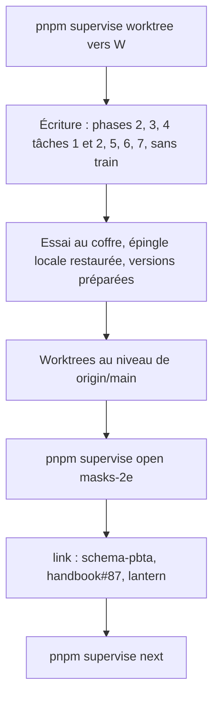
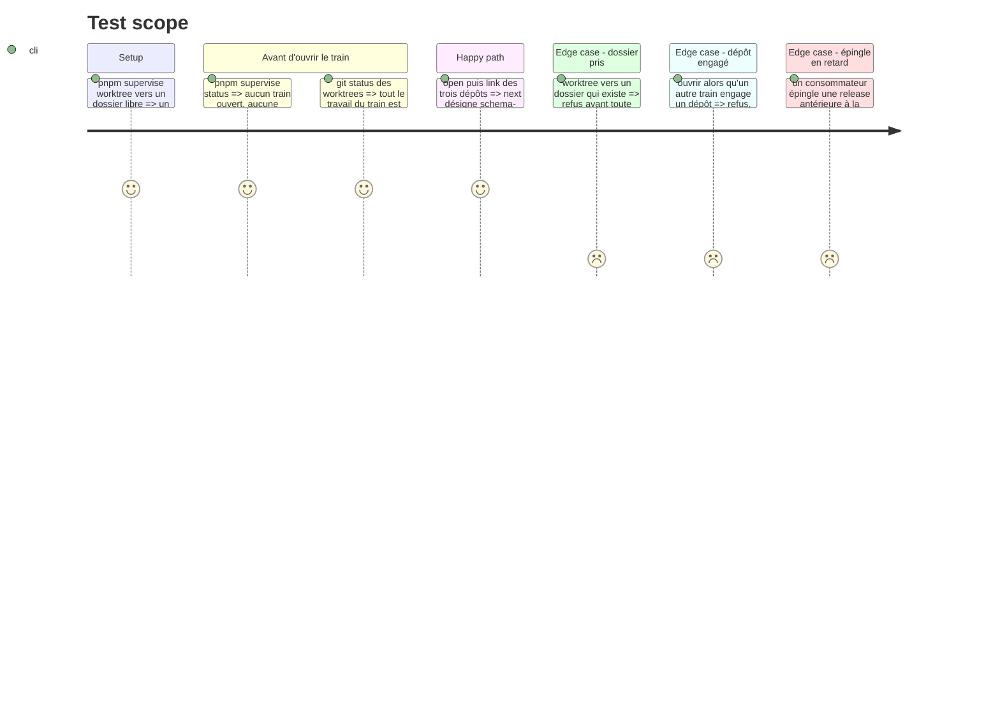

# Instruction: Créer les worktrees, puis ouvrir le train unique

> Exécution dans les worktrees du superviseur (`plan.md`, ligne Exécution) : chemins sous `<W>/<dépôt>`, commandes `pnpm supervise` lancées depuis `<W>/obsidian-handbook` avec `--root <W>`.

Cette phase se fait en **deux temps** (`plan.md`, ligne Ordre). La tâche 1 crée les worktrees et se fait tout de suite : écrire le code ne demande aucun train et n'attend la livraison d'aucun autre. La tâche 2 ouvre le train `masks-2e`, qui publie la majeure suivante de `schema-pbta`, la fait adopter par Handbook et Lantern et livre #87 : elle ne vient qu'**une fois les phases 2, 3, 5, 6, 7 et les tâches 1 et 2 de la phase 4 écrites, l'essai au coffre fait (phase 8, tâche 1) et l'épingle locale restaurée (phase 4, tâche 3)**. Les versions ne sont pas écrites ici : elles se lisent au moment d'exécuter.

## Architecture projection

> Tree of the final files. ✅ create · ✏️ modify · ❌ delete

```txt
obsidian-handbook/
└── supervisor/trains/masks-2e.json   ✅ écrit par `open` puis `link`, jamais à la main
```

## User Journey



## Test Scope



## Tasks to do

### `1)` Créer les worktrees (tout de suite)

> Aucun préalable de train : un train ouvert ailleurs ou une épingle en retard n'empêchent pas d'écrire.

1. Choisir `<W>` : un dossier qui n'existe pas, à côté des dépôts (`../train` et `../us2e` étaient pris le 2026-10-07 ; relire `git worktree list`)
2. Depuis le checkout habituel de Handbook : `pnpm supervise worktree <W>` (les cinq dépôts de la topologie, installation gelée comprise). L'état de travail des checkouts habituels n'entre plus en compte ensuite. Si la commande refuse parce que le code du superviseur de ce checkout diffère de `origin/main`, le mettre à jour est un geste de l'utilisateur
3. Le plan n'a pas besoin d'être dans `<W>` : tant qu'il n'est pas poussé, il se lit et se tient à jour (statuts, Decisions) dans le checkout habituel. Il se commite et se pousse à la demande de l'utilisateur, au plus tard avant la tâche 2
4. Lire dans `<W>/schema-pbta` le contrat que porte `main` (`PBTA_CONTRACT_VERSION`) et vérifier qu'il est tagué (`git tag --list`). L'écriture part sur la majeure suivante ; le numéro se fige à la tâche 2
5. Enchaîner sur la phase 2 ; revenir ici pour la tâche 2 une fois le code écrit

### `2)` Ouvrir et lier (code écrit)

> Une issue par dépôt, la coordination vit dans Handbook. #87 est l'issue de Handbook dans ce train. Photo du 2026-10-08, à remesurer : plus aucun train n'est ouvert, Handbook et Lantern épinglent la dernière release de `schema-pbta`.

1. Préalables : tout train qui engagerait ces dépôts est clos ; le plan est poussé sur `origin/main` ; l'essai au coffre (phase 8, tâche 1) et la restauration de l'épingle locale (phase 4, tâche 3) sont faits
2. Mettre chaque worktree au niveau de `origin/main` (`git fetch origin`, puis remise à niveau du travail non commité par-dessus). Si `main` de `schema-pbta` a pris une majeure entre-temps, renuméroter : `gen`, contrats de pack, témoins (`plan.md`, Decisions)
3. `<W>/schema-pbta` : le tag du contrat courant v\<N> existe ; `pnpm supervise status --strict --root <W>` ne signale aucun train ouvert, aucune épingle divergente ni sur une candidate, et l'épingle de `schema-pbta` vise l'archive de sa dernière release
4. `pnpm supervise open masks-2e --title "Masks 2E : livret de PJ, carte de PNJ, polices et callouts" --root <W>`
5. `pnpm supervise link schema-pbta --create --title "Masks 2E : contrat étendu, masks-npc, apparence et callouts du pack" --yes --root <W>` (`--create` n'accepte pas `--depends-on`)
6. `pnpm supervise link obsidian-handbook#87 --root <W>`, puis `pnpm supervise link obsidian-handbook#87 --depends-on schema-pbta --root <W>`
7. `pnpm supervise link lantern --create --title "Adopter le contrat Masks 2E de schema-pbta" --yes --root <W>`, puis `pnpm supervise link lantern#<n> --depends-on schema-pbta --root <W>`
8. `pnpm supervise sync --root <W>`, puis `pnpm supervise next --root <W>`

## Test acceptance criteria

| Task | Acceptance criteria |
| ---- | ------------------- |
| 1 | Les worktrees existent sous `<W>`, détachés sur `origin/main` ; `git worktree list` ne montre aucune branche neuve ; aucun train n'a été ouvert ni aucun dépôt lié |
| 2 | Le code des phases 2, 3, 5, 6, 7 et des tâches 1 et 2 de la phase 4 est écrit et essayé au coffre, l'épingle locale est restaurée ; `status --strict` sort sans écart et ne liste aucun train ouvert ; Handbook et Lantern épinglent la dernière release de `schema-pbta` ; le fichier de train existe ; `next` désigne l'élément `schema-pbta` ; Handbook (#87) et Lantern en dépendent |
