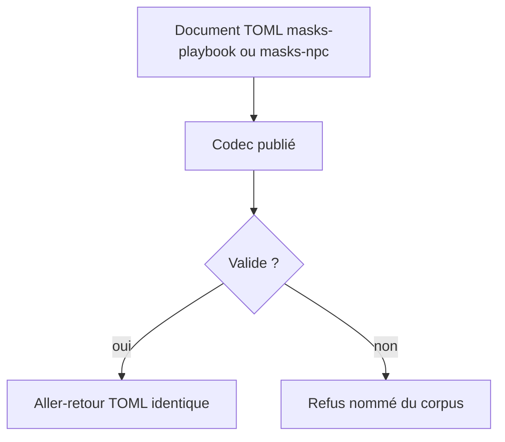
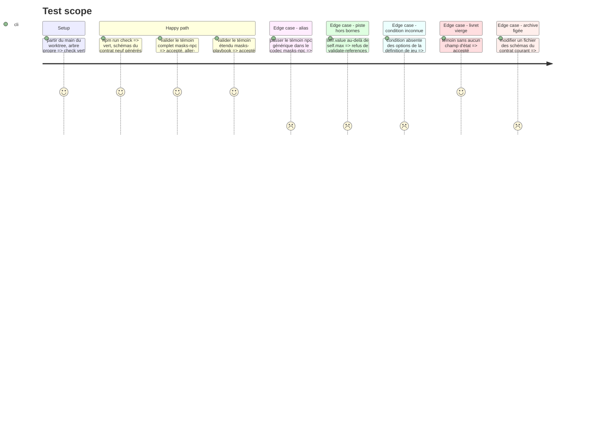

# Instruction: schema-pbta — majeure suivante du contrat, `masks-playbook` et `masks-npc`

> Exécution dans les worktrees du superviseur (`plan.md`, ligne Exécution) : chemins sous `<W>/<dépôt>`, commandes `pnpm supervise` lancées depuis `<W>/obsidian-handbook` avec `--root <W>`.

Phase d'écriture, **sans train ouvert ni commit** (`plan.md`, ligne Ordre) : ce travail deviendra l'élément `schema-pbta` du train `masks-2e`, ouvert une fois tout le code écrit. **v\<N>** est le contrat que porte `main` au départ (`PBTA_CONTRACT_VERSION` dans `src/contract-version.ts`), **v\<N+1>** celui que cette phase ouvre : lire N avant de commencer, ne recopier aucun numéro de ce plan. Si `main` prend une majeure avant la livraison, le numéro se recale à l'ouverture du train (phase 1, tâche 2). Les contrats de présentation sont **générés** (`npm run gen`) depuis `src/presentation/*.ts` : on édite la source TypeScript, jamais le JSON (phase 3). Dépôt en **npm** (`npm.cmd run check` sous Bash). Règles locales : `z.strictObject`, `.optional()` jamais `.default()`, aucun `.refine()` dans `src/zod`, une `description` par propriété, règles inter-champs dans `tools/validate-references.ts`. Témoins et exemples originaux : aucun texte du quickstart.

## Architecture projection

> Tree of the final files. ✅ create · ✏️ modify · ❌ delete

```txt
schema-pbta/
├── package.json                                   ✏️ majeure suivante, `exports` et `files` pour schemas/v<N+1>
├── src/contract-version.ts                        ✏️ N+1
├── src/zod/masks-playbook.ts                      ✏️ champs du recto et du verso
├── src/zod/masks-npc.ts                           ✅
├── src/zod/constants.ts                           ✏️ entrée `masks-npc` dans TARGETS
├── src/codecs/toml.ts                             ✏️ schéma, type, parse/stringify, codec
├── src/index.ts                                   ✏️ exports publics
├── src/presentation/collections.ts                ✏️ collections neuves de `masks-playbook` ; type de cible inchangé
├── src/presentation/stat-ranges.ts                ✏️ entrée `masks-playbook` (`rangesPath: "statRanges"`), type de cible élargi
├── schemas/v<N+1>/                                ✅ généré par `gen`, à commiter
├── corpus/contract/cases.json                     ✏️
├── corpus/contract/valid/masks-playbook-complete.toml   ✏️
├── corpus/contract/valid/masks-npc-complete.toml        ✅
├── corpus/contract/invalid/masks-playbook-<défaut>.toml ✅ un par contrainte neuve
├── corpus/contract/invalid/masks-npc-<défaut>.toml      ✅
├── corpus/temoins/masks/masks-playbook/           ✏️
├── corpus/temoins/masks/masks-npc/                ✅
├── corpus/refus/masks/masks-playbook/             ✅ un défaut nommé par refus
├── corpus/refus/masks/masks-npc/                  ✅
├── examples/masks/masks-playbook/the-ember.toml   ✏️
├── examples/masks/masks-npc/<slug>.toml           ✅
├── packs/*/pack-contract.json                     ✏️ contractVersion N+1 ; masks : document `masks-npc`, `block:pbta-npc`
├── cross-tool-provider.json                       ✏️ contractVersion N+1, `block:pbta-npc` pour handbook
├── tools/validate-version-compat.ts               ✏️ archivedVersions += N
├── tools/validate-package.ts                      ✏️ listes en dur de cibles et de parseurs, assertions de version
├── tools/validate-references.ts                   ✏️ règles Masks : bornes de `self`, `potential` ≤ `potentialMax`, noms de conditions ∈ options de la définition de jeu
├── tools/validate-pack-coverage.ts                ✏️ mesure d'alias contre le `npc` générique
├── tools/validate-presentation-contract.ts        ✏️ assertion de plage Masks inversée
├── docs/compatibility.md                          ✏️ matrice, règle `<pack.id>-<type>`
└── README.md, CHANGELOG.md                        ✏️
```

## User Journey



## Test Scope



## Tasks to do

### `1)` Ouvrir la majeure suivante

> Tout changement d'un schéma publié est majeur une fois son contrat tagué.

1. `contract-version.ts`, `package.json` (version, `exports`, `files`), `archivedVersions`, assertions de `validate-package.ts`
2. `contractVersion` des six `pack-contract.json` et de `cross-tool-provider.json` ; matrice de `docs/compatibility.md` ; `CHANGELOG.md`. Aucun artefact porteur de version n'est laissé de côté (`.codex/rules/04-tooling/4-release-completeness.md`) : `npm.cmd run validate:version` et `npm.cmd run validate:package` le prouvent, pas une relecture

### `2)` Étendre `masks-playbook`

> Liste arrêtée sur `livret1.png` et `livret2.png` (un pré-tiré). Tous les champs neufs sont optionnels : un livret vierge reste valide.

Déjà portés, inchangés : `stats`, `moves[].checked`, `advancement[] {label, checked?}`, `momentOfTruth`, `potential` (cases cochées), `influence` (lignes du cadre « Influence » du verso), `editorial`, `playbookImage`.

| Champ neuf | Forme | Région | Collection publiée |
| --- | --- | --- | --- |
| `heroName` | texte | en-tête recto et verso | — |
| `statRanges` | `record<stat, {min, max}>` | piste des Labels | — |
| `conditions` | `[{name, description?, checked?}]` | Conditions (`description` = malus) | `pbta-condition`, capacité `checked` |
| `momentUnlocked` | booléen | case « Débloqué » | — |
| `influenceOptions` | `string[]` | Options d'influence | `pbta-text` |
| `potentialMax` | compte | nombre de cases de Potentiel | — |
| `drives` | `{intro?: string[], options: [{label, checked?}]}` | Drives | `drives.options` : `pbta-advancement`, `checked` ; `drives.intro` : `pbta-text` |
| `realName`, `abilities`, `demeanor` | textes | lignes d'identité du verso | — |
| `backstory` | `string[]` | Passé | `pbta-text` |
| `relationships` | `string[]` | Relations | `pbta-text` |

1. Écrire ces champs dans `masks-playbook.ts` ; `drives.options` réutilise `advancementEntrySchema` ; la condition Masks est un sous-schéma local (celui de monsterhearts, privé à son fichier, n'a pas d'état coché et ne change pas)
2. `stat-ranges.ts` : entrée `masks-playbook`, type `target` élargi au-delà du littéral `monsterhearts-playbook` ; dans `validate-presentation-contract.ts`, le compte de descripteurs publiés (`PBTA_STAT_RANGE_PRESENTATIONS.length`) passe à deux et l'assertion qui interdit une plage à Masks est inversée
3. `validate-references.ts`, bloc `masks-playbook` sur le modèle du bloc `urban-shadows-playbook` : `potential` ≤ `potentialMax` ; chaque `conditions[].name` figure dans `character.attributes.conditions.options` de la définition de jeu ; chaque clé de `statRanges` est une stat du jeu
4. `collections.ts` : les collections du tableau, avec les éditeurs existants seulement ; `PBTA_COLLECTION_ITEM_EDITORS` ne gagne aucune valeur, sinon Lantern ne compile plus
5. Les `attributes` hérités du playbook portable restent admis et ne sont pas lus par le layout ; `masks.toml` ne change pas
6. Deux témoins (pré-tiré complet, livret vierge), un refus par contrainte, exemple `the-ember` à jour ; textes originaux

### `3)` Créer `masks-npc`

> La carte de `pnj.png`, cible à part : le `npc` générique ne change pas.

1. `z.strictObject` autonome (pas `npcSchema.extend`) : `slug`, `name`, `game`, `description` (le « Background » en prose sous la carte), `tags?`, `generation?`, `realName?`, `drive?`, `abilities?`, `resistance?` (compte, le chiffre cerclé), `conditions?: string[]` (noms, pas des cases), `self {min, max, value}` **requis**, `worstSelf?`, `bestSelf?`, `moves?: string[]` (lignes à puce) ; pas de champ d'image, l'illustration est une image de la note
2. `validate-references.ts` : `self.min` ≤ `self.value` ≤ `self.max` ; chaque condition figure dans `npc.attributes.condition.options` ; la cible `masks-npc` n'entre pas dans `attributeKeys` (elle n'a pas d'`attributes`) et un slug `masks-npc` ne résout pas une référence de type `npc` — le dire dans `docs/compatibility.md`
3. `constants.ts`, `toml.ts`, `index.ts`, listes en dur de `validate-package.ts`
4. Corpus contractuel (accept + reject obligatoires), corpus d'audit, exemple
5. Élargir la mesure d'alias de `validate-pack-coverage.ts` aux témoins du `npc` générique

### `4)` Déclarer la cible et la capacité

> Ce que les consommateurs liront dans le tarball.

1. `packs/masks/pack-contract.json` : second document `masks-npc` ; `requirements.handbook` gagne `block:pbta-npc` ; `requirements.lantern` reste `edit:pbta`
2. `cross-tool-provider.json` : `block:pbta-npc` dans `capabilities.handbook`
3. Textes de `docs/compatibility.md` / `README.md` alignés sur `<pack.id>-<type>` ; aucune collection n'est publiée pour `masks-npc` (aucun éditeur ne la consommerait) : le type `${string}-playbook` de `collections.ts` ne change pas et Lantern compile sans retouche

### `5)` Vérifier

> La CI finit par `git diff --exit-code`.

1. `npm.cmd run check` vert ; schémas générés présents dans l'arbre, à commiter avec le reste ; attention aux faux `M` de fins de ligne. Aucun écart admis : v\<N> est tagué, `validate:version` doit passer
2. Rien n'est commité ni poussé : le message de commit s'écrit en phase 4 (tâche 3), les phases 2 et 3 partageant l'élément

## Test acceptance criteria

| Task | Acceptance criteria |
| ---- | ------------------- |
| 1 | Le paquet s'annonce en `<N+1>.0.0`, `schemas/v<N>` est identique au tag du contrat courant, `schemas/v<N+1>` est exporté |
| 2 | Le pré-tiré et le livret vierge sont acceptés et survivent à l'aller-retour ; chaque contrainte neuve a son refus ; `getPbtaStatRangePresentation("masks-playbook")` renvoie `statRanges` et le témoin y porte −2…+3 |
| 3 | Le témoin `masks-npc` est accepté ; le témoin `npc` générique est refusé par le codec `masks-npc` ; une valeur de Self hors bornes et une condition inconnue sont refusées |
| 4 | Le contrat du pack Masks déclare deux documents ; chaque exigence est incluse dans les capacités du fournisseur |
| 5 | `check` est vert et ne laisse aucun diff |
