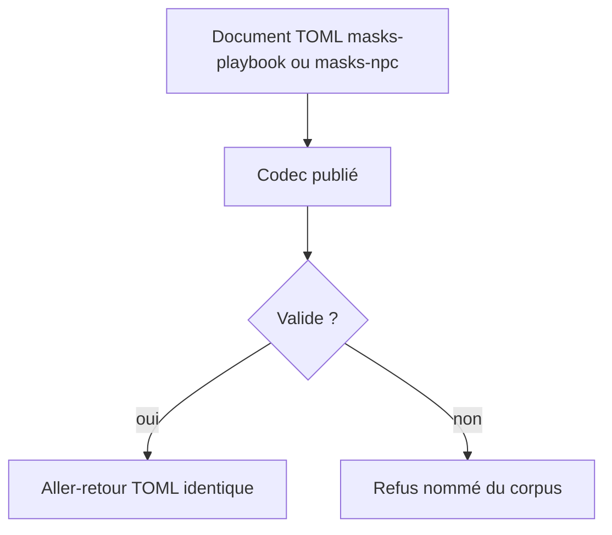
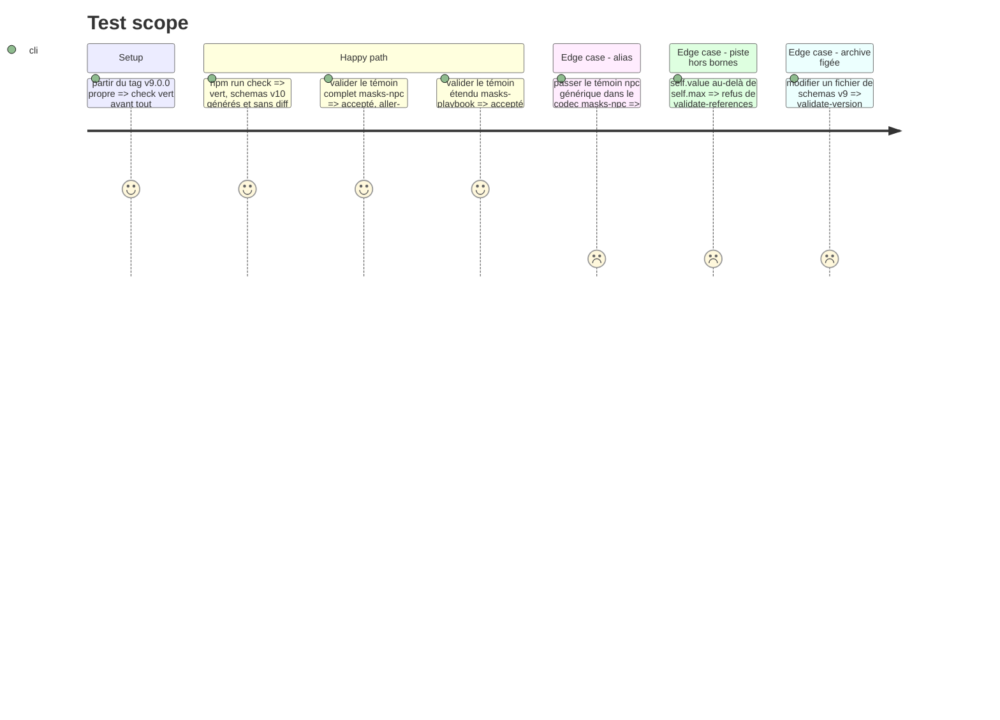

# Instruction: schema-pbta — contrat v10, `masks-playbook` et `masks-npc`

Élément `schema-pbta` du train. Dépôt en **npm** (`npm.cmd run check` sous Bash). Règles locales : `z.strictObject`, `.optional()` jamais `.default()`, aucun `.refine()` dans `src/zod`, une `description` par propriété, règles inter-champs dans `tools/validate-references.ts`. Témoins et exemples originaux : aucun texte du quickstart.

## Architecture projection

> Tree of the final files. ✅ create · ✏️ modify · ❌ delete

```txt
schema-pbta/
├── package.json                                   ✏️ 10.0.0, `exports` et `files` pour schemas/v10
├── src/contract-version.ts                        ✏️ 10 / v10.0.0
├── src/zod/masks-playbook.ts                      ✏️ champs du recto et du verso
├── src/zod/masks-npc.ts                           ✅
├── src/zod/constants.ts                           ✏️ entrée `masks-npc` dans TARGETS
├── src/codecs/toml.ts                             ✏️ schéma, type, parse/stringify, codec
├── src/index.ts                                   ✏️ exports publics
├── src/presentation/collections.ts                ✏️ type élargi à `<pack>-<type>`, collections Masks
├── src/presentation/stat-ranges.ts                ✏️ plage −2…+3 pour `masks-playbook`
├── schemas/v10/                                   ✅ généré par `gen`, à commiter
├── corpus/contract/cases.json                     ✏️
├── corpus/contract/valid/masks-playbook-complete.toml   ✏️
├── corpus/contract/valid/masks-npc-complete.toml        ✅
├── corpus/contract/invalid/masks-playbook-<défaut>.toml ✅ un par contrainte neuve
├── corpus/contract/invalid/masks-npc-<défaut>.toml      ✅
├── corpus/temoins/masks/masks-playbook/           ✏️
├── corpus/temoins/masks/masks-npc/                ✅
├── corpus/refus/masks/masks-playbook/             ✅ un défaut nommé par refus
├── corpus/refus/masks/masks-npc/                  ✅
├── examples/masks/masks-playbook/the-ember.toml   ✏️
├── examples/masks/masks-npc/<slug>.toml           ✅
├── examples/masks/game-definition/masks.toml      ✏️ si le vocabulaire bouge
├── packs/*/pack-contract.json                     ✏️ contractVersion 10 ; masks : document `masks-npc`, `block:pbta-npc`
├── cross-tool-provider.json                       ✏️ contractVersion 10, `block:pbta-npc` pour handbook
├── tools/validate-version-compat.ts               ✏️ archivedVersions += 9
├── tools/validate-package.ts                      ✏️ listes en dur de cibles et de parseurs, assertions de version
├── tools/validate-references.ts                   ✏️ bornes de piste, conditions connues, cible `masks-npc`
├── tools/validate-pack-coverage.ts                ✏️ mesure d'alias contre le `npc` générique
├── tools/validate-presentation-contract.ts        ✏️ assertion de plage Masks inversée
├── docs/compatibility.md                          ✏️ matrice, règle `<pack.id>-<type>`
└── README.md, CHANGELOG.md                        ✏️
```

## User Journey



## Test Scope



## Tasks to do

### `1)` Ouvrir la v10

> Tout changement d'un schéma publié est majeur une fois `v9.0.0` tagué.

1. `contract-version.ts`, `package.json` (version, `exports`, `files`), `archivedVersions`, assertions de `validate-package.ts`
2. `contractVersion` des six `pack-contract.json` et de `cross-tool-provider.json` ; matrice de `docs/compatibility.md` ; `CHANGELOG.md`

### `2)` Étendre `masks-playbook`

> Le recto et le verso du livret vierge, d'après `livret1.png` et `livret2.png`.

1. Relire les deux captures et arrêter la liste des champs ; réutiliser les sous-schémas existants avant d'en créer (`advancement` du playbook portable, conditions et `backstory` de `monsterhearts-playbook`)
2. Recto : conditions avec malus et état coché, Drives (introduction + options cochables), cases de Potentiel, options d'Influence, verrou du Moment de vérité ; les moves cochables et les Advances existent déjà (`moves[].checked`, `advancement`)
3. Verso : nom réel, capacités, attitude, passé, relations, influence — des invites de livret vierge, pas des valeurs de personnage
4. Plage des Labels : publier −2…+3 par `stat-ranges.ts` et inverser l'assertion de `validate-presentation-contract.ts`
5. Collections dans `collections.ts` avec les éditeurs existants seulement (`pbta-condition`, `pbta-advancement`, `pbta-text`) : la liste `PBTA_COLLECTION_ITEM_EDITORS` ne gagne aucune valeur, sinon Lantern ne compile plus
6. Témoin complet, un refus par contrainte, exemple `the-ember` à jour

### `3)` Créer `masks-npc`

> La carte de `pnj.png`, cible à part : le `npc` générique ne change pas.

1. Schéma : nom et génération, nom réel, drive, capacités, résistance, conditions, piste Self (`min`, `max`, valeur), Worst Self, Best Self, moves, background ; la piste Self est requise (anti-alias)
2. Conditions des PNJ : clés des conditions du jeu, vérifiées contre le `game-definition` dans `validate-references.ts` (hypothèse de l'issue, à confirmer sur la capture)
3. `constants.ts`, `toml.ts`, `index.ts`, listes en dur de `validate-package.ts`
4. Corpus contractuel (accept + reject obligatoires), corpus d'audit, exemple
5. Élargir la mesure d'alias de `validate-pack-coverage.ts` aux témoins du `npc` générique

### `4)` Déclarer la cible et la capacité

> Ce que les consommateurs liront dans le tarball.

1. `packs/masks/pack-contract.json` : second document `masks-npc` ; `requirements.handbook` gagne `block:pbta-npc` ; `requirements.lantern` reste `edit:pbta`
2. `cross-tool-provider.json` : `block:pbta-npc` dans `capabilities.handbook`
3. Type `-playbook` de `collections.ts` et textes de `docs/compatibility.md` / `README.md` alignés sur `<pack.id>-<type>`

### `5)` Vérifier

> La CI finit par `git diff --exit-code`.

1. `npm.cmd run check` vert ; schémas générés commités ; attention aux faux `M` de fins de ligne
2. Message de commit en anglais dans `.git/SUPERVISOR_COMMIT_MSG` (le commit vient en phase 3, les deux phases partagent l'élément)

## Test acceptance criteria

| Task | Acceptance criteria |
| ---- | ------------------- |
| 1 | Le paquet s'annonce en 10.0.0, `schemas/v9` est identique au tag `v9.0.0`, `schemas/v10` est exporté |
| 2 | Le témoin étendu est accepté et survit à l'aller-retour ; chaque contrainte neuve a son refus ; la plage publiée pour `masks-playbook` vaut −2…+3 |
| 3 | Le témoin `masks-npc` est accepté ; le témoin `npc` générique est refusé par le codec `masks-npc` ; une valeur de Self hors bornes est refusée |
| 4 | Le contrat du pack Masks déclare deux documents ; chaque exigence est incluse dans les capacités du fournisseur |
| 5 | `check` est vert et ne laisse aucun diff |
