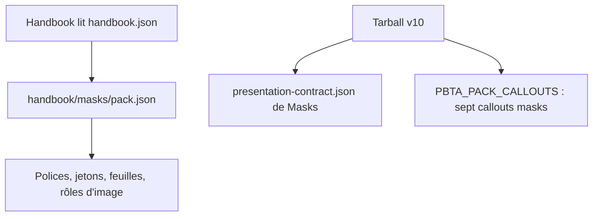
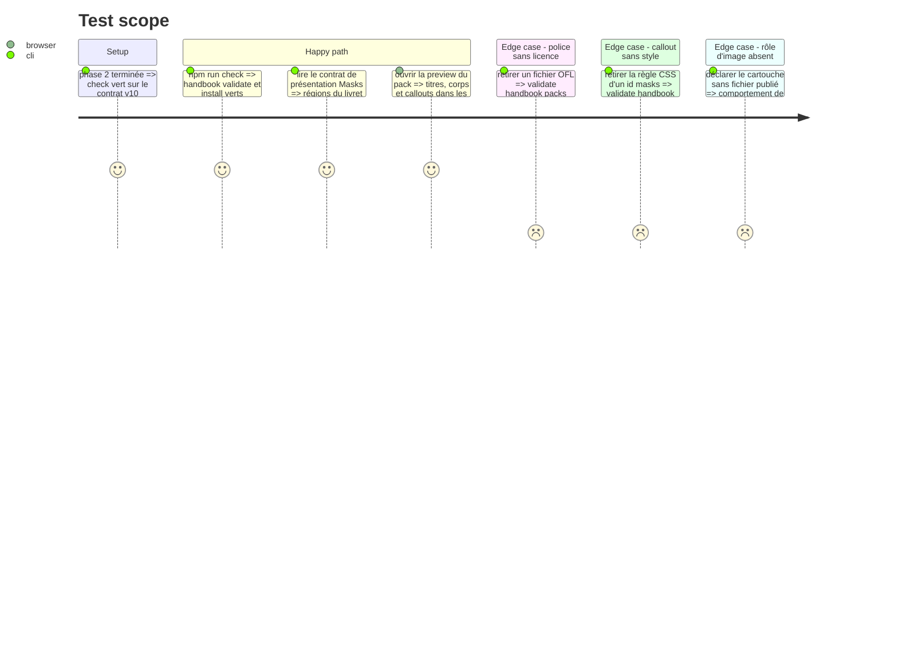

# Instruction: schema-pbta — présentation et apparence du pack Masks

Même élément de train que la phase 2. Deux arbres distincts : `packs/masks/` part dans le tarball, `handbook/masks/` est lu par Handbook sur `main` de GitHub. Tout ce qui est poussé dans `handbook/` atteint les utilisateurs sans release : ne rien y exiger que le Handbook publié ne sache faire.

## Architecture projection

> Tree of the final files. ✅ create · ✏️ modify · ❌ delete

```txt
schema-pbta/
├── src/presentation/masks-playbook.ts             ✅ régions recto/verso, ordre, rangées, libellés français
├── src/presentation/masks-npc.ts                  ✅ régions de la carte
├── src/presentation/callouts.ts                   ✏️ sept entrées `masks-*` dans PBTA_PACK_CALLOUTS
├── src/presentation/index.ts, src/index.ts        ✏️ exports, type PbtaPackCallout
├── src/pack-manifest.ts                           ✏️ bloc `presentation` ouvert à d'autres cibles que monsterhearts
├── tools/gen-presentation-contracts.ts            ✏️ génère aussi Masks
├── tools/validate-presentation-contract.ts        ✏️ contrat Masks
├── packs/masks/presentation-contract.json         ✅ généré
├── packs/masks/pack-contract.json                 ✏️ bloc `presentation`
├── handbook.json                                  ✏️ version du pack Masks
├── handbook/masks/pack.json                       ✏️ `assets.fonts`, jetons, rôles d'image, version
├── handbook/masks/assets/fonts/*.woff2            ✅ quatre familles
├── handbook/masks/assets/fonts/OFL-<famille>.txt  ✅ une licence par famille, telle quelle
├── handbook/masks/assets/fonts/README.md          ✏️ ne plus dire « polices système »
├── handbook/masks/assets/styles/callouts.css      ✏️ sept callouts sous `body.brumes--masks`
├── handbook/masks/assets/styles/page.css          ✅ puces, tableaux, termes de jeu (si le validateur l'admet)
├── handbook/masks/styles/base.css                 ✏️ `@font-face` de la preview
├── handbook/masks/preview/preview.toml            ✏️ livret étendu, carte de PNJ
├── handbook/masks/preview/index.html              ✏️ régénéré
├── handbook/masks/README.md                       ✏️
├── LICENSES/HANDBOOK-ASSETS.md                    ✏️ provenance et licence des polices
├── tools/render-handbook-preview.ts               ✏️ sections Masks
├── tools/validate-handbook-packs.ts               ✏️ champs spécialisés et surface d'édition Masks
└── tools/validate-handbook-catalog-fixtures.ts    ✏️ ses fixtures négatives partent du pack Masks
```

## User Journey



## Test Scope



## Tasks to do

### `1)` Contrat de présentation Masks

> Handbook ne code ni ordre ni libellé en dur.

1. Généraliser le bloc `presentation` de `pack-manifest.ts` (cible littérale `monsterhearts-playbook` aujourd'hui) et `gen-presentation-contracts.ts`
2. `masks-playbook` : régions du recto (Labels, Conditions, Moment de vérité, Moves, Drives, Influence, Progressions et Potentiel) et du verso (Identité, Capacités, Attitude, Passé, Relations, Influence), `canonicalOrder` et `rows` d'après les captures, libellés français
3. `masks-npc` : En-tête, Identité, Capacités, Résistance et conditions, Piste Self, Pire soi / Meilleur soi, Moves, Contexte
4. Nombre de cases de Potentiel : dans le contrat s'il est fixe pour le jeu, sinon champ de document (à lire sur `livret1.png`)

### `2)` Polices

> Quatre familles OFL, publiées par le pack.

1. WOFF2 de Staatliches (400), Josefin Sans (variable 100–700), Crimson Pro (variable 200–900 + italique), Comic Neue (400, 700) ; Bebas Neue seulement si la comparaison de la phase 8 la retient
2. Josefin Sans : compression seule, tables `name` intactes, ni sous-ensemble ni instance statique
3. `assets.fonts` de `pack.json` au format `famille → file, weight, style` ; `OFL.txt` de chaque famille à côté ; `LICENSES/HANDBOOK-ASSETS.md`
4. Les polices restent sous `handbook/` : la licence du paquet npm ne change pas

### `3)` Jetons et style de page

> Titres bleu marine condensés, intertitres dorés, puces étoile, tableaux, termes de jeu.

1. `style.base` et `style.light` : familles, couleurs relevées sur `page1.png`, `page2.png`, `tables.png` ; `--code-normal` et `--code-background` fixés ; `polarities` reste `["light"]`
2. Vérifier d'abord si `validate-handbook-packs.ts` admet une seconde feuille dans `assets.stylesheets` : si oui, `page.css` porte puces étoile, tableaux rayés à filets dorés et termes en bleu gras, sélecteurs préfixés `body.brumes--masks` ; sinon ces règles passent par des jetons que `_page.scss` de Handbook consomme (phase 6)
3. Puce étoile et bandeau à silhouette de ville : motifs originaux en SVG livrés par le pack, déclarés dans `assets.images` (hypothèse de l'issue : pas une illustration du livre)

### `4)` Callouts du pack

> Sept callouts, préfixe du pack, libellés français.

1. Entrées de `PBTA_PACK_CALLOUTS` : `masks-read-aloud` (texte à lire), `masks-sidebar` (encadré à bandeau), `masks-move` (boîte de move), `masks-crisis` (déclencheur de crise), `masks-caption` (légende d'image), `masks-portrait` (vignette portrait), `masks-chapter` (titre de chapitre)
2. CSS de chacun dans `callouts.css`, d'après `callouts.png`, `moves.png`, `page1.png`, `team.png`, `chapter.png`
3. Portrait : l'image est celle que la note intègre dans le corps du callout, le CSS la cadre en doré
4. Cartouche de chapitre : rôle `chapter-cartouche`, lu par `var(--brumes-image-chapter-cartouche)` ; **constater** ce que fait l'installeur de Handbook d'un rôle déclaré sans fichier publié. S'il refuse le pack, le rôle n'est pas déclaré par le pack et l'image est intégrée dans le corps du callout, comme le portrait
5. Sans image, les deux callouts restent lisibles (titre et texte seuls)

### `5)` Preview, version, commit

> Bump conjoint obligatoire.

1. `preview.toml`, `render-handbook-preview.ts`, attentes Masks de `validate-handbook-packs.ts`, fixtures de `validate-handbook-catalog-fixtures.ts`
2. Version du pack montée à l'identique dans `pack.json` et `handbook.json` ; `requires` et `minimumHandbookVersion` inchangés par rapport à ce que #86 a établi
3. `npm.cmd run check` vert, sans diff ; puis `pnpm supervise commit schema-pbta` depuis Handbook

## Test acceptance criteria

| Task | Acceptance criteria |
| ---- | ------------------- |
| 1 | Le tarball contient un contrat de présentation Masks nommant chaque région du livret et de la carte en français |
| 2 | Le pack déclare quatre familles, chacune accompagnée de sa licence ; le fichier Josefin Sans garde son nom de famille d'origine |
| 3 | La preview montre titres bleu marine, intertitres dorés, puces étoile et tableaux rayés ; le code a ses deux jetons |
| 4 | Les sept callouts ont une entrée publiée et un style ; portrait et chapitre restent lisibles sans image ; le sort du rôle sans fichier est consigné dans le plan |
| 5 | `check` est vert ; la version du pack est la même dans les deux fichiers ; le commit de l'élément est fait par le superviseur |
