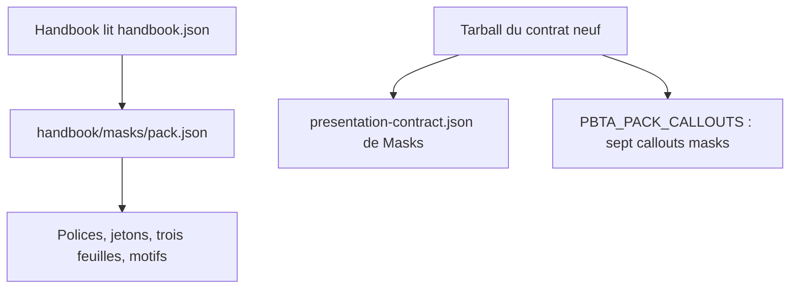
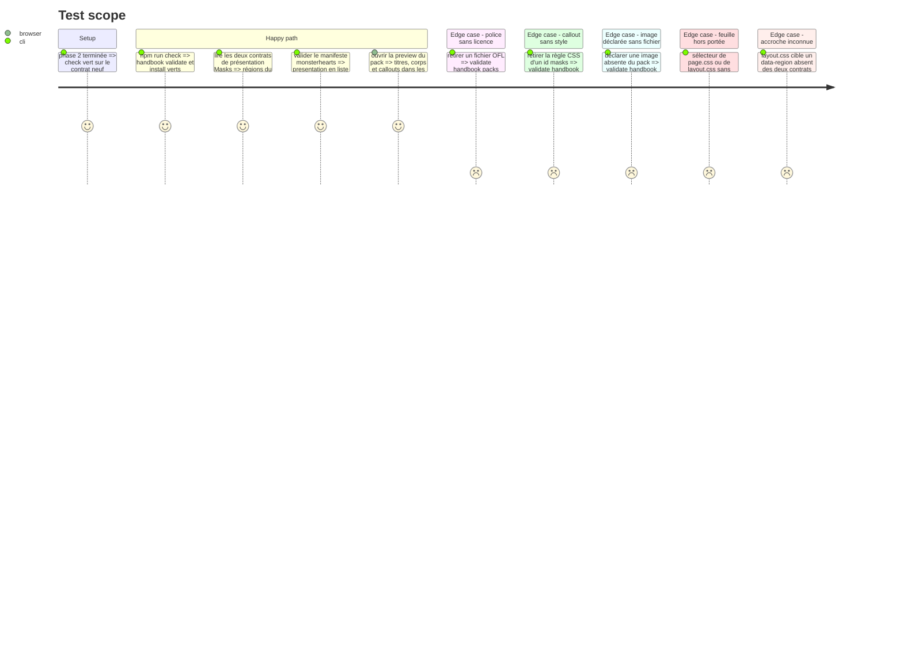

# Instruction: schema-pbta — présentation et apparence du pack Masks

> Exécution dans les worktrees du superviseur (`plan.md`, ligne Exécution) : chemins sous `<W>/<dépôt>`, commandes `pnpm supervise` lancées depuis `<W>/obsidian-handbook` avec `--root <W>`.

Suite de la phase 2, même worktree, toujours sans train ni commit. Deux arbres distincts : `packs/masks/` part dans le tarball, `handbook/masks/` est lu par Handbook sur GitHub, à la référence que suit la source du coffre (par défaut la dernière release du schéma, sinon un tag ou une branche). Ce qui est dans `handbook/` atteint donc les utilisateurs sans qu'ils aient mis Handbook à jour : ne rien y exiger que le Handbook déjà publié ne sache faire.

## Architecture projection

> Tree of the final files. ✅ create · ✏️ modify · ❌ delete

```txt
schema-pbta/
├── src/presentation/masks-playbook.ts             ✅ régions recto/verso, ordre, rangées, libellés français
├── src/presentation/masks-npc.ts                  ✅ régions de la carte
├── src/presentation/callouts.ts                   ✏️ sept entrées `masks-*` dans PBTA_PACK_CALLOUTS
├── src/presentation/index.ts, src/index.ts        ✏️ exports, type PbtaPackCallout
├── src/pack-manifest.ts                           ✏️ `presentation` devient une liste `{target, artifact, appearanceArtifact?}`
├── tools/gen-presentation-contracts.ts            ✏️ génère aussi Masks
├── tools/validate-presentation-contract.ts        ✏️ contrat Masks
├── packs/masks/presentation-contract.json         ✅ généré, cible `masks-playbook`
├── packs/masks/npc-presentation-contract.json     ✅ généré, cible `masks-npc`
├── packs/masks/pack-contract.json                 ✏️ deux entrées `presentation`, `presentation:pbta-layout` pour handbook
├── packs/monsterhearts/pack-contract.json         ✏️ `presentation` en liste d'une entrée
├── handbook.json                                  ✏️ version du pack Masks
├── handbook/masks/pack.json                       ✏️ `assets.fonts`, jetons, images de motif, deux feuilles de plus, version
├── handbook/masks/assets/fonts/*.woff2            ✅ quatre familles
├── handbook/masks/assets/fonts/OFL-<famille>.txt  ✅ une licence par famille, telle quelle
├── handbook/masks/assets/fonts/README.md          ✏️ ne plus dire « polices système »
├── handbook/masks/assets/styles/callouts.css      ✏️ sept callouts sous `body.brumes--masks`
├── handbook/masks/assets/styles/page.css          ✅ puces, tableaux, termes de jeu
├── handbook/masks/assets/styles/layout.css        ✅ géométrie de la carte de PNJ et du livret (`plan.md`, Decisions)
├── handbook/masks/assets/images/star-bullet.svg   ✅ motif original
├── handbook/masks/assets/images/skyline-band.svg  ✅ motif original
├── handbook/masks/styles/base.css                 ✏️ `@font-face` de la preview
├── handbook/masks/preview/preview.toml            ✏️ livret étendu, carte de PNJ
├── handbook/masks/preview/index.html              ✏️ régénéré
├── handbook/masks/README.md                       ✏️
├── LICENSES/HANDBOOK-ASSETS.md                    ✏️ provenance et licence des polices
├── tools/render-handbook-preview.ts               ✏️ sections Masks
├── tools/validate-handbook-packs.ts               ✏️ bloc Masks sur le modèle du bloc monsterhearts : contrat de présentation comparé à l'export npm, polices et licences exigées, accroches de `layout.css` comparées aux deux contrats
└── tools/validate-handbook-catalog-fixtures.ts    ✏️ ses fixtures négatives partent du pack Masks
```

## User Journey



## Test Scope



## Tasks to do

### `1)` Contrat de présentation Masks

> Handbook ne code ni ordre ni libellé en dur.

1. `pack-manifest.ts` : `presentation` est déjà une liste non vide (une entrée par cible, `appearanceArtifact` optionnel), livrée par #89 : vérifier, ne pas réécrire. Masks y déclare deux entrées et ne publie pas de contrat d'apparence : son apparence vit dans `handbook/masks`. **Les contrats se rédigent dans `src/presentation/masks-playbook.ts` et `src/presentation/masks-npc.ts`, puis `npm run gen` écrit `packs/masks/*presentation-contract.json` : le JSON n'est jamais édité à la main** (une retouche serait écrasée)
2. `masks-playbook`, recto en deux colonnes : gauche = Labels, Conditions, Moment de vérité, Options d'influence, Progressions et Potentiel ; droite = Moves, Drives. Verso : En-tête, Identité (nom réel, capacités, attitude), Passé, Relations, Influence, Illustration à droite. `canonicalOrder`, `faces` et colonnes d'après les captures, libellés français
3. `masks-npc` : En-tête (nom, génération), Identité (nom réel, drive, capacités sur trois lignes), Résistance et Conditions, Piste Self, Pire soi / Meilleur soi, Moves, Contexte (hors de la carte). Pas de région d'illustration : le schéma n'a pas de champ d'image et une région exige au moins un champ
4. Chaque fichier Masks déclare **son propre schéma Zod** : celui de monsterhearts est fermé sur son jeu (ids de région et `primitives` en énumérations locales, `rows` à exactement trois colonnes, bloc `pack` littéral) et ne change pas. Parties communes reprises telles quelles : `regions[] {id, label, group, primitive, fields}`, `canonicalOrder`, `fallbacks`. Propre à `masks-playbook` : `faces[] {id, label, header, columns}` (recto et verso, deux colonnes de régions empilées chacune ; la région d'en-tête est nommée par `header` sur les deux faces, toute autre région est placée une seule fois) ; pas de bloc `pack`. Propre à `masks-npc` : `rows` (une ou deux colonnes par rangée) et `outsideCard` (la région Contexte). Primitives Masks : piste, cases, lignes clé-valeur, liste, prose, portrait
5. `packs/masks/pack-contract.json` : `requirements.handbook` gagne `presentation:pbta-layout` (déjà déclarée par Handbook depuis #86) ; `requirements.lantern` ne la gagne pas, Lantern ne rend pas ce layout
6. Rangées de **une à trois colonnes** (la carte en a de une et de deux) et règle « une rangée = une face » (groupes `recto`/`verso`) : le schéma zod de chaque fichier Masks les énonce, sur le modèle de `urban-shadows-playbook`
7. Corpus de refus, les deux moitiés étant nécessaires : un témoin valide par cible, et dans `corpus/presentation/invalid/` un fichier par contrainte (région sans champ, rangée de plus de trois colonnes, rangée à cheval sur deux faces, région d'en-tête absente de la face, id dupliqué). `validate-presentation-contract.ts` nomme les régions volontairement non placées (ici le contexte de la carte) ; une région non placée et non déclarée échoue

### `2)` Polices

> Quatre familles OFL, publiées par le pack.

1. WOFF2 de Staatliches (400), Josefin Sans (variable 100–700), Crimson Pro (variable 200–900 + italique), Comic Neue (400, 700) ; Bebas Neue seulement si la comparaison de la phase 8 la retient
2. Josefin Sans : compression seule, tables `name` intactes, ni sous-ensemble ni instance statique
3. `assets.fonts` de `pack.json` au format `famille → file, weight, style` ; `OFL.txt` de chaque famille à côté ; `LICENSES/HANDBOOK-ASSETS.md`
4. Les polices restent sous `handbook/` : la licence du paquet npm ne change pas

### `3)` Jetons et style de page

> Titres bleu marine condensés, intertitres dorés, puces étoile, tableaux, termes de jeu.

1. `style.base` et `style.light` : familles, couleurs relevées sur `page1.png`, `page2.png`, `tables.png` ; `--code-normal` et `--code-background` fixés ; `polarities` reste `["light"]`
2. `page.css`, seconde entrée de `assets.stylesheets` : puces étoile, tableaux rayés à filets dorés, termes de jeu en bleu gras. Contraintes vérifiées dans Handbook (`validatePackCss`, `rewritePackUrls`) : aucun `@import`, chaque sélecteur commence par `body.brumes--masks`, chaque `url()` est relative et vise une image déclarée
3. Puce étoile et bandeau à silhouette de ville : motifs originaux en SVG, déclarés dans `assets.images` **avec leur fichier** (toute image déclarée doit exister, sinon `missing asset`)

### `4)` Géométrie de la carte et du livret

> Publiée par le pack, pas écrite en SCSS dans Handbook (`plan.md`, Decisions). Écrite ici, réglée au coffre pendant les phases 5, 6 et 8.

1. `layout.css`, troisième entrée de `assets.stylesheets`, mêmes contraintes que `page.css`. Tout sélecteur commence par `body.brumes--masks` et n'accroche que les attributs du layout : `[data-region="<id>"]`, `[data-primitive="<primitive>"]`, `[data-face]`, `[data-row]`, `[data-column]` ; aucune classe supposée de Handbook
2. Carte de PNJ : cadre, rangées à une ou deux colonnes, piste Self pleine largeur, résistance cerclée, contexte hors du cadre. Livret : deux colonnes par face, piste de Labels, cases (conditions, moves, Drives, Progressions, Potentiel), lignes d'identité à remplir, colonne d'illustration. Géométrie commune (piste, case, ligne clé-valeur) écrite une fois, par liste de sélecteurs et propriétés personnalisées : pas de copie de valeurs
3. Couleurs par les jetons du pack, aucune valeur en dur hors `pack.json` ; saut de page entre deux faces sous `@media print` ; aucune règle sombre (pack en clair seul). Cases à cocher : `align-items: flex-start`, `margin: calc((1lh - 1.25rem) / 2) 0 0` et `font: inherit` sur la case, pour qu'elle reste alignée sur la première ligne d'un libellé qui passe à la ligne
4. `validate-handbook-packs.ts` : toute valeur de `data-region` ciblée par `layout.css` est l'id d'une région de `presentation-contract.json` ou de `npc-presentation-contract.json` de Masks, toute valeur de `data-primitive` une primitive qu'ils déclarent ; la feuille passe le même contrôle de portée que les autres
5. Le pack atteint les coffres avant le Handbook qui émet ce DOM : la feuille ne cible alors rien, sans effet ; `requires` et `minimumHandbookVersion` ne bougent pas pour elle

### `5)` Callouts du pack

> Sept callouts, préfixe du pack, libellés français.

1. Entrées de `PBTA_PACK_CALLOUTS` : `masks-read-aloud` (texte à lire), `masks-sidebar` (encadré à bandeau), `masks-move` (boîte de move), `masks-crisis` (déclencheur de crise), `masks-caption` (légende d'image), `masks-portrait` (vignette portrait), `masks-chapter` (titre de chapitre)
2. CSS de chacun dans `callouts.css`, d'après `callouts.png`, `moves.png`, `page1.png`, `team.png`, `chapter.png`
3. Portrait : l'image est celle que la note intègre dans le corps du callout, le CSS la cadre en doré
4. Cartouche de chapitre : même voie que le portrait, image intégrée par la note dans le corps du callout, que le CSS place derrière le titre ; aucun rôle d'image déclaré
5. Sans image, les deux callouts restent lisibles (titre et texte seuls)

### `6)` Preview et version du pack

> Bump conjoint obligatoire. Aucun commit ici.

1. `preview.toml`, `render-handbook-preview.ts`, bloc Masks de `validate-handbook-packs.ts`, fixtures de `validate-handbook-catalog-fixtures.ts`
2. Version du pack montée à l'identique dans `pack.json` et `handbook.json` ; `requires` et `minimumHandbookVersion` inchangés par rapport à ce que #86 a établi
3. `npm.cmd run check` vert, sans diff ; rien n'est commité ni poussé ici : le commit, le push et la release partent avec le train (phase 8), une fois les phases 5 à 7 écrites. L'arbre de `schema-pbta` reste donc modifié pendant toute l'écriture de Handbook, qui le lit par un tarball local (phase 4, tâche 2) : une retouche du contrat demandée par les phases 5 à 7 se fait ici, sans release, suivie d'un nouveau `npm pack`

## Test acceptance criteria

| Task | Acceptance criteria |
| ---- | ------------------- |
| 1 | Le tarball contient deux contrats de présentation Masks nommant chaque région du livret et de la carte en français ; `presentation-contract.json` de monsterhearts est identique au tag du contrat courant |
| 2 | Le pack déclare quatre familles, chacune accompagnée de sa licence ; le fichier Josefin Sans garde son nom de famille d'origine |
| 3 | La preview montre titres bleu marine, intertitres dorés, puces étoile et tableaux rayés ; le code a ses deux jetons ; `page.css` passe le validateur amont |
| 4 | `layout.css` est déclarée et passe le validateur ; cibler un `data-region` ou un `data-primitive` inconnu des contrats fait échouer `handbook:validate` ; aucune couleur en dur dans la feuille |
| 5 | Les sept callouts ont une entrée publiée et un style ; portrait et chapitre restent lisibles sans image ; `pack.json` ne déclare aucune image sans fichier |
| 6 | `check` est vert ; la version du pack est la même dans les deux fichiers ; l'arbre de `schema-pbta` porte les changements des phases 2 et 3, non commités |
