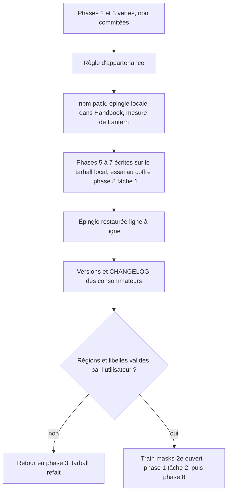
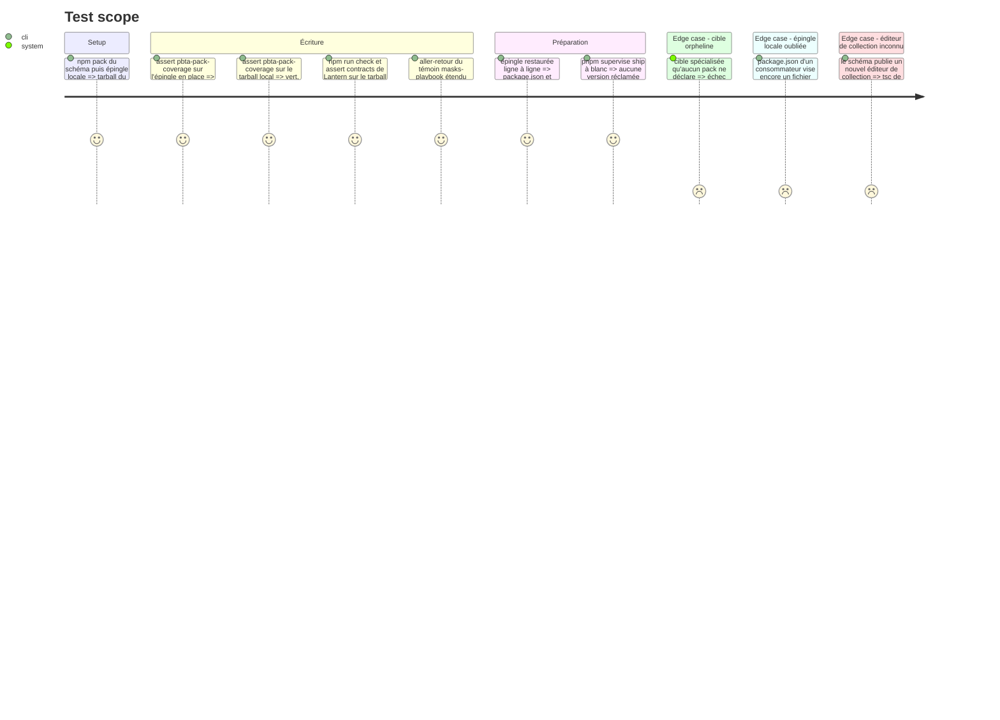

# Instruction: Adoption du contrat par Handbook et Lantern, puis versions

> Exécution dans les worktrees du superviseur (`plan.md`, ligne Exécution) : chemins sous `<W>/<dépôt>`, commandes `pnpm supervise` lancées depuis `<W>/obsidian-handbook` avec `--root <W>`.

Cette phase se fait en **deux temps** (`plan.md`, ligne Ordre).

- **Écriture, sans train ni commit (tâches 1 et 2)**, à la suite de la phase 3 : la règle d'appartenance, puis l'épingle locale du tarball qui sert aux phases 5 à 7.
- **Préparation de la livraison (tâche 3)**, une fois les phases 5 à 7 écrites et l'essai au coffre fait (phase 8, tâche 1) : restaurer l'épingle, préparer les versions, faire relire le contrat.

Il n'y a qu'un train (`plan.md`, Decisions) : `present` mesure Handbook et Lantern sur l'archive que `schema-pbta` publierait (`npm pack --dry-run`), non sur leur épingle. Tout ce que Handbook commite, code importeur du contrat neuf compris, est donc valide dès la présentation ; la candidate est ensuite publiée et adoptée par le superviseur, qui écrit épingle, lockfiles et `release-train.matrix.json`. Il n'écrit ni la version ni le `CHANGELOG` des consommateurs : `present` refuse une version déjà publiée, `release` tague celle que `origin/main` porte. Elles se préparent par l'action `prepare` du skill `ship-train` (`plan.md`, lignes Versions et Skills) ; commit, preview, `ship` et réparation sont les actions suivantes du même skill (phase 8), avec `--root <W>` sur chaque commande.

## Architecture projection

> Tree of the final files. ✅ create · ✏️ modify · ❌ delete

```txt
obsidian-handbook/
├── tools/pbtaPackCoverage.harness.mts             ✏️ règle de préfixe, plus de découpe sur `-playbook`
├── src/settings/pbtaCoverageModal.ts              ✏️ pack attendu lu dans les contrats
├── src/features/pbta/coverage.ts                  ✏️ messages et classement `<pack.id>-<type>`
├── src/features/pbta/specializedPlaybooks.ts      ✏️ une cible spécialisée n'est plus supposée être un playbook
├── aidd_docs/memory/internal/pbta-coverage.md     ✏️ règle `<pack.id>-<type>`
├── package.json, manifest.json, versions.json     ✏️ version, par `prepare` de `ship-train` (`pnpm version`)
├── CHANGELOG.md                                   ✏️ section de la version
├── package.json, pnpm-lock.yaml                   ✏️ épingle, écrits par le superviseur (l'épingle locale de la tâche 2 n'y figure jamais)
└── supervisor/trains/masks-2e.json                ✏️ clos par `ship`
lantern/
├── package.json, package-lock.json                ✏️ version, par `prepare` de `ship-train` (`npm version`)
├── CHANGELOG.md                                   ✏️ section de la version, limites comprises
├── package.json, package-lock.json, pnpm-lock.yaml ✏️ épingle, écrits par le superviseur
└── release-train.matrix.json                      ✏️ écrit par le superviseur
hors dépôt (dossier temporaire)
└── schema-pbta-<version>.tgz                      ✅ tarball local, refait à chaque retouche du schéma
```

## User Journey



## Test Scope



## Tasks to do

### `1)` Handbook : règle d'appartenance (écriture)

> `<pack.id>-<type>`, propriétaire lu dans les contrats de pack. Le harnais `pbtaPackCoverage.harness.mts` et `expectedPackId` de `pbtaCoverageModal.ts` découpent encore sur `-playbook` (relu le 2026-10-08) : sans cette règle, `masks-npc` est mal rattaché. Elle s'écrit **avant** l'épingle locale, sur l'épingle en place, parce que les phases suivantes s'appuient sur elle.

1. `pbtaPackCoverage.harness.mts` : remplacer l'égalité `<pack.id>-playbook` par « cible déclarée par exactement un pack et préfixée par son id » ; supprimer les découpes sur `-playbook`
2. `pbtaCoverageModal.ts` : `expectedPackId` dérive le pack des contrats, pas du suffixe ; libellés qui disaient « playbook » revus
3. `coverage.ts` et `specializedPlaybooks.ts` : une cible spécialisée n'est plus supposée être un playbook ; les messages « rendered as generic playbooks » distinguent le type
4. La tolérance asymétrique tient : cible amont non branchée (`masks-npc` ici) = constat sous `unresolved`, cible déclarée sans propriétaire = échec
5. Aucun import d'un fichier propre à la v\<N+1> dans cette tâche ; `block:pbta-npc` n'est pas déclaré ici
6. Vérifier sur l'épingle en place : `rtk proxy pnpm build`, les deux portées de lint, `pnpm assert:pbta-pack-coverage`. Un rouge déjà présent sur `origin/main` se relève comme préexistant, sur une copie propre, et ne se corrige pas ici
7. Mettre à jour `aidd_docs/memory/internal/pbta-coverage.md` (règle `<pack.id>-<type>`)

### `2)` Épingler le tarball local (écriture)

> Seule façon de lire la candidate avant qu'elle existe. L'épingle locale ne se commite jamais ; elle reste en place pendant les phases 5 à 7 et se restaure en tâche 3.

1. Dans `<W>/schema-pbta` : `npm.cmd run check` vert, puis `npm.cmd pack --pack-destination <dossier temporaire hors dépôt>`
2. Dans `<W>/obsidian-handbook`, jamais dans le checkout habituel : `rtk proxy pnpm add "schema-pbta@file:<chemin du tgz>"`. Seules la ligne `schema-pbta` de `package.json` et `pnpm-lock.yaml` bougent
3. `pnpm check` s'arrête désormais sur les harnais qui refusent une épingle hors release (`assert:pbta-contract`, `assert:consumer-schema-pins`, `assert:release-train-schema-pbta`, `assert:prove-schema-pbta-candidate`), rouges par construction : jusqu'à la tâche 3, lancer `rtk proxy pnpm build`, les deux lints et les `assert:*` **un par un**, dont `assert:guards-by-role`. `assert:pbta-pack-coverage` doit rester vert sur le tarball. Tout autre échec est un défaut de Handbook à corriger, ou un contrat qui casse un consommateur : retour en phase 2
4. Lantern, mesure seule : dans `<W>/lantern`, épingler le même fichier, installer, lancer `npm run check`, `npm run assert:contracts`, `npm run build`, `npm run assert:template-chunks`. Échecs attendus et sans suite : `assert:consumer-schema-pins`, `assert:candidate-pins`, `assert:release-inputs`. Puis restaurer tout de suite `package.json` et les lockfiles de Lantern à leur état commité et réinstaller en mode gelé : aucune phase n'écrit de code dans Lantern, son épingle locale n'a pas à durer
5. Chaque retouche de `schema-pbta` pendant les phases 5 à 7 : `npm.cmd run check`, nouveau `npm pack`, réinstallation dans Handbook
6. Enchaîner sur les phases 5, 6 et 7, puis l'essai au coffre (phase 8, tâche 1) ; revenir ici pour la tâche 3

### `3)` Restaurer l'épingle, préparer les versions, faire relire le contrat (préparation de la livraison)

> Le worktree de Handbook porte à ce moment la règle d'appartenance, les phases 5 à 7 et l'épingle locale. Il part en entier dans le train unique : aucun patch, aucune séparation. Régions, libellés et champs partent dans le tarball, et une finale publiée est immuable : une erreur vue après coûte un correctif du fournisseur. Cette tâche précède la tâche 2 de la phase 1.

1. Dernière porte sur l'épingle locale, avant de la quitter : `rtk proxy pnpm build`, les deux portées de lint, tous les `assert:*` utiles un par un (dont `assert:guards-by-role`, `assert:masks-layout`, `assert:pbta-pack-coverage`, `assert:style-scope`, `assert:mist-font-packs`). Un échec se corrige maintenant : après la restauration, le build local est rouge par construction
2. Restaurer l'épingle : remettre la ligne `schema-pbta` de `package.json` à sa valeur commitée, **à la main**, sans toucher aux scripts neufs (`assert:masks-layout`) ; `git checkout -- pnpm-lock.yaml` ; `rtk proxy pnpm install --frozen-lockfile`. Vérifier que `git diff` ne contient ni `file:` ni chemin de tarball. Le build local est alors rouge, c'est attendu : le code des phases 5 à 7 lit un contrat que l'épingle en place ne porte pas, et c'est `present` qui le mesure sur l'archive du fournisseur
3. Supprimer tout harnais jetable `src/__assert_*.ts`
4. Lantern, version, par `ship-train` / `prepare` : si le tag `v<version de package.json>` de Lantern existe déjà (le cas que `present` refuse, « prepare a new version with the change »), `npm version minor --no-git-tag-version` : `package.json` et `package-lock.json` suivent ; sinon la version en place, jamais publiée, sert telle quelle. Dans les deux cas, section correspondante du `CHANGELOG.md`, en anglais. `assert:release-identity` croise ces trois fichiers. Limites à consigner dans cette section : aucun champ neuf de `masks-playbook` n'est affiché ni édité (le gabarit `src/templates/masks/playbook/static.ts` déclare une liste fixe de sections ; tous survivent à l'aller-retour, ce que `assertLanternModules` affirme) ; pas de gabarit PNJ PbtA (`masks-npc` ne finit pas par `-playbook`, `assertDeclaredCapabilities` le range sous « not editable here » sans échouer). Les rendre éditables est une issue Lantern distincte
5. Handbook, même action `prepare` : si le tag `v<version de package.json>` existe déjà, `pnpm version <x.y.z>` avec la mineure suivante, lue et non recopiée (`manifest.json` et `versions.json` suivent par `version-bump.mjs`) ; section du `CHANGELOG.md` ; `pnpm assert:release-version`
6. Montrer à l'utilisateur, tiré des deux contrats de présentation générés, le tableau « région → libellé français → champs → capture » du livret et de la carte, à côté du rendu déjà essayé au coffre (phase 8, tâche 1) ; attendre sa validation. Un refus renvoie en phase 3, tarball refait puis épingle locale remise (tâche 2)
7. Message de commit en anglais, pour chacun des trois worktrees, dans le fichier que donne `git rev-parse --git-path SUPERVISOR_COMMIT_MSG` (dans un worktree lié, `.git` est un fichier et non un dossier). Les commits eux-mêmes se font en phase 8, tâche 2

## Test acceptance criteria

| Task | Acceptance criteria |
| ---- | ------------------- |
| 1 | `assert:pbta-pack-coverage` passe sur l'épingle en place ; il échoue, nommément, sur une cible spécialisée sans pack ; `pbta-coverage.md` dit la règle |
| 2 | Sur le tarball local, `assert:pbta-pack-coverage` rattache `masks-npc` au pack masks et le liste comme non résolu ; la modale nomme le pack Masks pour un `masks-npc` ; seuls échouent les harnais qui refusent une épingle hors release ; `git status` de Lantern ne montre ni `package.json` ni lockfile modifié ; rien n'est commité, aucun train n'est ouvert |
| 3 | `package.json` et `pnpm-lock.yaml` de Handbook sont identiques à `HEAD`, hors scripts neufs ; aucun fichier de `src/` ni de `tools/` de Lantern n'a changé et ses deux limites figurent dans son `CHANGELOG` ; `npm run assert:contracts` liste `masks:pbta/masks-npc` sous « not editable here » ; `pnpm assert:release-version` est vert ; l'utilisateur a validé le tableau des régions |
