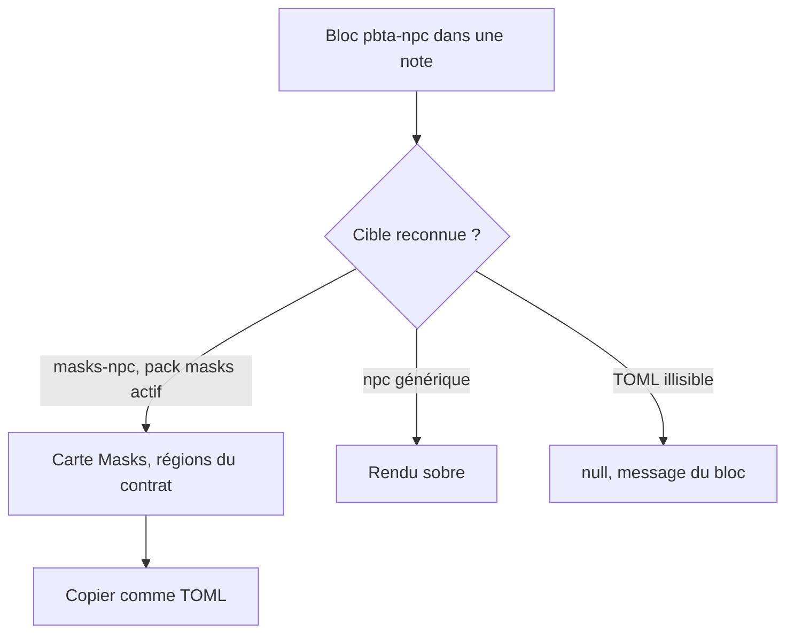
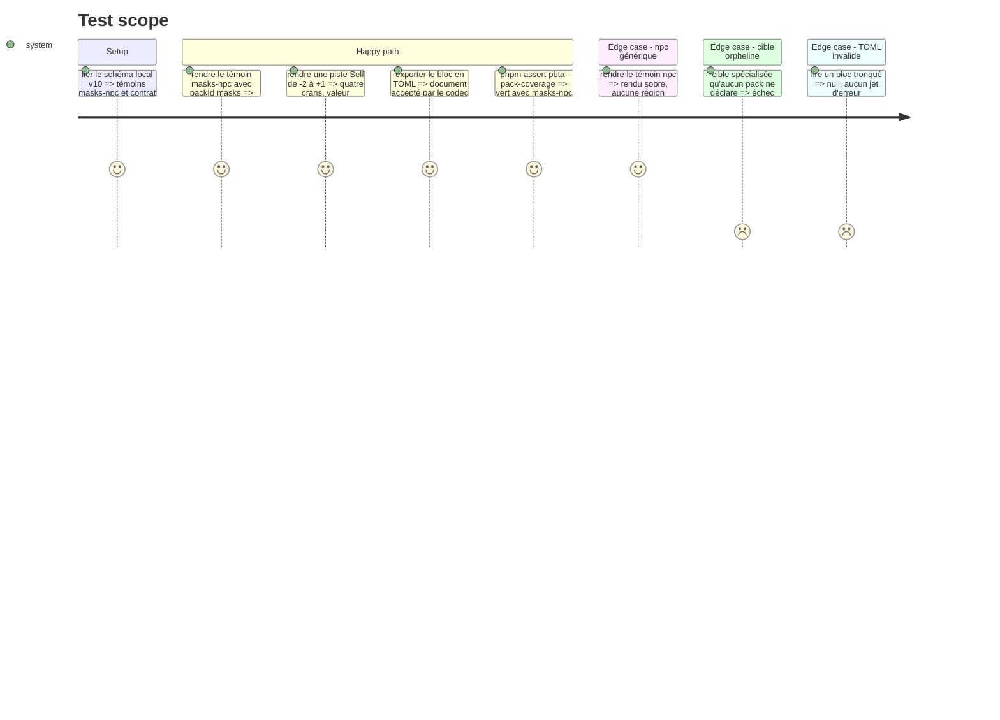

# Instruction: Handbook — appartenance des cibles et bloc PNJ

Élément `obsidian-handbook` du train. Développer contre le schéma local (`pnpm dev:schema-pbta`) tant que la candidate n'est pas épinglée ; l'épingle et le lockfile sont écrits par le superviseur. Les quatre obligations d'un format de bloc s'appliquent (`aidd_docs/guidelines/schema-design.md`).

## Architecture projection

> Tree of the final files. ✅ create · ✏️ modify · ❌ delete

```txt
.
├── src/features/pbta/npc.ts                       ✅ lecture tolérante `masks-npc` puis `npc`, rendu générique sobre
├── src/features/pbta/masksNpc.ts                  ✅ layout de la carte, régions du contrat publié
├── src/features/pbta/block.ts                     ✏️ bloc `pbta-npc`, gabarit
├── src/features/pbta/shape.ts                     ✏️ zones nommées de la carte
├── src/features/pbta/coverage.ts                  ✏️ classement et messages `<pack.id>-<type>`
├── src/features/pbta/specializedPlaybooks.ts      ✏️ typage des cibles projetées
├── src/features/blocks/registry.ts                ✏️ entrée dans BRUMES_BLOCKS
├── src/features/blocks/tomlExports.ts             ✏️ « copier comme TOML »
├── src/games/capabilities.ts                      ✏️ `block:pbta-npc`
├── src/settings/types.ts                          ✏️ réutilise `pbtaParser`, aucune clé renommée
├── src/settings/pbtaCoverageModal.ts              ✏️ pack attendu lu dans les contrats
├── src/styles/pbta/_masks.scss                    ✅ géométrie de la carte (mixins partagés avec la phase 5)
├── src/styles/pbta/index.scss                     ✏️ `@use`
├── tools/pbtaPackCoverage.harness.mts             ✏️ règle de préfixe, plus de découpe sur `-playbook`
├── tools/pbtaContractCorpus.mts                   ✏️ cible `masks-npc`
├── tools/assert-pbta-contract.mjs                 ✏️ liste épinglée sur la mesure
├── tools/customPacks.harness.mts                  ✏️ bloc neuf
├── tools/contextualPackBlocks.harness.mts         ✏️ bloc neuf
├── tools/assert-masks-layout.mjs                  ✅
├── tools/assertMasksLayout.harness.mts            ✅ faux DOM avec setAttribute et dataset
├── package.json                                   ✏️ script `assert:masks-layout`
├── aidd_docs/guidelines/schema-design.md          ✏️ bloc `pbta-npc`
└── aidd_docs/memory/internal/pbta-coverage.md     ✏️ règle `<pack.id>-<type>`
```

## User Journey



## Test Scope



## Wireframe

```txt
┌──────────────────────────────────────────────┐
│ (1) NOM DU PNJ                 · génération   │
├──────────────────────────────────────────────┤
│ (2) Nom réel · Drive                          │
├──────────────────────────────────────────────┤
│ (3) Capacités                                 │
├───────────────────────┬──────────────────────┤
│ (4) Résistance         │ (5) Piste Self        │
│     ☐ ☐ ☐ conditions   │   -2  -1  0  +1       │
├───────────────────────┼──────────────────────┤
│ (6) Pire soi           │ (7) Meilleur soi      │
├───────────────────────┴──────────────────────┤
│ (8) Moves                                     │
├──────────────────────────────────────────────┤
│ (9) Contexte                                  │
└──────────────────────────────────────────────┘
```

1. En-tête : nom en capitales condensées, génération à droite.
2. Identité : nom réel et drive sur une ligne.
3. Capacités : texte court.
4. Résistance et conditions : cases lues dans le TOML.
5. Piste Self : crans de `min` à `max`, propres à chaque PNJ.
6. Pire soi : comportement à l'extrémité basse de la piste.
7. Meilleur soi : comportement à l'extrémité haute.
8. Moves : liste des moves du PNJ.
9. Contexte : paragraphe libre.

L'ordre et les libellés viennent du contrat publié ; ce croquis ne fixe que la structure à faire valider.

## Tasks to do

### `1)` Règle d'appartenance

> `<pack.id>-<type>`, propriétaire lu dans les contrats de pack.

1. `pbtaPackCoverage.harness.mts` : remplacer l'égalité `<pack.id>-playbook` par « cible déclarée par exactement un pack et préfixée par son id » ; supprimer les découpes sur `-playbook`
2. `pbtaCoverageModal.ts` : `expectedPackId` dérive le pack des contrats, pas du suffixe ; libellés qui disaient « playbook » revus
3. `coverage.ts` et `specializedPlaybooks.ts` : une cible spécialisée n'est plus supposée être un playbook ; les messages « rendered as generic playbooks » distinguent le type
4. La tolérance asymétrique tient : cible amont non branchée = constat, cible déclarée sans propriétaire = échec

### `2)` Bloc `pbta-npc`

> Les quatre obligations d'un format de bloc.

1. Lecture tolérante : `masks-npc` d'abord, puis `npc` ; `null` sinon
2. Rendu : `masksNpc.ts` quand `packId` vaut `masks` et la cible `masks-npc`, régions du contrat de présentation ; rendu sobre sinon (nom, description, drive, moves, attributs)
3. Zones nommées dans `shape.ts` ; commande « copier comme TOML » ; gabarit de bloc
4. Capacité `block:pbta-npc` dans `capabilities.ts` ; drapeau `pbtaParser` réutilisé
5. Géométrie en `@mixin` dans `_masks.scss`, sous `body.brumes--masks`, aucune couleur en dur

### `3)` Harnais

> `dump:dom` et `assert:corpus` rendent sans `packId` : ce chemin a besoin du sien.

1. `assert:masks-layout`, volet PNJ : régions, ordre, libellés, crans de la piste, cases
2. `masks-npc` ajouté aux corpus des harnais de contrat, de packs contextuels et de packs personnalisés
3. Mémoire et guide à jour

## Test acceptance criteria

| Task | Acceptance criteria |
| ---- | ------------------- |
| 1 | `assert:pbta-pack-coverage` passe avec `masks-npc` et échoue, nommément, sur une cible spécialisée sans pack ; la modale nomme le pack Masks pour un `masks-npc` |
| 2 | Un bloc `pbta-npc` Masks rend la carte, un `npc` générique rend la version sobre, un TOML tronqué ne rend rien et ne lève pas ; l'export TOML repasse le codec |
| 3 | Le harnais échoue si une région, un libellé ou un cran de piste est retiré ; `pnpm check` est vert |
