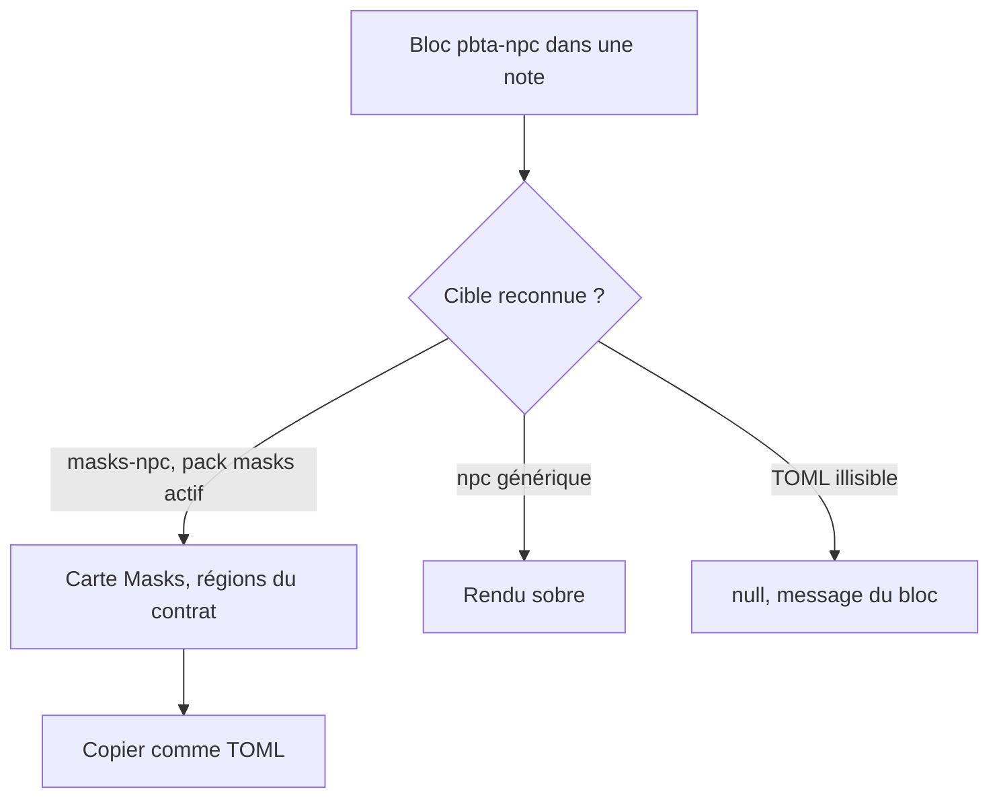
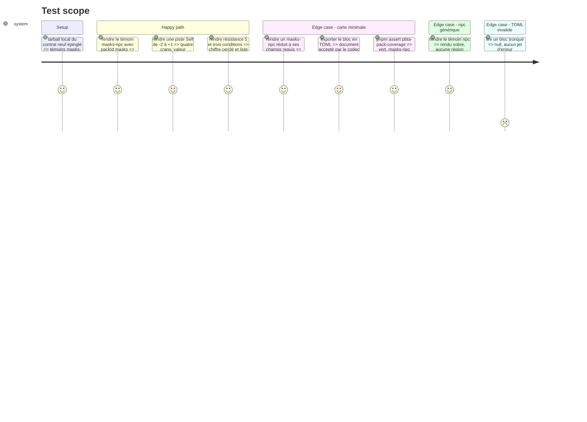

# Instruction: Handbook — bloc PNJ

> Exécution dans les worktrees du superviseur (`plan.md`, ligne Exécution) : chemins sous `<W>/<dépôt>`, commandes `pnpm supervise` lancées depuis `<W>/obsidian-handbook` avec `--root <W>`.

Phase d'écriture, **sans train ouvert ni commit** (`plan.md`, ligne Ordre) : ce travail deviendra l'élément `obsidian-handbook` (#87) du train `masks-2e`. Handbook épingle le **tarball local** de `schema-pbta` posé en phase 4 (tâche 2) : le code importe le contrat neuf directement. Tant que cette épingle est là, `pnpm check` s'arrête sur les harnais d'épingle, rouges par construction : la preuve de chaque étape est `rtk proxy pnpm build`, les deux lints et les `assert:*` concernés lancés un par un ; `pnpm check` en entier est joué par `present`, sur l'archive du fournisseur (phase 8, tâche 2). La règle d'appartenance `<pack.id>-<type>` est déjà écrite (phase 4, tâche 1). Les gardes que cette phase ajoute lisent un rôle, jamais un chiffre (`pnpm assert:guards-by-role`) ; une donnée de test fermée porte `guard-fixture: <raison>`. Les quatre obligations d'un format de bloc s'appliquent (`aidd_docs/guidelines/schema-design.md`).

## Architecture projection

> Tree of the final files. ✅ create · ✏️ modify · ❌ delete

```txt
.
├── src/features/pbta/npc.ts                       ✅ lecture tolérante `masks-npc` puis `npc`, rendu générique sobre
├── src/features/pbta/masksNpc.ts                  ✅ layout de la carte, régions de `packs/masks/npc-presentation-contract.json`
├── src/features/pbta/block.ts                     ✏️ bloc `pbta-npc`, gabarit
├── src/features/pbta/shape.ts                     ✏️ zones nommées de la carte
├── src/features/pbta/coverage.ts                  ✏️ `masks-npc` passe de non résolu à projeté
├── src/features/pbta/specializedPlaybooks.ts      ✏️ typage des cibles projetées
├── src/features/blocks/registry.ts                ✏️ entrée dans BRUMES_BLOCKS
├── src/features/blocks/tomlExports.ts             ✏️ « copier comme TOML »
├── src/games/capabilities.ts                      ✏️ `block:pbta-npc`
├── src/settings/types.ts                          ✏️ réutilise `pbtaParser`, aucune clé renommée
├── tools/pbtaPackCoverage.harness.mts             ✏️ `block:pbta-npc` déclaré, `masks-npc` projeté
├── tools/pbtaContractCorpus.mts                   ✏️ cible `masks-npc`
├── tools/assert-pbta-contract.mjs                 ✏️ liste épinglée sur la mesure (rouge sur le tarball local pour son contrôle d'épingle : se vérifie en phase 8, tâche 2)
├── tools/customPacks.harness.mts                  ✏️ bloc neuf
├── tools/contextualPackBlocks.harness.mts         ✏️ bloc neuf
├── tools/assert-masks-layout.mjs                  ✅
├── tools/assertMasksLayout.harness.mts            ✅ faux DOM avec setAttribute et dataset
├── package.json                                   ✏️ script `assert:masks-layout`
├── aidd_docs/guidelines/schema-design.md          ✏️ bloc `pbta-npc`
├── <W>/schema-pbta/handbook/masks/assets/styles/layout.css  ✏️ géométrie de la carte, réglée au coffre (phase 3, tâche 4)
└── aidd_docs/memory/internal/pbta-coverage.md     ✏️ `masks-npc` projeté
```

## User Journey



## Test Scope



## Wireframe

```txt
┌──────────────────────────────────────────────┐
│ (1) NOM DU PNJ                 · génération   │
├──────────────────────────────────────────────┤
│ (2) Nom réel   ...                            │
│     Drive      ...                            │
│     Capacités  ...                            │
├──────────────────────────────────────────────┤
│ (3) Résistance (5)   Conditions : a, b, c     │
├──────────────────────────────────────────────┤
│ (4) Self      -2   -1   [0]   +1              │
├───────────────────────┬──────────────────────┤
│ (5) Pire soi           │ (6) Meilleur soi      │
├───────────────────────┴──────────────────────┤
│ (7) Moves                                     │
│     ★ ligne de texte                          │
│     ★ ligne de texte                          │
└──────────────────────────────────────────────┘
  (8) Contexte : prose sous la carte
```

L'illustration du PNJ est au-dessus de la carte : c'est une image de la note, hors du bloc.

1. En-tête : nom en capitales condensées, génération à droite.
2. Identité : nom réel, drive et capacités, une ligne clé-valeur chacun.
3. Résistance : nombre dans un cercle ; conditions : liste de noms, pas des cases.
4. Piste Self : pleine largeur, crans de `min` à `max` propres à chaque PNJ, valeur marquée.
5. Pire soi : comportement à l'extrémité basse de la piste.
6. Meilleur soi : comportement à l'extrémité haute.
7. Moves : lignes de texte à puce étoile.
8. Contexte : `description`, en prose, hors du cadre de la carte.

L'ordre et les libellés viennent du contrat publié ; ce croquis ne fixe que la structure à faire valider.

## Tasks to do

### `1)` Projeter `masks-npc`

> La cible était un constat depuis la phase 4 ; elle devient une déclaration de Handbook.

1. `coverage.ts`, `specializedPlaybooks.ts` et `pbtaContractCorpus.mts` : `masks-npc` rejoint les cibles projetées, associée au bloc `pbta-npc`
2. `PBTA_PROJECTED_TARGETS` et son type s'ouvrent à une cible qui n'est pas un playbook ; `pbtaPackCoverage.harness.mts` mesure alors `masks-npc` comme projetée, et tout compte en dur portant sur une déclaration de Handbook reste une égalité, mise à jour ici

### `2)` Bloc `pbta-npc`

> Les quatre obligations d'un format de bloc.

1. Lecture tolérante : `masks-npc` d'abord, puis `npc` ; `null` sinon
2. Rendu : `masksNpc.ts` quand `packId` vaut `masks` et la cible `masks-npc`, régions, `rows` et `outsideCard` du contrat de présentation, une région sans donnée n'est pas émise ; rendu sobre sinon (nom, description, drive, moves, attributs), y compris pour un `masks-npc` lu sans le pack masks : ses moves sont alors des lignes de texte, ceux du `npc` des entrées de move
3. Zones nommées dans `shape.ts` ; commande « copier comme TOML » ; gabarit de bloc
4. Capacité `block:pbta-npc` dans `capabilities.ts` ; drapeau `pbtaParser` réutilisé
5. Aucun SCSS dans Handbook pour la carte (`plan.md`, Decisions) : `masksNpc.ts` pose sur chaque région `data-region` (id du contrat) et `data-primitive`, sur chaque rangée `data-row` et sur chaque colonne `data-column`, comme `monsterheartsLayout.ts` ; la géométrie est celle de `layout.css` du pack, dans `<W>/schema-pbta`. Sans cette feuille les régions s'empilent dans le flux et restent lisibles

### `3)` Harnais

> `dump:dom` et `assert:corpus` rendent sans `packId` : ce chemin a besoin du sien.

1. `assert:masks-layout`, volet PNJ : régions, ordre, libellés, crans de la piste, résistance chiffrée, contexte hors du cadre ; chaque région émise porte `data-region` et `data-primitive` aux valeurs du contrat (c'est ce contrat qui lie le rendu à la feuille du pack). Ordre et libellés attendus sont lus dans le contrat publié, jamais recopiés en littéral : une release corrective du contrat ne rougit pas le harnais
2. `masks-npc` ajouté aux corpus des harnais de contrat, de packs contextuels et de packs personnalisés
3. Mémoire et guide à jour

## Test acceptance criteria

| Task | Acceptance criteria |
| ---- | ------------------- |
| 1 | `assert:pbta-pack-coverage` ne liste plus `masks-npc` comme non résolu et ne signale plus `block:pbta-npc` comme capacité offerte non déclarée |
| 2 | Un bloc `pbta-npc` Masks rend la carte, un `npc` générique rend la version sobre, un TOML tronqué ne rend rien et ne lève pas ; l'export TOML repasse le codec |
| 3 | Le harnais échoue si une région, un libellé, un cran de piste ou un attribut d'accroche est retiré ; aucun fichier de `src/styles/` n'a changé ; build, deux lints et chaque `assert:*` touché par la phase sont verts un par un, seuls les harnais d'épingle restant rouges ; rien n'est commité |
