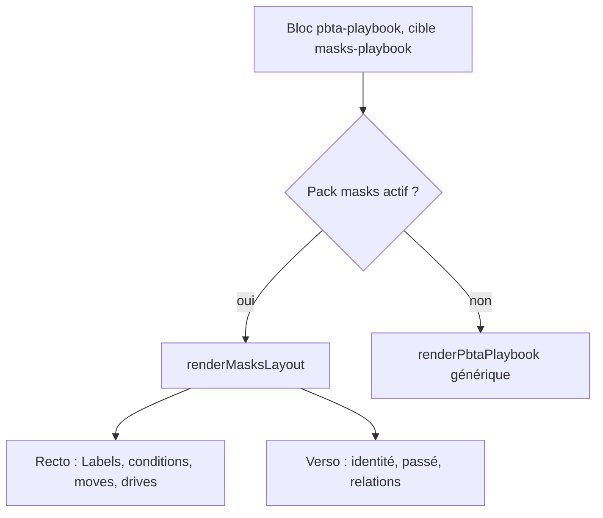
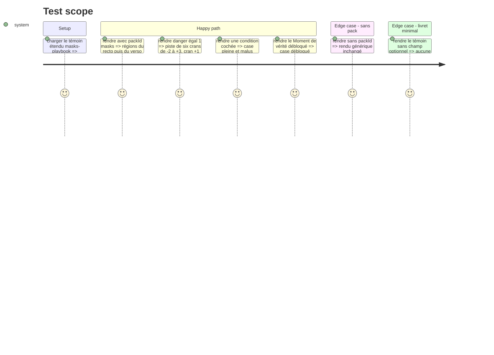

# Instruction: Handbook — layout du livret Masks

Même élément de train que la phase 4. Le modèle est `monsterheartsLayout.ts` : rendu par région, d'après `canonicalOrder` et `rows` du contrat publié. Le rendu générique du playbook reste valide sans `packId`.

## Architecture projection

> Tree of the final files. ✅ create · ✏️ modify · ❌ delete

```txt
.
├── src/features/pbta/masksLayout.ts               ✅ recto et verso, régions du contrat
├── src/features/pbta/block.ts                     ✏️ branchement par pack et par cible
├── src/features/pbta/renderer.ts                  ✏️ PBTA_SPECIALIZED_FIELDS pour les champs neufs
├── src/features/pbta/shape.ts                     ✏️ zones nommées du livret
├── src/styles/pbta/_masks.scss                    ✏️ piste de Labels, cases, grille recto/verso
├── tools/assertMasksLayout.harness.mts            ✏️ volet livret
├── tools/pbtaSpecializedProjection.harness.mts    ✏️ champs mécaniques neufs, par cible
└── tools/assert-pbta-theme.mjs                    ✏️ `_masks.scss` soumis à l'interdit des couleurs en dur
```

## User Journey



## Test Scope



## Wireframe

```txt
RECTO
┌──────────────────────────────────────────────────────────┐
│ (1) NOM DU LIVRET                        · nom de héros   │
├────────────────────────────┬─────────────────────────────┤
│ (2) Labels                  │ (5) Moves du livret          │
│  DANGER   -2 -1 0 +1 +2 +3  │  ☐ move · texte              │
│  FREAK    -2 -1 0 +1 +2 +3  │  ☑ move · texte              │
│  ...                        │  ☐ move · texte              │
├────────────────────────────┤                              │
│ (3) Conditions              │                              │
│  ☐ Afraid   malus           │                              │
│  ☐ Angry    malus  ...      │                              │
├────────────────────────────┼─────────────────────────────┤
│ (4) Moment de vérité        │ (6) Drives                   │
│     ☐ débloqué              │  intro · ☐ ☐ ☐ ☐ options     │
├────────────────────────────┼─────────────────────────────┤
│ (7) Influence               │ (8) Progressions             │
│     options                 │  ☐ avancée ...  Potentiel ☐☐☐│
└────────────────────────────┴─────────────────────────────┘

VERSO
┌──────────────────────────────────────────────────────────┐
│ (9) Identité : nom réel · apparence                       │
├────────────────────────────┬─────────────────────────────┤
│ (10) Capacités              │ (11) Attitude                │
├────────────────────────────┴─────────────────────────────┤
│ (12) Passé : questions du livret                          │
├────────────────────────────┬─────────────────────────────┤
│ (13) Relations              │ (14) Influence               │
└────────────────────────────┴─────────────────────────────┘
```

1. Bandeau : nom du livret en capitales condensées, nom de héros.
2. Labels : une piste par Label, bornes publiées (−2…+3), valeur du document marquée.
3. Conditions : cinq cases et leur malus.
4. Moment de vérité : texte et case « débloqué ».
5. Moves : liste cochable, la plus haute région du recto.
6. Drives : texte d'introduction et options à cocher.
7. Influence : options de départ.
8. Progressions : avancées cochables et cases de Potentiel.
9. Identité : invites du livret vierge.
10. Capacités : options ou texte.
11. Attitude : options ou texte.
12. Passé : questions.
13. Relations : invites vers les coéquipiers.
14. Influence : à qui le personnage en accorde.

Les positions exactes suivent `livret1.png` et `livret2.png` par les `rows` du contrat ; ce croquis ne fixe que les régions à faire valider.

## Tasks to do

### `1)` Brancher le layout

> Un pack, une cible, un layout ; plus de condition en ligne par jeu.

1. Remplacer le ternaire de `block.ts` par une table `pack + cible → layout` (monsterhearts, masks)
2. `masksLayout.ts` importe le contrat de présentation Masks et rend région par région ; une région sans donnée n'est pas émise

### `2)` Régions mécaniques

> Tout ce qui se coche est lu dans le TOML.

1. Piste de Labels : crans de la plage publiée, libellés des Labels lus dans les données (définition de jeu ou `statsDetail`), jamais en dur
2. Conditions avec malus, moves cochables, Drives, Progressions, cases de Potentiel, Influence, verrou du Moment de vérité
3. `PBTA_SPECIALIZED_FIELDS["masks-playbook"]` étendu : le rendu générique imprime aussi les champs neufs

### `3)` Verso

> Livret vierge : des invites, pas des valeurs.

1. Identité, Capacités, Attitude, Passé, Relations, Influence
2. Saut de page entre recto et verso à l'impression ; papier blanc par défaut (`printerFriendly`)

### `4)` Style et harnais

> Géométrie partagée par `@mixin` avec la carte de PNJ.

1. `_masks.scss` : piste, cases, grille ; uniquement des jetons du pack
2. `assert:masks-layout`, volet livret : régions, ordre, libellés, crans, cases, absence de région vide
3. `assert:pbta-specialized-projection` : chaque champ mécanique neuf ne s'affiche que s'il est déclaré, et au moins un témoin par cible l'affiche

## Test acceptance criteria

| Task | Acceptance criteria |
| ---- | ------------------- |
| 1 | Un `masks-playbook` rend le layout Masks quand le pack est actif, le rendu générique sinon ; le livret monsterhearts est inchangé (`pnpm dump:dom` sans diff hors Masks) |
| 2 | `danger = 1` rend six crans dont `+1` marqué ; une condition cochée rend une case pleine ; aucun libellé de Label n'est une chaîne du layout |
| 3 | Le verso suit le recto ; l'export PDF est sur fond blanc |
| 4 | Le harnais échoue si une région ou un cran est retiré ; `assert:pbta-theme` ne trouve aucune couleur en dur dans `_masks.scss` |
