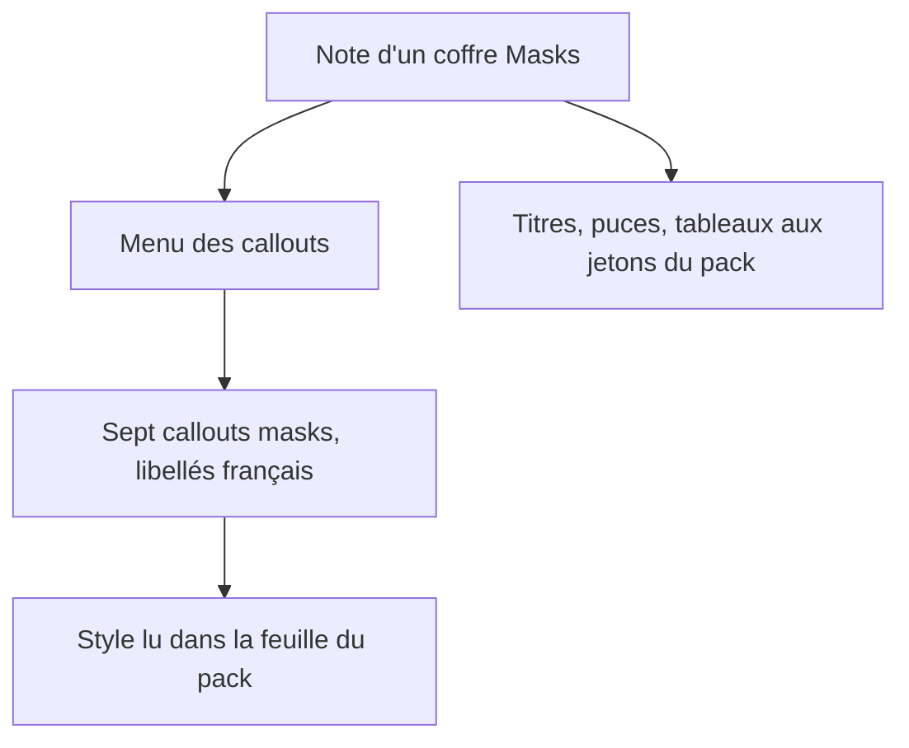
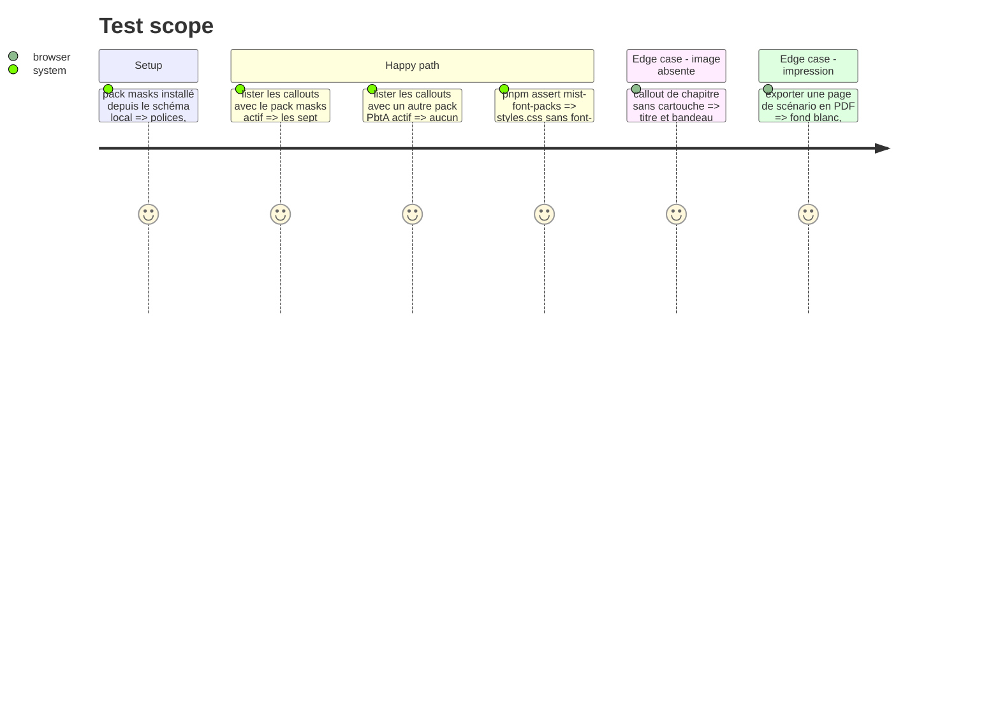

# Instruction: Handbook — callouts et style de page Masks

Même élément de train que les phases 4 et 5. Le mécanisme de callouts de pack (`PBTA_PACK_CALLOUTS`, portée par pack) est celui que #86 a livré : cette phase le vérifie sur un second pack et ne le réécrit pas. Polices et jetons arrivent par le pack ; rien dans `src/games/`.

## Architecture projection

> Tree of the final files. ✅ create · ✏️ modify · ❌ delete

```txt
.
├── src/features/callouts/nativeCallouts.ts        ✏️ icônes des callouts Masks, si la table ne les couvre pas
├── src/styles/pbta/_callouts.scss                 ✏️ seulement ce qui est commun à tous les packs
├── src/styles/pbta/_page.scss                     ✏️ jetons de puce, tableau et terme de jeu, si la phase 3 a choisi la voie des jetons
├── tools/assertCallouts.harness.mts               ✏️ callouts Masks attendus sous le pack masks seul
└── tools/assert-pbta-theme.mjs                    ✏️ jetons neufs exigés
```

## User Journey



## Test Scope



## Tasks to do

### `1)` Callouts du pack

> Menus pilotés par les métadonnées publiées.

1. Vérifier que les sept entrées `masks-*` sortent dans le menu sans code propre à Masks ; compléter la table d'icônes si besoin
2. `assertCallouts.harness.mts` : présence sous `masks`, absence sous les autres packs
3. Si la phase 3 a conclu que l'installeur refuse un rôle d'image sans fichier, rien à faire ici : le cartouche est une image du corps du callout

### `2)` Style de page

> Selon la voie retenue en phase 3.

1. Voie « feuille de pack » : aucun SCSS neuf, vérifier seulement la portée `body.brumes--masks`
2. Voie « jetons » : `_page.scss` consomme les jetons de puce, d'en-tête de tableau, de rayure et de terme de jeu, avec des replis neutres pour les autres packs ; aucune couleur en dur
3. Toute règle sombre reste derrière `.theme-dark` ou `.brumes--colour-dark` (aucune attendue : pack en clair seul)

### `3)` Polices

> Jamais embarquées.

1. Vérifier que les quatre familles sont servies depuis le dossier du pack installé et que `dist/styles.css` n'en contient aucune

## Test acceptance criteria

| Task | Acceptance criteria |
| ---- | ------------------- |
| 1 | Le menu d'un coffre Masks propose les sept callouts en français ; un coffre monsterhearts n'en propose aucun |
| 2 | Titres, puces, tableaux et termes de jeu d'une note Masks suivent les captures ; les autres packs PbtA sont visuellement inchangés |
| 3 | `assert:mist-font-packs` et `assert:style-scope` passent |
