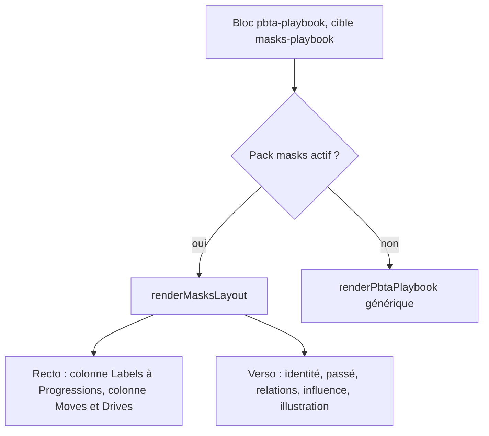
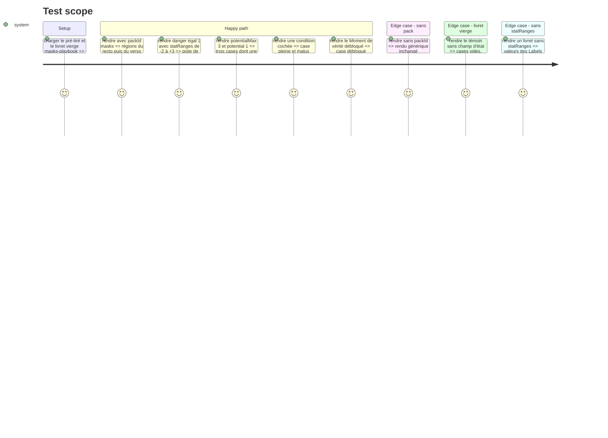

# Instruction: Handbook — layout du livret Masks

> Exécution dans les worktrees du superviseur (`plan.md`, ligne Exécution) : chemins sous `<W>/<dépôt>`, commandes `pnpm supervise` lancées depuis `<W>/obsidian-handbook` avec `--root <W>`.

Suite de la phase 5 : même worktree, même tarball local, toujours sans train ni commit, preuves lancées un par un. Le modèle est `monsterheartsLayout.ts` : rendu par région, d'après `canonicalOrder` et `faces` du contrat, importé de `schema-pbta/packs/masks/presentation-contract.json`. Le rendu générique du playbook reste valide sans `packId`. Le travail de #89 est sur `origin/main` (`plan.md`, Decisions) : la table `PLAYBOOK_LAYOUTS` de `block.ts` existe, s'y brancher au lieu de la réécrire ; `pbtaBookletShape` n'existe pas, les zones de `shape.ts` se dérivent du contrat de Masks. Les mixins `pbta-booklet-*` de #89 ne sont pas repris : la géométrie Masks est publiée par le pack (`plan.md`, Decisions).

## Architecture projection

> Tree of the final files. ✅ create · ✏️ modify · ❌ delete

```txt
.
├── src/features/pbta/masksLayout.ts               ✅ recto et verso, régions du contrat
├── src/features/pbta/block.ts                     ✏️ branchement par pack et par cible
├── src/features/pbta/renderer.ts                  ✏️ PBTA_SPECIALIZED_FIELDS pour les champs neufs
├── src/features/pbta/shape.ts                     ✏️ zones nommées du livret
├── tools/assertMasksLayout.harness.mts            ✏️ volet livret
├── tools/pbtaSpecializedProjection.harness.mts    ✏️ champs mécaniques neufs, par cible
└── <W>/schema-pbta/handbook/masks/assets/styles/layout.css  ✏️ géométrie du livret, réglée au coffre (phase 3, tâche 4)
```

## User Journey



## Test Scope



## Wireframe

```txt
RECTO — deux colonnes indépendantes
┌──────────────────────────────────────────────────────────┐
│ (1) NOM DE HÉROS                         nom du livret    │
├────────────────────────────┬─────────────────────────────┤
│ (2) Labels                  │ (7) Moves                    │
│  DANGER   -2 -1 0 [+1] +2 +3│  ☑ move · texte              │
│  FREAK    -2 -1 [0] +1 +2 +3│  ☐ move · texte              │
│  ...                        │     · sous-liste             │
│ (3) Conditions              │  ☐ move · texte              │
│  ☐ Afraid   malus           │                              │
│  ☑ Angry    malus  ...      │ (8) Drives                   │
│ (4) Moment de vérité        │  paragraphes d'introduction  │
│     texte      ☐ Débloqué   │  ☑ option   ☐ option         │
│ (5) Options d'influence     │  ☐ option   ☑ option  ...    │
│     • option                │                              │
│ (6) Progressions            │                              │
│  ☐ ☐ ☐ ☐   Potentiel ☐☐☐    │                              │
└────────────────────────────┴─────────────────────────────┘

VERSO — texte à gauche, illustration à droite
┌──────────────────────────────────────────────────────────┐
│ (1) NOM DE HÉROS                         nom du livret    │
├────────────────────────────────────┬─────────────────────┤
│ (9) Nom réel    ...                 │                     │
│     Capacités   ...                 │ (13) Illustration   │
│     Attitude    ...                 │      du livret      │
│ (10) Passé : prose                  │                     │
│ (11) Relations                      │                     │
│      ★ invite   ★ invite            │                     │
│ ┌ (12) Influence ────────────────┐  │                     │
│ └────────────────────────────────┘  │                     │
└────────────────────────────────────┴─────────────────────┘
```

1. En-tête : nom de héros en grandes capitales condensées, nom du livret en doré ; sans nom de héros, le nom du livret prend la place.
2. Labels : bandeau vertical « Labels », une piste par Label, bornes lues dans `statRanges`, valeur du document marquée.
3. Conditions : une case par condition et son malus.
4. Moment de vérité : texte et case « Débloqué ».
5. Options d'influence : liste à puces.
6. Progressions : avancées cochables, puis `potentialMax` cases de Potentiel dont `potential` cochées.
7. Moves : cases cochables, texte, sous-listes.
8. Drives : paragraphes d'introduction puis options à cocher.
9. Identité : trois lignes clé-valeur ; sur un livret vierge les trois libellés restent, suivis d'une ligne à remplir.
10. Passé : paragraphes.
11. Relations : invites à puce étoile.
12. Influence : cadre.
13. Illustration : `playbookImage`, colonne absente si le champ manque.

Les positions exactes suivent `livret1.png` et `livret2.png` par le contrat ; ce croquis fixe les régions et les colonnes à faire valider.

## Tasks to do

### `1)` Brancher le layout

> Un pack, une cible, un layout ; plus de condition en ligne par jeu.

1. `PLAYBOOK_LAYOUTS` (`block.ts`, livrée par #86 et #89) : y ajouter la ligne `masks` + `masks-playbook` ; aucun ternaire par jeu
2. `masksLayout.ts` importe le contrat de présentation Masks et rend région par région ; une région sans donnée n'est pas émise

### `2)` Régions mécaniques

> Tout ce qui se coche est lu dans le TOML.

1. Piste de Labels : crans lus dans `statRanges` par `getPbtaStatRangePresentation` ; libellé de chaque Label = sa clé de stat dans le document, comme `monsterheartsLayout.ts`, mise en capitales par le CSS ; jamais une chaîne du layout
2. Conditions avec malus, moves cochables, Drives, Progressions, cases de Potentiel (`potentialMax`, `potential`), options d'influence, verrou du Moment de vérité
3. `PBTA_SPECIALIZED_FIELDS["masks-playbook"]` étendu : le rendu générique imprime aussi les champs neufs

### `3)` Verso

> Le même document sert au livret vierge et au pré-tiré.

1. Identité (trois lignes), Passé, Relations, Influence, Illustration ; seules les lignes d'identité sont émises vides
2. Chaque face porte `data-face` (id du contrat) : le saut de page entre deux faces à l'impression est une règle `@media print` de `layout.css` ; l'en-tête est rendu en tête de chaque face (`faces[].header`) ; papier blanc par défaut (`printerFriendly`)

### `4)` Accroches et harnais

> La géométrie est dans `layout.css` du pack, partagée avec la carte de PNJ ; Handbook ne fournit que le DOM.

1. `masksLayout.ts` pose `data-region`, `data-primitive`, `data-face`, `data-row`, `data-column` aux valeurs du contrat ; aucun SCSS neuf. Mesurer `dist/styles.css` après build : sa taille ne doit pas avoir bougé du fait des phases 5 et 6
2. `assert:masks-layout`, volet livret : régions, ordre, libellés, crans, cases, absence de région vide, attributs d'accroche de chaque région et de chaque face ; ordre, libellés et ids attendus lus dans le contrat publié
3. `assert:pbta-specialized-projection` : chaque champ mécanique neuf ne s'affiche que s'il est déclaré, et au moins un témoin par cible l'affiche

## Test acceptance criteria

| Task | Acceptance criteria |
| ---- | ------------------- |
| 1 | Un `masks-playbook` rend le layout Masks quand le pack est actif, le rendu générique sinon ; le livret monsterhearts est inchangé (`pnpm dump:dom` sans diff hors Masks) |
| 2 | `danger = 1` rend six crans dont `+1` marqué ; une condition cochée rend une case pleine ; `potentialMax = 3` rend trois cases ; aucun libellé de Label n'est une chaîne du layout |
| 3 | Le verso suit le recto ; le livret vierge montre ses trois lignes d'identité ; sans `playbookImage` le texte prend toute la largeur ; l'export PDF est sur fond blanc |
| 4 | Le harnais échoue si une région, un cran ou un attribut d'accroche est retiré ; aucun fichier de `src/styles/` n'a changé et `dist/styles.css` a la taille mesurée avant la phase 5 |
