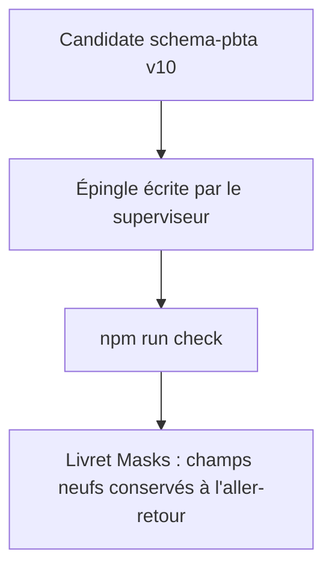
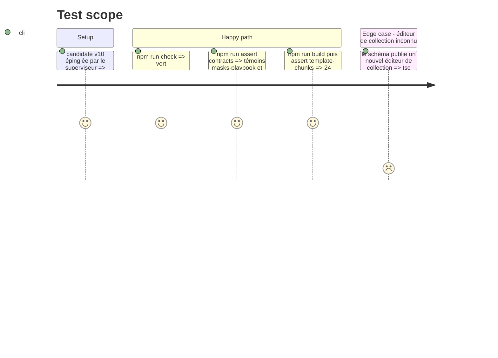

# Instruction: Lantern — adoption de l'épingle

Élément `lantern` du train, dépendant de `schema-pbta`. Aucun changement de `src/` n'est attendu : les registres de cibles sont ouverts. L'épingle et les lockfiles sont écrits par le superviseur ; restent les versions recopiées en dur dans les harnais. Dépôt en npm.

## Architecture projection

> Tree of the final files. ✅ create · ✏️ modify · ❌ delete

```txt
lantern/
├── package.json, lockfiles                        ✏️ épingle v10, écrits par le superviseur
├── tools/consumer-schema-pins.harness.mjs         ✏️ version attendue
├── tools/release-identity.harness.mjs             ✏️ version attendue
├── tools/release-train-matrix.harness.mjs         ✏️ matrice
└── release-train/                                 ✏️ manifestes du train
```

## User Journey



## Test Scope



## Tasks to do

### `1)` Adopter

> Rien d'autre que l'épingle et ce qui la recopie.

1. Laisser le superviseur écrire épingle et lockfiles
2. Mettre à jour les versions en dur des trois harnais et les manifestes de `release-train/`
3. `npm run check`, `npm run assert:contracts`, `npm run build`, `npm run assert:template-chunks`

### `2)` Constater les limites

> Hors périmètre, à consigner.

1. Le gabarit Masks de Lantern n'affiche ni n'édite les champs neufs ; ils survivent à l'aller-retour
2. Lantern n'a pas de gabarit PNJ PbtA ; si l'édition de `masks-npc` est voulue, ouvrir une issue Lantern distincte (gabarit, registre, compte de gabarits 24 → 25)

## Test acceptance criteria

| Task | Acceptance criteria |
| ---- | ------------------- |
| 1 | Les quatre commandes sont vertes sur la candidate ; aucun fichier de `src/` n'a changé |
| 2 | Un livret Masks étendu ouvert puis enregistré dans Lantern garde ses champs neufs |
