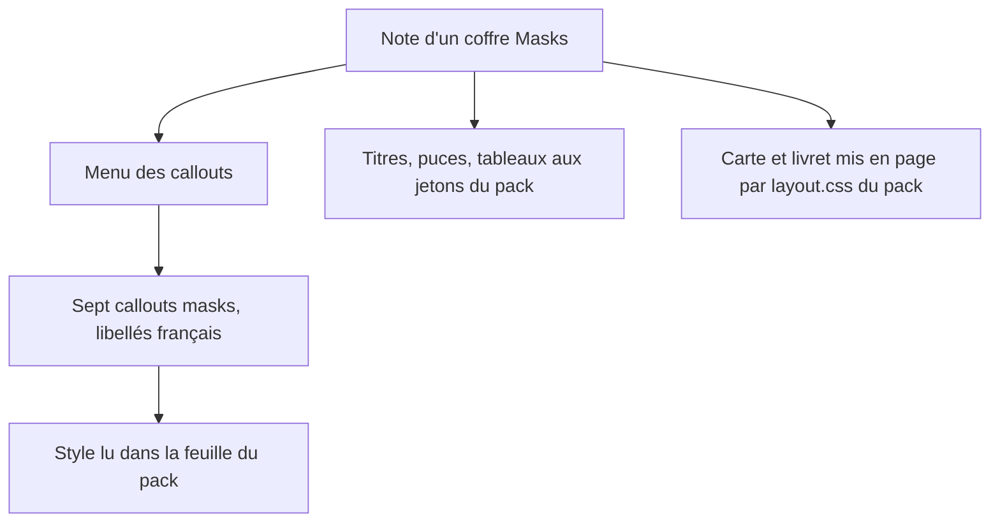
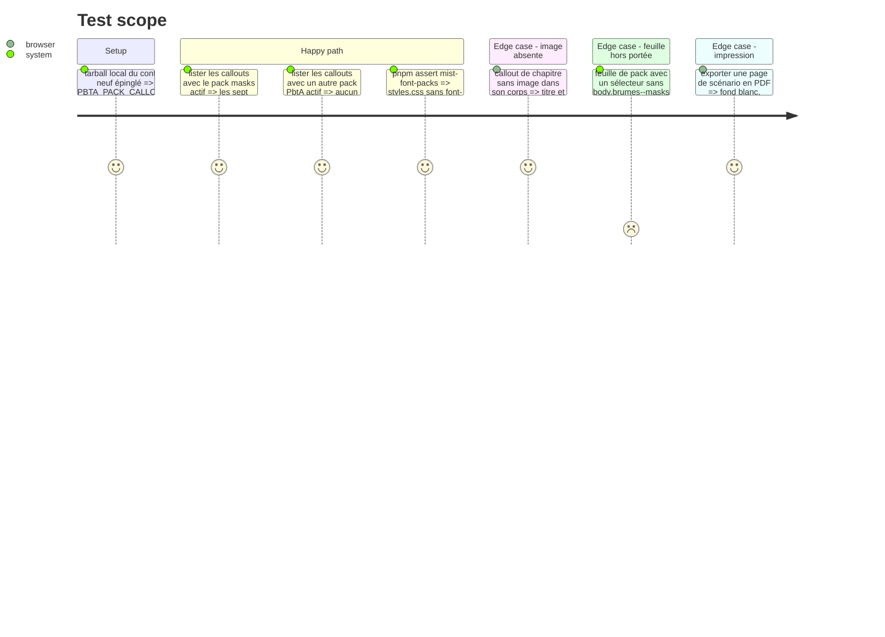

# Instruction: Handbook — callouts et style de page Masks

> Exécution dans les worktrees du superviseur (`plan.md`, ligne Exécution) : chemins sous `<W>/<dépôt>`, commandes `pnpm supervise` lancées depuis `<W>/obsidian-handbook` avec `--root <W>`.

Suite des phases 5 et 6 : même worktree, même tarball local, toujours sans train ni commit, preuves lancées un par un. Le schéma publie les callouts propres à un pack dans `PBTA_PACK_CALLOUTS`, et Handbook le lit déjà (`nativeCallouts.ts`, `SCHEMA_CALLOUT_IDS`, livré par #89, relu sur `origin/main` le 2026-10-08) : cette phase **vérifie** que les sept entrées `masks-*` sont servies sous le pack Masks à la fois (ceux de monsterhearts en profitent). Si ce branchement existe déjà au moment d'exécuter, la tâche 1 se réduit à sa vérification. Polices et jetons arrivent par le pack ; rien dans `src/games/`.

## Architecture projection

> Tree of the final files. ✅ create · ✏️ modify · ❌ delete

```txt
.
├── src/features/callouts/nativeCallouts.ts        ✏️ définitions tirées de `PBTA_PACK_CALLOUTS`, portée = pack ; icônes par id en texte
├── tools/assertCallouts.harness.mts               ✏️ callouts de pack : visibles sous leur pack seul, réglages anciens complétés
└── tools/customPacks.harness.mts                  ✏️ pack à plusieurs feuilles : portée acceptée, `@media print` admis, sélecteur nu ignoré
```

## User Journey



## Test Scope



## Tasks to do

### `1)` Callouts du pack

> Menus pilotés par les métadonnées publiées.

1. `nativeCallouts.ts` : le branchement existe (une `CalloutDefinition` par entrée, `scope` = `entry.pack`, icônes par id en texte avec une icône par défaut). Ne le réécrire que si la vérification d'une entrée `masks-*` échoue ; aucun identifiant de pack écrit dans Handbook. `SCHEMA_CALLOUT_IDS` contient déjà les ids de `PBTA_PACK_CALLOUTS` : c'est la liste que `migrateAliases.ts` parcourt pour compléter des réglages enregistrés avant l'ajout
2. `assertCallouts.harness.mts` : chaque entrée publiée est disponible sous son pack avec `style:pbta`, indisponible sous un autre pack ou sans la capacité ; des réglages enregistrés avant cette version reçoivent les définitions neuves sans perdre leurs alias (précédent : les callouts Adrenaline)
3. Portrait et cartouche : images du corps du callout, intégrées par la note ; aucun rôle d'image à brancher

### `2)` Style de page

> Tout vient des feuilles du pack (`page.css`, `layout.css`) ; aucun SCSS neuf dans Handbook.

1. Vérifier que `page.css` et `layout.css` sont chargées (aucune entrée dans `missingStylesheets`) : `validatePackCss` exige l'absence d'`@import`, des sélecteurs sous `body.brumes--masks` et des `url()` vers des actifs déclarés
2. `customPacks.harness.mts` : un pack à plusieurs feuilles les charge toutes, règles sous `@media print` comprises ; une feuille au sélecteur nu est ignorée avec un avertissement (`log.setLevel("warn")`)
3. Toute règle sombre reste derrière `.theme-dark` ou `.brumes--colour-dark` (aucune attendue : pack en clair seul)

### `3)` Polices

> Jamais embarquées.

1. Vérifier que les quatre familles sont servies depuis le dossier du pack installé et que `dist/styles.css` n'en contient aucune

## Test acceptance criteria

| Task | Acceptance criteria |
| ---- | ------------------- |
| 1 | Le menu d'un coffre Masks propose les sept callouts en français et aucun de monsterhearts ; un coffre monsterhearts propose les siens et aucun de Masks ; `nativeCallouts.ts` ne contient ni `masks` ni `monsterhearts` en littéral |
| 2 | Titres, puces, tableaux et termes de jeu d'une note Masks suivent les captures ; aucun fichier de `src/styles/` n'a changé dans cette phase ; les autres packs PbtA sont visuellement inchangés |
| 3 | `assert:style-scope` passe ; `dist/styles.css` ne contient aucun `@font-face` ; `dist/styles.css` a la taille mesurée avant la phase 5 : ce plan n'ajoute rien au plafond de `assert:mist-font-packs` (`plan.md`, Decisions) |
